# Final Project Submission

Please fill out:
* Student name: Steve Newman
* Student pace: part time
* Scheduled project review date/time: Sat Nov 23, 2019 3pm – 3:45pm
* Instructor name: James Irving
* Blog post URL:https://medium.com/@stevenewmanphotography/eliminating-outliers-in-python-with-z-scores-dd72ca5d4ead
* Video of 5-min Non-Technical Presentation:


# Project Objectives

The objective of this project is to find the best combination of variables to predict the highest price a house in King County, WA can be sold for.

## Questions to Answer

1. Which processes can be automated by functions?
2. How to prepare the variables for EDA/modeling?
3. How to approach modeling a category with over 70 options (zipcodes)?
4. Which variables should be eliminated due to correlation?
6. What is the best method to remove outliers?
7. Which variables should be selected for the model?

# OBTAIN


```python
!pip install -U fsds_100719
from fsds_100719.imports import *
import scipy.stats as stats
import seaborn as sns
from sklearn.preprocessing import StandardScaler
```

    Requirement already up-to-date: fsds_100719 in /Users/srn/anaconda3/envs/learn-env/lib/python3.6/site-packages (0.4.45)
    Requirement already satisfied, skipping upgrade: pprint in /Users/srn/anaconda3/envs/learn-env/lib/python3.6/site-packages (from fsds_100719) (0.1)
    Requirement already satisfied, skipping upgrade: numpy in /Users/srn/anaconda3/envs/learn-env/lib/python3.6/site-packages (from fsds_100719) (1.16.5)
    Requirement already satisfied, skipping upgrade: pyperclip in /Users/srn/anaconda3/envs/learn-env/lib/python3.6/site-packages (from fsds_100719) (1.7.0)
    Requirement already satisfied, skipping upgrade: ipywidgets in /Users/srn/anaconda3/envs/learn-env/lib/python3.6/site-packages (from fsds_100719) (7.5.1)
    Requirement already satisfied, skipping upgrade: pandas-profiling in /Users/srn/anaconda3/envs/learn-env/lib/python3.6/site-packages (from fsds_100719) (2.3.0)
    Requirement already satisfied, skipping upgrade: wordcloud in /Users/srn/anaconda3/envs/learn-env/lib/python3.6/site-packages (from fsds_100719) (1.6.0)
    Requirement already satisfied, skipping upgrade: tzlocal in /Users/srn/anaconda3/envs/learn-env/lib/python3.6/site-packages (from fsds_100719) (2.0.0)
    Requirement already satisfied, skipping upgrade: seaborn in /Users/srn/anaconda3/envs/learn-env/lib/python3.6/site-packages (from fsds_100719) (0.9.0)
    Requirement already satisfied, skipping upgrade: missingno in /Users/srn/anaconda3/envs/learn-env/lib/python3.6/site-packages (from fsds_100719) (0.4.2)
    Requirement already satisfied, skipping upgrade: scikit-learn in /Users/srn/anaconda3/envs/learn-env/lib/python3.6/site-packages (from fsds_100719) (0.21.2)
    Requirement already satisfied, skipping upgrade: IPython in /Users/srn/anaconda3/envs/learn-env/lib/python3.6/site-packages (from fsds_100719) (7.8.0)
    Requirement already satisfied, skipping upgrade: scipy in /Users/srn/anaconda3/envs/learn-env/lib/python3.6/site-packages (from fsds_100719) (1.3.1)
    Requirement already satisfied, skipping upgrade: matplotlib in /Users/srn/anaconda3/envs/learn-env/lib/python3.6/site-packages (from fsds_100719) (3.1.1)
    Requirement already satisfied, skipping upgrade: pandas in /Users/srn/anaconda3/envs/learn-env/lib/python3.6/site-packages (from fsds_100719) (0.25.1)
    Requirement already satisfied, skipping upgrade: nbformat>=4.2.0 in /Users/srn/anaconda3/envs/learn-env/lib/python3.6/site-packages (from ipywidgets->fsds_100719) (4.4.0)
    Requirement already satisfied, skipping upgrade: ipykernel>=4.5.1 in /Users/srn/anaconda3/envs/learn-env/lib/python3.6/site-packages (from ipywidgets->fsds_100719) (5.1.2)
    Requirement already satisfied, skipping upgrade: traitlets>=4.3.1 in /Users/srn/anaconda3/envs/learn-env/lib/python3.6/site-packages (from ipywidgets->fsds_100719) (4.3.2)
    Requirement already satisfied, skipping upgrade: widgetsnbextension~=3.5.0 in /Users/srn/anaconda3/envs/learn-env/lib/python3.6/site-packages (from ipywidgets->fsds_100719) (3.5.1)
    Requirement already satisfied, skipping upgrade: confuse>=1.0.0 in /Users/srn/anaconda3/envs/learn-env/lib/python3.6/site-packages (from pandas-profiling->fsds_100719) (1.0.0)
    Requirement already satisfied, skipping upgrade: phik>=0.9.8 in /Users/srn/anaconda3/envs/learn-env/lib/python3.6/site-packages (from pandas-profiling->fsds_100719) (0.9.8)
    Requirement already satisfied, skipping upgrade: astropy in /Users/srn/anaconda3/envs/learn-env/lib/python3.6/site-packages (from pandas-profiling->fsds_100719) (3.2.3)
    Requirement already satisfied, skipping upgrade: jinja2>=2.8 in /Users/srn/anaconda3/envs/learn-env/lib/python3.6/site-packages (from pandas-profiling->fsds_100719) (2.10.1)
    Requirement already satisfied, skipping upgrade: htmlmin>=0.1.12 in /Users/srn/anaconda3/envs/learn-env/lib/python3.6/site-packages (from pandas-profiling->fsds_100719) (0.1.12)
    Requirement already satisfied, skipping upgrade: pillow in /Users/srn/anaconda3/envs/learn-env/lib/python3.6/site-packages (from wordcloud->fsds_100719) (6.1.0)
    Requirement already satisfied, skipping upgrade: pytz in /Users/srn/anaconda3/envs/learn-env/lib/python3.6/site-packages (from tzlocal->fsds_100719) (2019.2)
    Requirement already satisfied, skipping upgrade: joblib>=0.11 in /Users/srn/anaconda3/envs/learn-env/lib/python3.6/site-packages (from scikit-learn->fsds_100719) (0.13.2)
    Requirement already satisfied, skipping upgrade: pexpect; sys_platform != "win32" in /Users/srn/anaconda3/envs/learn-env/lib/python3.6/site-packages (from IPython->fsds_100719) (4.7.0)
    Requirement already satisfied, skipping upgrade: setuptools>=18.5 in /Users/srn/anaconda3/envs/learn-env/lib/python3.6/site-packages (from IPython->fsds_100719) (41.2.0)
    Requirement already satisfied, skipping upgrade: backcall in /Users/srn/anaconda3/envs/learn-env/lib/python3.6/site-packages (from IPython->fsds_100719) (0.1.0)
    Requirement already satisfied, skipping upgrade: pickleshare in /Users/srn/anaconda3/envs/learn-env/lib/python3.6/site-packages (from IPython->fsds_100719) (0.7.5)
    Requirement already satisfied, skipping upgrade: jedi>=0.10 in /Users/srn/anaconda3/envs/learn-env/lib/python3.6/site-packages (from IPython->fsds_100719) (0.15.1)
    Requirement already satisfied, skipping upgrade: decorator in /Users/srn/anaconda3/envs/learn-env/lib/python3.6/site-packages (from IPython->fsds_100719) (4.4.0)
    Requirement already satisfied, skipping upgrade: prompt-toolkit<2.1.0,>=2.0.0 in /Users/srn/anaconda3/envs/learn-env/lib/python3.6/site-packages (from IPython->fsds_100719) (2.0.9)
    Requirement already satisfied, skipping upgrade: appnope; sys_platform == "darwin" in /Users/srn/anaconda3/envs/learn-env/lib/python3.6/site-packages (from IPython->fsds_100719) (0.1.0)
    Requirement already satisfied, skipping upgrade: pygments in /Users/srn/anaconda3/envs/learn-env/lib/python3.6/site-packages (from IPython->fsds_100719) (2.4.2)
    Requirement already satisfied, skipping upgrade: cycler>=0.10 in /Users/srn/anaconda3/envs/learn-env/lib/python3.6/site-packages (from matplotlib->fsds_100719) (0.10.0)
    Requirement already satisfied, skipping upgrade: kiwisolver>=1.0.1 in /Users/srn/anaconda3/envs/learn-env/lib/python3.6/site-packages (from matplotlib->fsds_100719) (1.1.0)
    Requirement already satisfied, skipping upgrade: pyparsing!=2.0.4,!=2.1.2,!=2.1.6,>=2.0.1 in /Users/srn/anaconda3/envs/learn-env/lib/python3.6/site-packages (from matplotlib->fsds_100719) (2.4.2)
    Requirement already satisfied, skipping upgrade: python-dateutil>=2.1 in /Users/srn/anaconda3/envs/learn-env/lib/python3.6/site-packages (from matplotlib->fsds_100719) (2.8.0)
    Requirement already satisfied, skipping upgrade: ipython_genutils in /Users/srn/anaconda3/envs/learn-env/lib/python3.6/site-packages (from nbformat>=4.2.0->ipywidgets->fsds_100719) (0.2.0)
    Requirement already satisfied, skipping upgrade: jsonschema!=2.5.0,>=2.4 in /Users/srn/anaconda3/envs/learn-env/lib/python3.6/site-packages (from nbformat>=4.2.0->ipywidgets->fsds_100719) (3.0.2)
    Requirement already satisfied, skipping upgrade: jupyter_core in /Users/srn/anaconda3/envs/learn-env/lib/python3.6/site-packages (from nbformat>=4.2.0->ipywidgets->fsds_100719) (4.5.0)
    Requirement already satisfied, skipping upgrade: tornado>=4.2 in /Users/srn/anaconda3/envs/learn-env/lib/python3.6/site-packages (from ipykernel>=4.5.1->ipywidgets->fsds_100719) (6.0.3)
    Requirement already satisfied, skipping upgrade: jupyter-client in /Users/srn/anaconda3/envs/learn-env/lib/python3.6/site-packages (from ipykernel>=4.5.1->ipywidgets->fsds_100719) (5.3.3)
    Requirement already satisfied, skipping upgrade: six in /Users/srn/anaconda3/envs/learn-env/lib/python3.6/site-packages (from traitlets>=4.3.1->ipywidgets->fsds_100719) (1.12.0)
    Requirement already satisfied, skipping upgrade: notebook>=4.4.1 in /Users/srn/anaconda3/envs/learn-env/lib/python3.6/site-packages (from widgetsnbextension~=3.5.0->ipywidgets->fsds_100719) (5.7.8)
    Requirement already satisfied, skipping upgrade: pyyaml in /Users/srn/anaconda3/envs/learn-env/lib/python3.6/site-packages (from confuse>=1.0.0->pandas-profiling->fsds_100719) (5.1.2)
    Requirement already satisfied, skipping upgrade: pytest>=4.0.2 in /Users/srn/anaconda3/envs/learn-env/lib/python3.6/site-packages (from phik>=0.9.8->pandas-profiling->fsds_100719) (5.3.0)
    Requirement already satisfied, skipping upgrade: nbconvert>=5.3.1 in /Users/srn/anaconda3/envs/learn-env/lib/python3.6/site-packages (from phik>=0.9.8->pandas-profiling->fsds_100719) (5.5.0)
    Requirement already satisfied, skipping upgrade: pytest-pylint>=0.13.0 in /Users/srn/anaconda3/envs/learn-env/lib/python3.6/site-packages (from phik>=0.9.8->pandas-profiling->fsds_100719) (0.14.1)
    Requirement already satisfied, skipping upgrade: numba>=0.38.1 in /Users/srn/anaconda3/envs/learn-env/lib/python3.6/site-packages (from phik>=0.9.8->pandas-profiling->fsds_100719) (0.46.0)
    Requirement already satisfied, skipping upgrade: MarkupSafe>=0.23 in /Users/srn/anaconda3/envs/learn-env/lib/python3.6/site-packages (from jinja2>=2.8->pandas-profiling->fsds_100719) (1.1.1)
    Requirement already satisfied, skipping upgrade: ptyprocess>=0.5 in /Users/srn/anaconda3/envs/learn-env/lib/python3.6/site-packages (from pexpect; sys_platform != "win32"->IPython->fsds_100719) (0.6.0)
    Requirement already satisfied, skipping upgrade: parso>=0.5.0 in /Users/srn/anaconda3/envs/learn-env/lib/python3.6/site-packages (from jedi>=0.10->IPython->fsds_100719) (0.5.1)
    Requirement already satisfied, skipping upgrade: wcwidth in /Users/srn/anaconda3/envs/learn-env/lib/python3.6/site-packages (from prompt-toolkit<2.1.0,>=2.0.0->IPython->fsds_100719) (0.1.7)
    Requirement already satisfied, skipping upgrade: pyrsistent>=0.14.0 in /Users/srn/anaconda3/envs/learn-env/lib/python3.6/site-packages (from jsonschema!=2.5.0,>=2.4->nbformat>=4.2.0->ipywidgets->fsds_100719) (0.14.11)
    Requirement already satisfied, skipping upgrade: attrs>=17.4.0 in /Users/srn/anaconda3/envs/learn-env/lib/python3.6/site-packages (from jsonschema!=2.5.0,>=2.4->nbformat>=4.2.0->ipywidgets->fsds_100719) (19.1.0)
    Requirement already satisfied, skipping upgrade: pyzmq>=13 in /Users/srn/anaconda3/envs/learn-env/lib/python3.6/site-packages (from jupyter-client->ipykernel>=4.5.1->ipywidgets->fsds_100719) (18.1.0)
    Requirement already satisfied, skipping upgrade: terminado>=0.8.1 in /Users/srn/anaconda3/envs/learn-env/lib/python3.6/site-packages (from notebook>=4.4.1->widgetsnbextension~=3.5.0->ipywidgets->fsds_100719) (0.8.2)
    Requirement already satisfied, skipping upgrade: Send2Trash in /Users/srn/anaconda3/envs/learn-env/lib/python3.6/site-packages (from notebook>=4.4.1->widgetsnbextension~=3.5.0->ipywidgets->fsds_100719) (1.5.0)
    Requirement already satisfied, skipping upgrade: prometheus-client in /Users/srn/anaconda3/envs/learn-env/lib/python3.6/site-packages (from notebook>=4.4.1->widgetsnbextension~=3.5.0->ipywidgets->fsds_100719) (0.7.1)
    Requirement already satisfied, skipping upgrade: pluggy<1.0,>=0.12 in /Users/srn/anaconda3/envs/learn-env/lib/python3.6/site-packages (from pytest>=4.0.2->phik>=0.9.8->pandas-profiling->fsds_100719) (0.12.0)
    Requirement already satisfied, skipping upgrade: more-itertools>=4.0.0 in /Users/srn/anaconda3/envs/learn-env/lib/python3.6/site-packages (from pytest>=4.0.2->phik>=0.9.8->pandas-profiling->fsds_100719) (7.0.0)
    Requirement already satisfied, skipping upgrade: py>=1.5.0 in /Users/srn/anaconda3/envs/learn-env/lib/python3.6/site-packages (from pytest>=4.0.2->phik>=0.9.8->pandas-profiling->fsds_100719) (1.8.0)
    Requirement already satisfied, skipping upgrade: packaging in /Users/srn/anaconda3/envs/learn-env/lib/python3.6/site-packages (from pytest>=4.0.2->phik>=0.9.8->pandas-profiling->fsds_100719) (19.2)
    Requirement already satisfied, skipping upgrade: importlib-metadata>=0.12; python_version < "3.8" in /Users/srn/anaconda3/envs/learn-env/lib/python3.6/site-packages (from pytest>=4.0.2->phik>=0.9.8->pandas-profiling->fsds_100719) (0.17)
    Requirement already satisfied, skipping upgrade: mistune>=0.8.1 in /Users/srn/anaconda3/envs/learn-env/lib/python3.6/site-packages (from nbconvert>=5.3.1->phik>=0.9.8->pandas-profiling->fsds_100719) (0.8.4)
    Requirement already satisfied, skipping upgrade: pandocfilters>=1.4.1 in /Users/srn/anaconda3/envs/learn-env/lib/python3.6/site-packages (from nbconvert>=5.3.1->phik>=0.9.8->pandas-profiling->fsds_100719) (1.4.2)
    Requirement already satisfied, skipping upgrade: entrypoints>=0.2.2 in /Users/srn/anaconda3/envs/learn-env/lib/python3.6/site-packages (from nbconvert>=5.3.1->phik>=0.9.8->pandas-profiling->fsds_100719) (0.3)
    Requirement already satisfied, skipping upgrade: testpath in /Users/srn/anaconda3/envs/learn-env/lib/python3.6/site-packages (from nbconvert>=5.3.1->phik>=0.9.8->pandas-profiling->fsds_100719) (0.4.2)
    Requirement already satisfied, skipping upgrade: bleach in /Users/srn/anaconda3/envs/learn-env/lib/python3.6/site-packages (from nbconvert>=5.3.1->phik>=0.9.8->pandas-profiling->fsds_100719) (1.5.0)
    Requirement already satisfied, skipping upgrade: defusedxml in /Users/srn/anaconda3/envs/learn-env/lib/python3.6/site-packages (from nbconvert>=5.3.1->phik>=0.9.8->pandas-profiling->fsds_100719) (0.6.0)
    Requirement already satisfied, skipping upgrade: pylint>=1.4.5 in /Users/srn/anaconda3/envs/learn-env/lib/python3.6/site-packages (from pytest-pylint>=0.13.0->phik>=0.9.8->pandas-profiling->fsds_100719) (2.4.4)
    Requirement already satisfied, skipping upgrade: llvmlite>=0.30.0dev0 in /Users/srn/anaconda3/envs/learn-env/lib/python3.6/site-packages (from numba>=0.38.1->phik>=0.9.8->pandas-profiling->fsds_100719) (0.30.0)
    Requirement already satisfied, skipping upgrade: zipp>=0.5 in /Users/srn/anaconda3/envs/learn-env/lib/python3.6/site-packages (from importlib-metadata>=0.12; python_version < "3.8"->pytest>=4.0.2->phik>=0.9.8->pandas-profiling->fsds_100719) (0.5.1)
    Requirement already satisfied, skipping upgrade: html5lib!=0.9999,!=0.99999,<0.99999999,>=0.999 in /Users/srn/anaconda3/envs/learn-env/lib/python3.6/site-packages (from bleach->nbconvert>=5.3.1->phik>=0.9.8->pandas-profiling->fsds_100719) (0.9999999)
    Requirement already satisfied, skipping upgrade: mccabe<0.7,>=0.6 in /Users/srn/anaconda3/envs/learn-env/lib/python3.6/site-packages (from pylint>=1.4.5->pytest-pylint>=0.13.0->phik>=0.9.8->pandas-profiling->fsds_100719) (0.6.1)
    Requirement already satisfied, skipping upgrade: isort<5,>=4.2.5 in /Users/srn/anaconda3/envs/learn-env/lib/python3.6/site-packages (from pylint>=1.4.5->pytest-pylint>=0.13.0->phik>=0.9.8->pandas-profiling->fsds_100719) (4.3.21)
    Requirement already satisfied, skipping upgrade: astroid<2.4,>=2.3.0 in /Users/srn/anaconda3/envs/learn-env/lib/python3.6/site-packages (from pylint>=1.4.5->pytest-pylint>=0.13.0->phik>=0.9.8->pandas-profiling->fsds_100719) (2.3.3)
    Requirement already satisfied, skipping upgrade: lazy-object-proxy==1.4.* in /Users/srn/anaconda3/envs/learn-env/lib/python3.6/site-packages (from astroid<2.4,>=2.3.0->pylint>=1.4.5->pytest-pylint>=0.13.0->phik>=0.9.8->pandas-profiling->fsds_100719) (1.4.3)
    Requirement already satisfied, skipping upgrade: wrapt==1.11.* in /Users/srn/anaconda3/envs/learn-env/lib/python3.6/site-packages (from astroid<2.4,>=2.3.0->pylint>=1.4.5->pytest-pylint>=0.13.0->phik>=0.9.8->pandas-profiling->fsds_100719) (1.11.2)
    Requirement already satisfied, skipping upgrade: typed-ast<1.5,>=1.4.0; implementation_name == "cpython" and python_version < "3.8" in /Users/srn/anaconda3/envs/learn-env/lib/python3.6/site-packages (from astroid<2.4,>=2.3.0->pylint>=1.4.5->pytest-pylint>=0.13.0->phik>=0.9.8->pandas-profiling->fsds_100719) (1.4.0)


```python
pd.set_option('display.max_columns',0)
```


```python
csv="https://raw.githubusercontent.com/learn-co-students/dsc-v2-mod1-final-project-online-ds-pt-100719/master/kc_house_data.csv"
df = pd.read_csv(csv)
df.head()
```


<div>
<style scoped>
    .dataframe tbody tr th:only-of-type {
        vertical-align: middle;
    }

    .dataframe tbody tr th {
        vertical-align: top;
    }

    .dataframe thead th {
        text-align: right;
    }
</style>
<table border="1" class="dataframe">
  <thead>
    <tr style="text-align: right;">
      <th></th>
      <th>id</th>
      <th>date</th>
      <th>price</th>
      <th>bedrooms</th>
      <th>bathrooms</th>
      <th>sqft_living</th>
      <th>sqft_lot</th>
      <th>floors</th>
      <th>waterfront</th>
      <th>view</th>
      <th>condition</th>
      <th>grade</th>
      <th>sqft_above</th>
      <th>sqft_basement</th>
      <th>yr_built</th>
      <th>yr_renovated</th>
      <th>zipcode</th>
      <th>lat</th>
      <th>long</th>
      <th>sqft_living15</th>
      <th>sqft_lot15</th>
    </tr>
  </thead>
  <tbody>
    <tr>
      <td>0</td>
      <td>7129300520</td>
      <td>10/13/2014</td>
      <td>221900.0</td>
      <td>3</td>
      <td>1.00</td>
      <td>1180</td>
      <td>5650</td>
      <td>1.0</td>
      <td>NaN</td>
      <td>0.0</td>
      <td>3</td>
      <td>7</td>
      <td>1180</td>
      <td>0.0</td>
      <td>1955</td>
      <td>0.0</td>
      <td>98178</td>
      <td>47.5112</td>
      <td>-122.257</td>
      <td>1340</td>
      <td>5650</td>
    </tr>
    <tr>
      <td>1</td>
      <td>6414100192</td>
      <td>12/9/2014</td>
      <td>538000.0</td>
      <td>3</td>
      <td>2.25</td>
      <td>2570</td>
      <td>7242</td>
      <td>2.0</td>
      <td>0.0</td>
      <td>0.0</td>
      <td>3</td>
      <td>7</td>
      <td>2170</td>
      <td>400.0</td>
      <td>1951</td>
      <td>1991.0</td>
      <td>98125</td>
      <td>47.7210</td>
      <td>-122.319</td>
      <td>1690</td>
      <td>7639</td>
    </tr>
    <tr>
      <td>2</td>
      <td>5631500400</td>
      <td>2/25/2015</td>
      <td>180000.0</td>
      <td>2</td>
      <td>1.00</td>
      <td>770</td>
      <td>10000</td>
      <td>1.0</td>
      <td>0.0</td>
      <td>0.0</td>
      <td>3</td>
      <td>6</td>
      <td>770</td>
      <td>0.0</td>
      <td>1933</td>
      <td>NaN</td>
      <td>98028</td>
      <td>47.7379</td>
      <td>-122.233</td>
      <td>2720</td>
      <td>8062</td>
    </tr>
    <tr>
      <td>3</td>
      <td>2487200875</td>
      <td>12/9/2014</td>
      <td>604000.0</td>
      <td>4</td>
      <td>3.00</td>
      <td>1960</td>
      <td>5000</td>
      <td>1.0</td>
      <td>0.0</td>
      <td>0.0</td>
      <td>5</td>
      <td>7</td>
      <td>1050</td>
      <td>910.0</td>
      <td>1965</td>
      <td>0.0</td>
      <td>98136</td>
      <td>47.5208</td>
      <td>-122.393</td>
      <td>1360</td>
      <td>5000</td>
    </tr>
    <tr>
      <td>4</td>
      <td>1954400510</td>
      <td>2/18/2015</td>
      <td>510000.0</td>
      <td>3</td>
      <td>2.00</td>
      <td>1680</td>
      <td>8080</td>
      <td>1.0</td>
      <td>0.0</td>
      <td>0.0</td>
      <td>3</td>
      <td>8</td>
      <td>1680</td>
      <td>0.0</td>
      <td>1987</td>
      <td>0.0</td>
      <td>98074</td>
      <td>47.6168</td>
      <td>-122.045</td>
      <td>1800</td>
      <td>7503</td>
    </tr>
  </tbody>
</table>
</div>


```python
df.shape
```


    (21597, 21)


```python
df.describe()
```


<div>
<style scoped>
    .dataframe tbody tr th:only-of-type {
        vertical-align: middle;
    }

    .dataframe tbody tr th {
        vertical-align: top;
    }

    .dataframe thead th {
        text-align: right;
    }
</style>
<table border="1" class="dataframe">
  <thead>
    <tr style="text-align: right;">
      <th></th>
      <th>id</th>
      <th>price</th>
      <th>bedrooms</th>
      <th>bathrooms</th>
      <th>sqft_living</th>
      <th>sqft_lot</th>
      <th>floors</th>
      <th>waterfront</th>
      <th>view</th>
      <th>condition</th>
      <th>grade</th>
      <th>sqft_above</th>
      <th>yr_built</th>
      <th>yr_renovated</th>
      <th>zipcode</th>
      <th>lat</th>
      <th>long</th>
      <th>sqft_living15</th>
      <th>sqft_lot15</th>
    </tr>
  </thead>
  <tbody>
    <tr>
      <td>count</td>
      <td>2.159700e+04</td>
      <td>2.159700e+04</td>
      <td>21597.000000</td>
      <td>21597.000000</td>
      <td>21597.000000</td>
      <td>2.159700e+04</td>
      <td>21597.000000</td>
      <td>19221.000000</td>
      <td>21534.000000</td>
      <td>21597.000000</td>
      <td>21597.000000</td>
      <td>21597.000000</td>
      <td>21597.000000</td>
      <td>17755.000000</td>
      <td>21597.000000</td>
      <td>21597.000000</td>
      <td>21597.000000</td>
      <td>21597.000000</td>
      <td>21597.000000</td>
    </tr>
    <tr>
      <td>mean</td>
      <td>4.580474e+09</td>
      <td>5.402966e+05</td>
      <td>3.373200</td>
      <td>2.115826</td>
      <td>2080.321850</td>
      <td>1.509941e+04</td>
      <td>1.494096</td>
      <td>0.007596</td>
      <td>0.233863</td>
      <td>3.409825</td>
      <td>7.657915</td>
      <td>1788.596842</td>
      <td>1970.999676</td>
      <td>83.636778</td>
      <td>98077.951845</td>
      <td>47.560093</td>
      <td>-122.213982</td>
      <td>1986.620318</td>
      <td>12758.283512</td>
    </tr>
    <tr>
      <td>std</td>
      <td>2.876736e+09</td>
      <td>3.673681e+05</td>
      <td>0.926299</td>
      <td>0.768984</td>
      <td>918.106125</td>
      <td>4.141264e+04</td>
      <td>0.539683</td>
      <td>0.086825</td>
      <td>0.765686</td>
      <td>0.650546</td>
      <td>1.173200</td>
      <td>827.759761</td>
      <td>29.375234</td>
      <td>399.946414</td>
      <td>53.513072</td>
      <td>0.138552</td>
      <td>0.140724</td>
      <td>685.230472</td>
      <td>27274.441950</td>
    </tr>
    <tr>
      <td>min</td>
      <td>1.000102e+06</td>
      <td>7.800000e+04</td>
      <td>1.000000</td>
      <td>0.500000</td>
      <td>370.000000</td>
      <td>5.200000e+02</td>
      <td>1.000000</td>
      <td>0.000000</td>
      <td>0.000000</td>
      <td>1.000000</td>
      <td>3.000000</td>
      <td>370.000000</td>
      <td>1900.000000</td>
      <td>0.000000</td>
      <td>98001.000000</td>
      <td>47.155900</td>
      <td>-122.519000</td>
      <td>399.000000</td>
      <td>651.000000</td>
    </tr>
    <tr>
      <td>25%</td>
      <td>2.123049e+09</td>
      <td>3.220000e+05</td>
      <td>3.000000</td>
      <td>1.750000</td>
      <td>1430.000000</td>
      <td>5.040000e+03</td>
      <td>1.000000</td>
      <td>0.000000</td>
      <td>0.000000</td>
      <td>3.000000</td>
      <td>7.000000</td>
      <td>1190.000000</td>
      <td>1951.000000</td>
      <td>0.000000</td>
      <td>98033.000000</td>
      <td>47.471100</td>
      <td>-122.328000</td>
      <td>1490.000000</td>
      <td>5100.000000</td>
    </tr>
    <tr>
      <td>50%</td>
      <td>3.904930e+09</td>
      <td>4.500000e+05</td>
      <td>3.000000</td>
      <td>2.250000</td>
      <td>1910.000000</td>
      <td>7.618000e+03</td>
      <td>1.500000</td>
      <td>0.000000</td>
      <td>0.000000</td>
      <td>3.000000</td>
      <td>7.000000</td>
      <td>1560.000000</td>
      <td>1975.000000</td>
      <td>0.000000</td>
      <td>98065.000000</td>
      <td>47.571800</td>
      <td>-122.231000</td>
      <td>1840.000000</td>
      <td>7620.000000</td>
    </tr>
    <tr>
      <td>75%</td>
      <td>7.308900e+09</td>
      <td>6.450000e+05</td>
      <td>4.000000</td>
      <td>2.500000</td>
      <td>2550.000000</td>
      <td>1.068500e+04</td>
      <td>2.000000</td>
      <td>0.000000</td>
      <td>0.000000</td>
      <td>4.000000</td>
      <td>8.000000</td>
      <td>2210.000000</td>
      <td>1997.000000</td>
      <td>0.000000</td>
      <td>98118.000000</td>
      <td>47.678000</td>
      <td>-122.125000</td>
      <td>2360.000000</td>
      <td>10083.000000</td>
    </tr>
    <tr>
      <td>max</td>
      <td>9.900000e+09</td>
      <td>7.700000e+06</td>
      <td>33.000000</td>
      <td>8.000000</td>
      <td>13540.000000</td>
      <td>1.651359e+06</td>
      <td>3.500000</td>
      <td>1.000000</td>
      <td>4.000000</td>
      <td>5.000000</td>
      <td>13.000000</td>
      <td>9410.000000</td>
      <td>2015.000000</td>
      <td>2015.000000</td>
      <td>98199.000000</td>
      <td>47.777600</td>
      <td>-121.315000</td>
      <td>6210.000000</td>
      <td>871200.000000</td>
    </tr>
  </tbody>
</table>
</div>


```python
df.distplot[]
```


      File "<ipython-input-21-dbb0f7b4373d>", line 1
        df.distplot[]
                    ^
    SyntaxError: invalid syntax


# SCRUB

## Functions


```python
def check_column(df, col_name, n_unique=10, target='price'):
    
    print('DataType:')
    print('\t',df[col_name].dtypes)
    
    num_nulls = df[col_name].isna().sum()
    print(f'Null Values Present = {num_nulls}')
    
    display(df[col_name].describe().round(3))
    
    print('\nValue Counts:')
    display(df[col_name].value_counts(n_unique))
    
    fig, ax = plt.subplots(nrows=1, ncols=2, figsize=(16,4))
    df.plot(kind='scatter', x=col_name, y=target, ax=ax[0])
    
    sns.boxplot(df[col_name], ax=ax[1])
        
        
        
def check_column_object(df, col_name, n_unique=10, target='price'):
    
    print('DataType:')
    print('\t',df[col_name].dtypes)
    
    num_nulls = df[col_name].isna().sum()
    print(f'Null Values Present = {num_nulls}')
    
    stats = df[col_name].agg(['min','median','max'])
    print(f'Stats = {stats}')
    
    print('\nValue Counts:')
    display(df[col_name].value_counts(n_unique))

    


```

## Variables

### id

Drop ID as it does not have any statistical relevance to house values.


```python
check_column(df,'id')
```

    DataType:
    	 int64
    Null Values Present = 0


    count    2.159700e+04
    mean     4.580474e+09
    std      2.876736e+09
    min      1.000102e+06
    25%      2.123049e+09
    50%      3.904930e+09
    75%      7.308900e+09
    max      9.900000e+09
    Name: id, dtype: float64


    
    Value Counts:


    795000620     0.000139
    1825069031    0.000093
    2019200220    0.000093
    7129304540    0.000093
    1781500435    0.000093
                    ...   
    7812801125    0.000046
    4364700875    0.000046
    3021059276    0.000046
    880000205     0.000046
    1777500160    0.000046
    Name: id, Length: 21420, dtype: float64


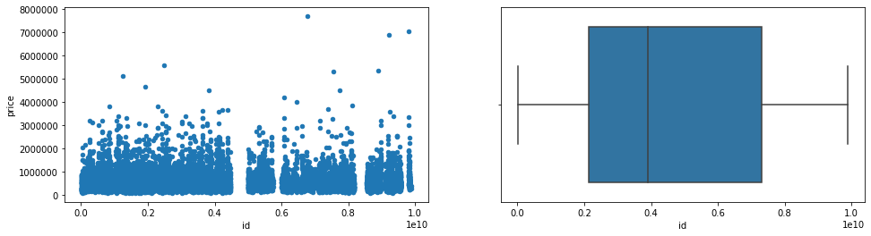


### date 

Drop Date


```python
df['date'] = pd.to_datetime(df['date'])
df['date'].dtype
```


    dtype('<M8[ns]')


```python
check_column_object(df,'date')
```

    DataType:
    	 datetime64[ns]
    Null Values Present = 0
    Stats = min   2014-05-02
    max   2015-05-27
    Name: date, dtype: datetime64[ns]
    
    Value Counts:


    2014-06-23    0.006575
    2014-06-25    0.006066
    2014-06-26    0.006066
    2014-07-08    0.005880
    2015-04-27    0.005834
                    ...   
    2014-07-27    0.000046
    2015-03-08    0.000046
    2014-11-02    0.000046
    2015-05-15    0.000046
    2015-05-24    0.000046
    Name: date, Length: 372, dtype: float64


### price


```python
check_column(df,'price')
```

    DataType:
    	 float64
    Null Values Present = 0


    count      21597.000
    mean      540296.574
    std       367368.140
    min        78000.000
    25%       322000.000
    50%       450000.000
    75%       645000.000
    max      7700000.000
    Name: price, dtype: float64


    
    Value Counts:


    350000.0    0.007964
    450000.0    0.007964
    550000.0    0.007362
    500000.0    0.007038
    425000.0    0.006945
                  ...   
    870515.0    0.000046
    336950.0    0.000046
    386100.0    0.000046
    176250.0    0.000046
    884744.0    0.000046
    Name: price, Length: 3622, dtype: float64


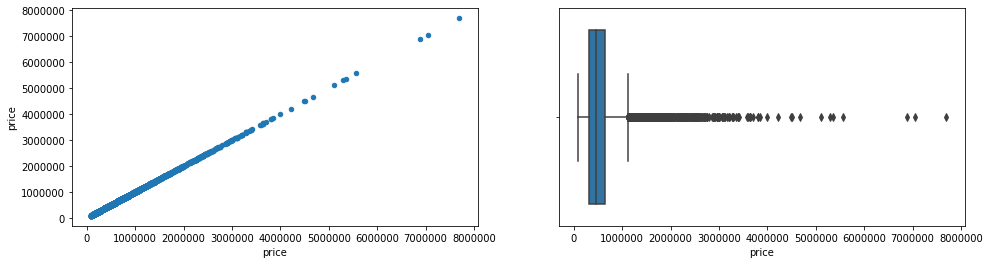


### bedrooms


```python
check_column(df,'bedrooms')
```

    DataType:
    	 int64
    Null Values Present = 0


    count    21597.000
    mean         3.373
    std          0.926
    min          1.000
    25%          3.000
    50%          3.000
    75%          4.000
    max         33.000
    Name: bedrooms, dtype: float64


    
    Value Counts:


    3     0.454878
    4     0.318655
    2     0.127796
    5     0.074131
    6     0.012594
    1     0.009075
    7     0.001760
    8     0.000602
    9     0.000278
    10    0.000139
    11    0.000046
    33    0.000046
    Name: bedrooms, dtype: float64


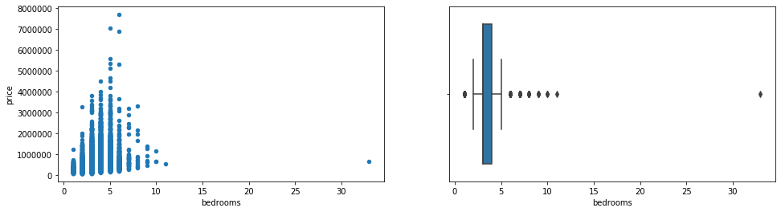


### bathrooms


```python
check_column(df,'bathrooms')
```

    DataType:
    	 float64
    Null Values Present = 0


    count    21597.000
    mean         2.116
    std          0.769
    min          0.500
    25%          1.750
    50%          2.250
    75%          2.500
    max          8.000
    Name: bathrooms, dtype: float64


    
    Value Counts:


    2.50    0.248970
    1.00    0.178312
    1.75    0.141131
    2.25    0.094782
    2.00    0.089364
    1.50    0.066907
    2.75    0.054869
    3.00    0.034866
    3.50    0.033847
    3.25    0.027272
    3.75    0.007177
    4.00    0.006297
    4.50    0.004630
    4.25    0.003658
    0.75    0.003287
    4.75    0.001065
    5.00    0.000972
    5.25    0.000602
    5.50    0.000463
    1.25    0.000417
    6.00    0.000278
    5.75    0.000185
    0.50    0.000185
    8.00    0.000093
    6.25    0.000093
    6.75    0.000093
    6.50    0.000093
    7.50    0.000046
    7.75    0.000046
    Name: bathrooms, dtype: float64


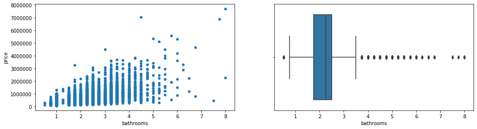


### sqft_living


```python
check_column(df,'sqft_living')
```

    DataType:
    	 int64
    Null Values Present = 0


    count    21597.000
    mean      2080.322
    std        918.106
    min        370.000
    25%       1430.000
    50%       1910.000
    75%       2550.000
    max      13540.000
    Name: sqft_living, dtype: float64


    
    Value Counts:


    1300    0.006390
    1400    0.006251
    1440    0.006158
    1660    0.005973
    1010    0.005973
              ...   
    4970    0.000046
    2905    0.000046
    2793    0.000046
    4810    0.000046
    1975    0.000046
    Name: sqft_living, Length: 1034, dtype: float64


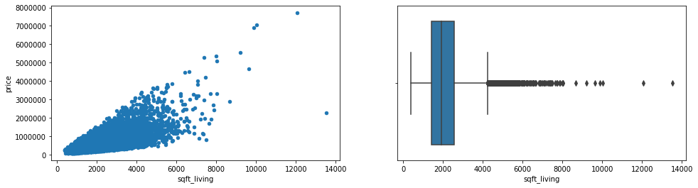


### sqft_lot


```python
check_column(df,'sqft_lot')
```

    DataType:
    	 int64
    Null Values Present = 0


    count      21597.000
    mean       15099.409
    std        41412.637
    min          520.000
    25%         5040.000
    50%         7618.000
    75%        10685.000
    max      1651359.000
    Name: sqft_lot, dtype: float64


    
    Value Counts:


    5000      0.016576
    6000      0.013428
    4000      0.011622
    7200      0.010187
    7500      0.005510
                ...   
    1448      0.000046
    38884     0.000046
    17313     0.000046
    35752     0.000046
    315374    0.000046
    Name: sqft_lot, Length: 9776, dtype: float64


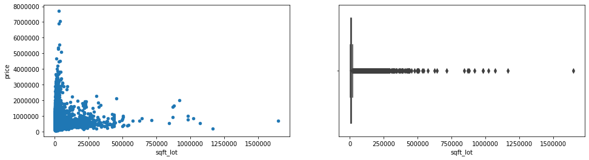


### floors


```python
check_column(df,'floors')
```

    DataType:
    	 float64
    Null Values Present = 0


    count    21597.000
    mean         1.494
    std          0.540
    min          1.000
    25%          1.000
    50%          1.500
    75%          2.000
    max          3.500
    Name: floors, dtype: float64


    
    Value Counts:


    1.0    0.494189
    2.0    0.381303
    1.5    0.088438
    3.0    0.028291
    2.5    0.007455
    3.5    0.000324
    Name: floors, dtype: float64


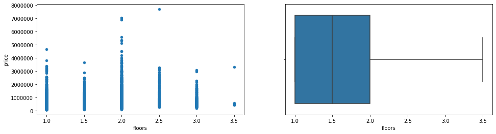


### waterfront


```python
check_column(df,'waterfront')
```

    DataType:
    	 float64
    Null Values Present = 2376


    count    19221.000
    mean         0.008
    std          0.087
    min          0.000
    25%          0.000
    50%          0.000
    75%          0.000
    max          1.000
    Name: waterfront, dtype: float64


    
    Value Counts:


    0.0    0.992404
    1.0    0.007596
    Name: waterfront, dtype: float64


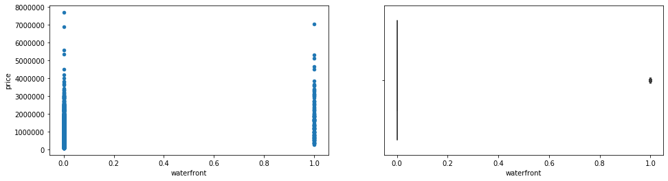


```python
df['waterfront'].fillna(0.0, inplace=True)

df['waterfront'].isna().sum()
```


    0


```python
df['wf'] = df['waterfront'].copy()

df['wf'].value_counts()
```


    0.0    21451
    1.0      146
    Name: wf, dtype: int64


### view


```python
check_column(df,'view')
```

    DataType:
    	 float64
    Null Values Present = 63


    count    21534.000
    mean         0.234
    std          0.766
    min          0.000
    25%          0.000
    50%          0.000
    75%          0.000
    max          4.000
    Name: view, dtype: float64


    
    Value Counts:


    0.0    0.901923
    2.0    0.044441
    3.0    0.023591
    1.0    0.015325
    4.0    0.014721
    Name: view, dtype: float64


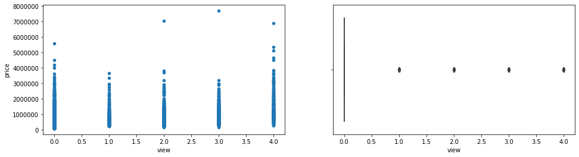


```python
df['view'].fillna(0, inplace=True)

df['view'].isna().sum()
```


    0


```python
df['viewed'] = df['view'].astype('bool')

df['viewed'].value_counts()
```


    False    19485
    True      2112
    Name: viewed, dtype: int64


### condition


```python
check_column(df,'condition')
```

    DataType:
    	 int64
    Null Values Present = 0


    count    21597.000
    mean         3.410
    std          0.651
    min          1.000
    25%          3.000
    50%          3.000
    75%          4.000
    max          5.000
    Name: condition, dtype: float64


    
    Value Counts:


    3    0.649164
    4    0.262861
    5    0.078761
    2    0.007871
    1    0.001343
    Name: condition, dtype: float64


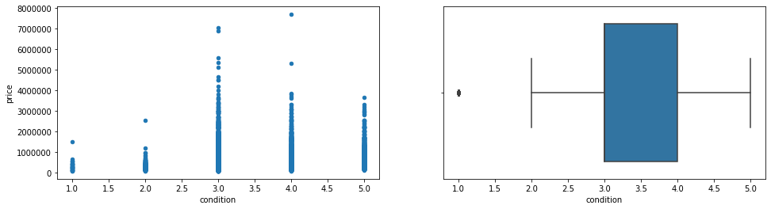


### grade


```python
check_column(df,'grade')
```

    DataType:
    	 int64
    Null Values Present = 0


    count    21597.000
    mean         7.658
    std          1.173
    min          3.000
    25%          7.000
    50%          7.000
    75%          8.000
    max         13.000
    Name: grade, dtype: float64


    
    Value Counts:


    7     0.415521
    8     0.280826
    9     0.121082
    6     0.094365
    10    0.052507
    11    0.018475
    5     0.011205
    12    0.004121
    4     0.001250
    13    0.000602
    3     0.000046
    Name: grade, dtype: float64


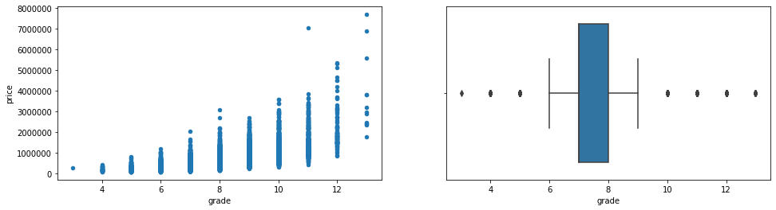


### sqft_above


```python
check_column(df,'sqft_above')
```

    DataType:
    	 int64
    Null Values Present = 0


    count    21597.000
    mean      1788.597
    std        827.760
    min        370.000
    25%       1190.000
    50%       1560.000
    75%       2210.000
    max       9410.000
    Name: sqft_above, dtype: float64


    
    Value Counts:


    1300    0.009816
    1010    0.009724
    1200    0.009538
    1220    0.008890
    1140    0.008520
              ...   
    2601    0.000046
    440     0.000046
    2473    0.000046
    2441    0.000046
    1975    0.000046
    Name: sqft_above, Length: 942, dtype: float64


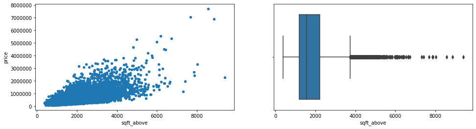


### sqft_basement


```python
df['sqft_basement'].replace(to_replace='?', value='0.0', inplace=True)
```


```python
df['sqft_basement'] = df['sqft_basement'].astype('float')
```


```python
check_column(df,'sqft_basement')
```

    DataType:
    	 float64
    Null Values Present = 0


    count    21597.000
    mean       285.717
    std        439.820
    min          0.000
    25%          0.000
    50%          0.000
    75%        550.000
    max       4820.000
    Name: sqft_basement, dtype: float64


    
    Value Counts:


    0.0       0.614900
    600.0     0.010048
    500.0     0.009677
    700.0     0.009631
    800.0     0.009307
                ...   
    915.0     0.000046
    295.0     0.000046
    1281.0    0.000046
    2130.0    0.000046
    906.0     0.000046
    Name: sqft_basement, Length: 303, dtype: float64


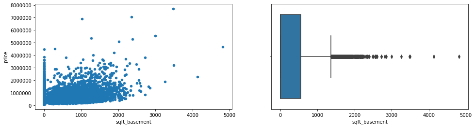


### yr_built


```python
check_column(df,'yr_built')
```

    DataType:
    	 int64
    Null Values Present = 0


    count    21597.000
    mean      1971.000
    std         29.375
    min       1900.000
    25%       1951.000
    50%       1975.000
    75%       1997.000
    max       2015.000
    Name: yr_built, dtype: float64


    
    Value Counts:


    2014    0.025883
    2006    0.020975
    2005    0.020836
    2004    0.020049
    2003    0.019447
              ...   
    1933    0.001389
    1901    0.001343
    1902    0.001250
    1935    0.001111
    1934    0.000972
    Name: yr_built, Length: 116, dtype: float64


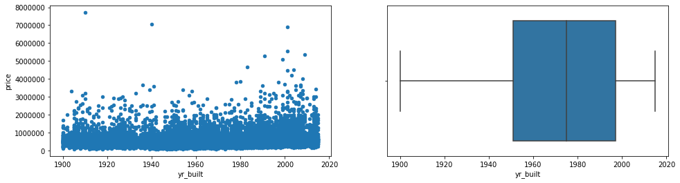


```python
quantile_list = [0, .25, .5, .75, 1.]
quantiles = df['yr_built'].quantile(quantile_list)

quantiles 
```


    0.00    1900.0
    0.25    1951.0
    0.50    1975.0
    0.75    1997.0
    1.00    2015.0
    Name: yr_built, dtype: float64


```python
yr_built_bins = [1899, 1951, 1975, 1997, 2015]
yb_labels = [1, 2, 3, 4]

df['yr_range'] = pd.cut(df['yr_built'], bins=yr_built_bins)

df['yr_category'] = pd.cut(df['yr_built'], bins=yr_built_bins, labels=yb_labels) 
```


```python
df[['yr_built','yr_range', 'yr_category']].iloc[800:810] 
```


<div>
<style scoped>
    .dataframe tbody tr th:only-of-type {
        vertical-align: middle;
    }

    .dataframe tbody tr th {
        vertical-align: top;
    }

    .dataframe thead th {
        text-align: right;
    }
</style>
<table border="1" class="dataframe">
  <thead>
    <tr style="text-align: right;">
      <th></th>
      <th>yr_built</th>
      <th>yr_range</th>
      <th>yr_category</th>
    </tr>
  </thead>
  <tbody>
    <tr>
      <td>800</td>
      <td>1913</td>
      <td>(1899, 1951]</td>
      <td>1</td>
    </tr>
    <tr>
      <td>801</td>
      <td>1967</td>
      <td>(1951, 1975]</td>
      <td>2</td>
    </tr>
    <tr>
      <td>802</td>
      <td>1987</td>
      <td>(1975, 1997]</td>
      <td>3</td>
    </tr>
    <tr>
      <td>803</td>
      <td>2007</td>
      <td>(1997, 2015]</td>
      <td>4</td>
    </tr>
    <tr>
      <td>804</td>
      <td>1954</td>
      <td>(1951, 1975]</td>
      <td>2</td>
    </tr>
    <tr>
      <td>805</td>
      <td>1989</td>
      <td>(1975, 1997]</td>
      <td>3</td>
    </tr>
    <tr>
      <td>806</td>
      <td>1989</td>
      <td>(1975, 1997]</td>
      <td>3</td>
    </tr>
    <tr>
      <td>807</td>
      <td>1977</td>
      <td>(1975, 1997]</td>
      <td>3</td>
    </tr>
    <tr>
      <td>808</td>
      <td>2004</td>
      <td>(1997, 2015]</td>
      <td>4</td>
    </tr>
    <tr>
      <td>809</td>
      <td>1999</td>
      <td>(1997, 2015]</td>
      <td>4</td>
    </tr>
  </tbody>
</table>
</div>


### yr_renovated


```python
check_column(df,'yr_renovated')
```

    DataType:
    	 float64
    Null Values Present = 3842


    count    17755.000
    mean        83.637
    std        399.946
    min          0.000
    25%          0.000
    50%          0.000
    75%          0.000
    max       2015.000
    Name: yr_renovated, dtype: float64


    
    Value Counts:


    0.0       0.958096
    2014.0    0.004112
    2003.0    0.001746
    2013.0    0.001746
    2007.0    0.001690
                ...   
    1946.0    0.000056
    1959.0    0.000056
    1971.0    0.000056
    1951.0    0.000056
    1954.0    0.000056
    Name: yr_renovated, Length: 70, dtype: float64


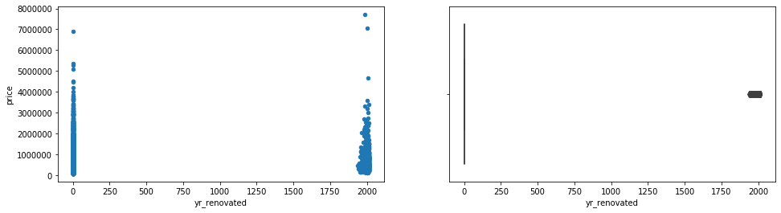


```python
df['yr_renovated'].fillna(0.0, inplace=True)

df['yr_renovated'].isna().sum()
```


    0


```python
df['is_renovated'] = np.where (df['yr_renovated'] == 0.0, 0, 1)

df['is_renovated'].value_counts()
```


    0    20853
    1      744
    Name: is_renovated, dtype: int64


### zipcode


```python
check_column(df,'zipcode')
```

    DataType:
    	 int64
    Null Values Present = 0


    count    21597.000
    mean     98077.952
    std         53.513
    min      98001.000
    25%      98033.000
    50%      98065.000
    75%      98118.000
    max      98199.000
    Name: zipcode, dtype: float64


    
    Value Counts:


    98103    0.027874
    98038    0.027272
    98115    0.026994
    98052    0.026578
    98117    0.025605
               ...   
    98102    0.004815
    98010    0.004630
    98024    0.003704
    98148    0.002639
    98039    0.002315
    Name: zipcode, Length: 70, dtype: float64


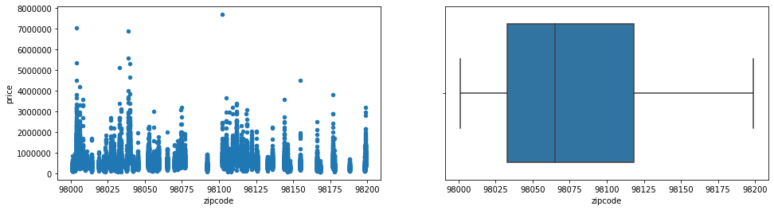


### lat	long

Eliminated due to correlation with zipcodes.

### sqft_living15


```python
check_column(df,'sqft_living15')
```

    DataType:
    	 int64
    Null Values Present = 0


    count    21597.00
    mean      1986.62
    std        685.23
    min        399.00
    25%       1490.00
    50%       1840.00
    75%       2360.00
    max       6210.00
    Name: sqft_living15, dtype: float64


    
    Value Counts:


    1540    0.009122
    1440    0.009029
    1560    0.008890
    1500    0.008334
    1460    0.007825
              ...   
    4890    0.000046
    2873    0.000046
    952     0.000046
    3193    0.000046
    2049    0.000046
    Name: sqft_living15, Length: 777, dtype: float64


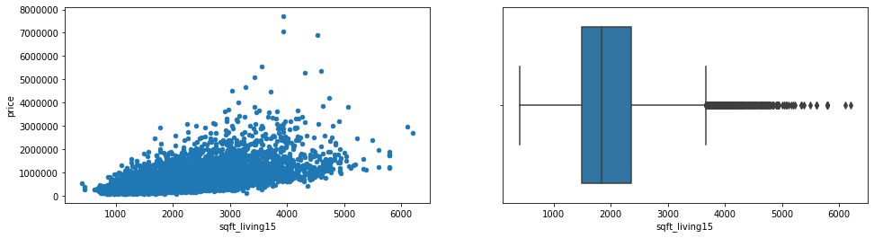


### sqft_lot15


```python
check_column(df,'sqft_lot15')
```

    DataType:
    	 int64
    Null Values Present = 0


    count     21597.000
    mean      12758.284
    std       27274.442
    min         651.000
    25%        5100.000
    50%        7620.000
    75%       10083.000
    max      871200.000
    Name: sqft_lot15, dtype: float64


    
    Value Counts:


    5000      0.019771
    4000      0.016484
    6000      0.013335
    7200      0.009724
    4800      0.006714
                ...   
    11036     0.000046
    8989      0.000046
    871200    0.000046
    809       0.000046
    6147      0.000046
    Name: sqft_lot15, Length: 8682, dtype: float64


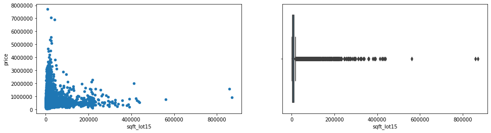


# EXPLORE

## Correlation


```python
corr = df.corr()

def corrplot(corr,figsize=(20,20)):
    fig, ax = plt.subplots(figsize=figsize)

    mask = np.zeros_like(corr, dtype=np.bool)
    idx = np.triu_indices_from(mask)
    mask[idx] = True

    sns.heatmap(np.abs(corr),square=True,mask=mask,cmap="Blues",annot=True,ax=ax)
    ax.set_ylim(len(corr), -.5, .5)
    return fig, ax

corrplot(np.abs(corr.round(3)))
```


    (<Figure size 1440x1440 with 2 Axes>,
     <matplotlib.axes._subplots.AxesSubplot at 0x1a21b30780>)


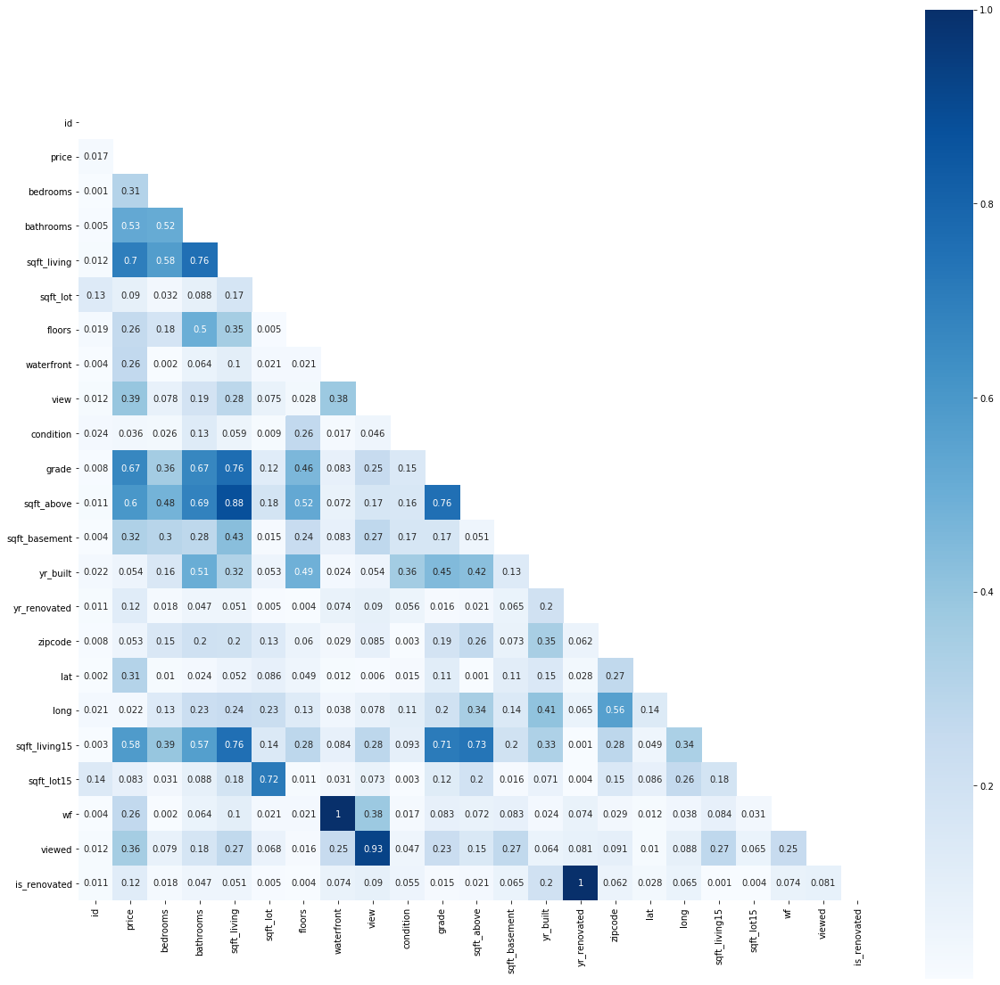


Drop "sqft_above" due to correlation with "sqft_living" and "grade". Drop "id" and "date" due to no significant statistical meaning. Drop "lat" and "long" due to correlation with "zipcode".


```python
drop_cols1 = ['sqft_above','id','lat', 'long', 'date']
df.drop(drop_cols1,axis=1,inplace=True)
```


```python
#df_post_corr.columns

df.columns
```


    Index(['price', 'bedrooms', 'bathrooms', 'sqft_living', 'sqft_lot', 'floors',
           'waterfront', 'view', 'condition', 'grade', 'sqft_basement', 'yr_built',
           'yr_renovated', 'zipcode', 'sqft_living15', 'sqft_lot15', 'wf',
           'viewed', 'yr_range', 'yr_category', 'is_renovated'],
          dtype='object')


```python
def histograms(df):
    plt.style.use('ggplot')
    for column in df.describe():
        fig = plt.figure(figsize=(12, 5))
        
        ax = fig.add_subplot(121)
        ax.hist(df[column], density=True, label = column+' histogram', bins=20)
        ax.set_title(column.capitalize())

        ax.legend()
        
        fig.tight_layout()
        
```


```python
df.describe()

```


<div>
<style scoped>
    .dataframe tbody tr th:only-of-type {
        vertical-align: middle;
    }

    .dataframe tbody tr th {
        vertical-align: top;
    }

    .dataframe thead th {
        text-align: right;
    }
</style>
<table border="1" class="dataframe">
  <thead>
    <tr style="text-align: right;">
      <th></th>
      <th>price</th>
      <th>bedrooms</th>
      <th>bathrooms</th>
      <th>sqft_living</th>
      <th>sqft_lot</th>
      <th>floors</th>
      <th>waterfront</th>
      <th>view</th>
      <th>condition</th>
      <th>grade</th>
      <th>sqft_basement</th>
      <th>yr_built</th>
      <th>yr_renovated</th>
      <th>zipcode</th>
      <th>sqft_living15</th>
      <th>sqft_lot15</th>
      <th>wf</th>
      <th>is_renovated</th>
    </tr>
  </thead>
  <tbody>
    <tr>
      <td>count</td>
      <td>2.159700e+04</td>
      <td>21597.000000</td>
      <td>21597.000000</td>
      <td>21597.000000</td>
      <td>2.159700e+04</td>
      <td>21597.000000</td>
      <td>21597.000000</td>
      <td>21597.000000</td>
      <td>21597.000000</td>
      <td>21597.000000</td>
      <td>21597.000000</td>
      <td>21597.000000</td>
      <td>21597.000000</td>
      <td>21597.000000</td>
      <td>21597.000000</td>
      <td>21597.000000</td>
      <td>21597.000000</td>
      <td>21597.000000</td>
    </tr>
    <tr>
      <td>mean</td>
      <td>5.402966e+05</td>
      <td>3.373200</td>
      <td>2.115826</td>
      <td>2080.321850</td>
      <td>1.509941e+04</td>
      <td>1.494096</td>
      <td>0.006760</td>
      <td>0.233181</td>
      <td>3.409825</td>
      <td>7.657915</td>
      <td>285.716581</td>
      <td>1970.999676</td>
      <td>68.758207</td>
      <td>98077.951845</td>
      <td>1986.620318</td>
      <td>12758.283512</td>
      <td>0.006760</td>
      <td>0.034449</td>
    </tr>
    <tr>
      <td>std</td>
      <td>3.673681e+05</td>
      <td>0.926299</td>
      <td>0.768984</td>
      <td>918.106125</td>
      <td>4.141264e+04</td>
      <td>0.539683</td>
      <td>0.081944</td>
      <td>0.764673</td>
      <td>0.650546</td>
      <td>1.173200</td>
      <td>439.819830</td>
      <td>29.375234</td>
      <td>364.037499</td>
      <td>53.513072</td>
      <td>685.230472</td>
      <td>27274.441950</td>
      <td>0.081944</td>
      <td>0.182384</td>
    </tr>
    <tr>
      <td>min</td>
      <td>7.800000e+04</td>
      <td>1.000000</td>
      <td>0.500000</td>
      <td>370.000000</td>
      <td>5.200000e+02</td>
      <td>1.000000</td>
      <td>0.000000</td>
      <td>0.000000</td>
      <td>1.000000</td>
      <td>3.000000</td>
      <td>0.000000</td>
      <td>1900.000000</td>
      <td>0.000000</td>
      <td>98001.000000</td>
      <td>399.000000</td>
      <td>651.000000</td>
      <td>0.000000</td>
      <td>0.000000</td>
    </tr>
    <tr>
      <td>25%</td>
      <td>3.220000e+05</td>
      <td>3.000000</td>
      <td>1.750000</td>
      <td>1430.000000</td>
      <td>5.040000e+03</td>
      <td>1.000000</td>
      <td>0.000000</td>
      <td>0.000000</td>
      <td>3.000000</td>
      <td>7.000000</td>
      <td>0.000000</td>
      <td>1951.000000</td>
      <td>0.000000</td>
      <td>98033.000000</td>
      <td>1490.000000</td>
      <td>5100.000000</td>
      <td>0.000000</td>
      <td>0.000000</td>
    </tr>
    <tr>
      <td>50%</td>
      <td>4.500000e+05</td>
      <td>3.000000</td>
      <td>2.250000</td>
      <td>1910.000000</td>
      <td>7.618000e+03</td>
      <td>1.500000</td>
      <td>0.000000</td>
      <td>0.000000</td>
      <td>3.000000</td>
      <td>7.000000</td>
      <td>0.000000</td>
      <td>1975.000000</td>
      <td>0.000000</td>
      <td>98065.000000</td>
      <td>1840.000000</td>
      <td>7620.000000</td>
      <td>0.000000</td>
      <td>0.000000</td>
    </tr>
    <tr>
      <td>75%</td>
      <td>6.450000e+05</td>
      <td>4.000000</td>
      <td>2.500000</td>
      <td>2550.000000</td>
      <td>1.068500e+04</td>
      <td>2.000000</td>
      <td>0.000000</td>
      <td>0.000000</td>
      <td>4.000000</td>
      <td>8.000000</td>
      <td>550.000000</td>
      <td>1997.000000</td>
      <td>0.000000</td>
      <td>98118.000000</td>
      <td>2360.000000</td>
      <td>10083.000000</td>
      <td>0.000000</td>
      <td>0.000000</td>
    </tr>
    <tr>
      <td>max</td>
      <td>7.700000e+06</td>
      <td>33.000000</td>
      <td>8.000000</td>
      <td>13540.000000</td>
      <td>1.651359e+06</td>
      <td>3.500000</td>
      <td>1.000000</td>
      <td>4.000000</td>
      <td>5.000000</td>
      <td>13.000000</td>
      <td>4820.000000</td>
      <td>2015.000000</td>
      <td>2015.000000</td>
      <td>98199.000000</td>
      <td>6210.000000</td>
      <td>871200.000000</td>
      <td>1.000000</td>
      <td>1.000000</td>
    </tr>
  </tbody>
</table>
</div>


```python
histograms(df)
```


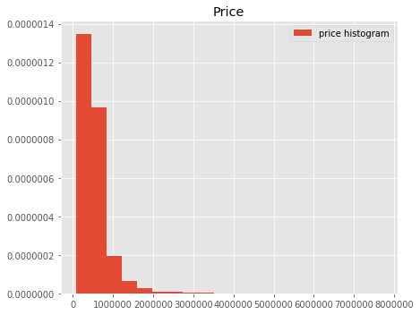


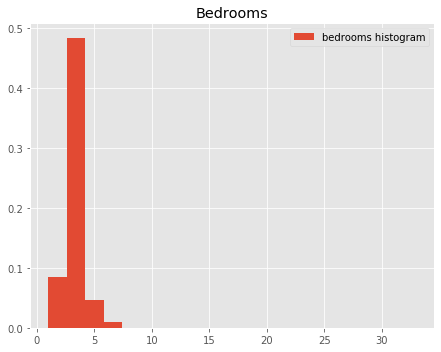


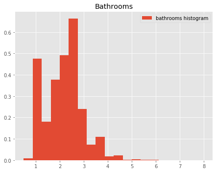


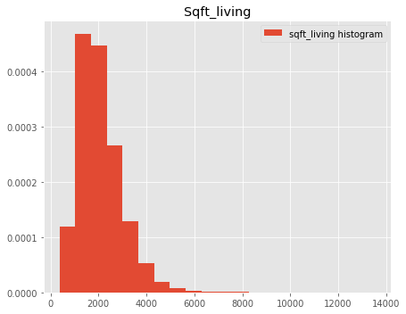


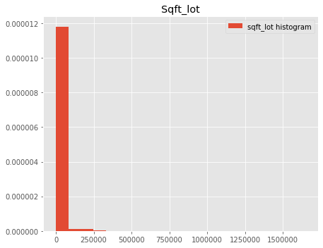


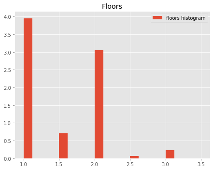


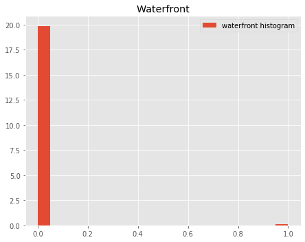


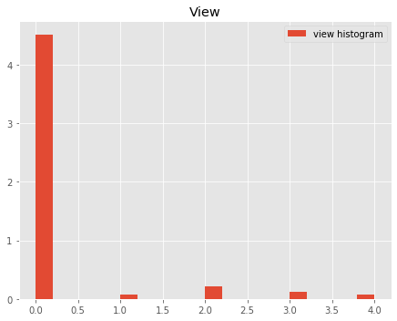


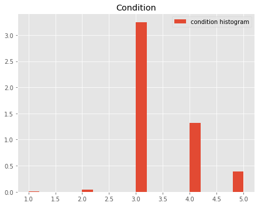


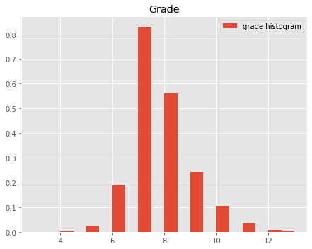


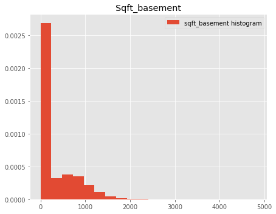


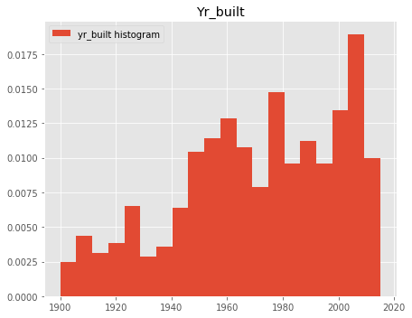


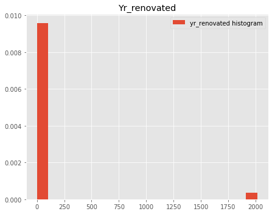


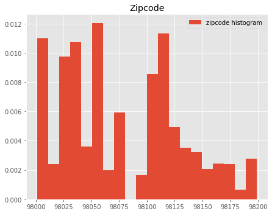


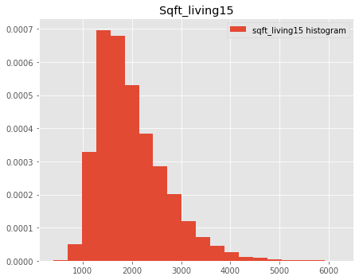


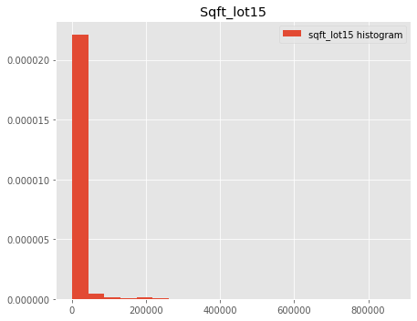


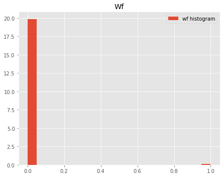


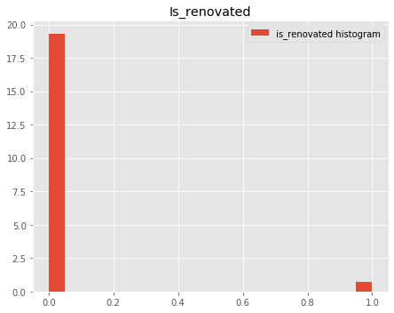


```python
log_cols = ['sqft_living', 'sqft_living15']


for col in log_cols:
    df[col+'_log'] = np.log(df[col])
```


```python
plt.style.use('ggplot')
fig, ax = plt.subplots(ncols=2, nrows=2, figsize=(12,12))
sns.distplot(df['sqft_living'], ax=ax[0][0])
sns.distplot(df['sqft_living_log'], ax=ax[0][1])
sns.distplot(df['sqft_living15'], ax=ax[1][0])
sns.distplot(df['sqft_living15_log'], ax=ax[1][1])
```


    <matplotlib.axes._subplots.AxesSubplot at 0x1a2386a358>


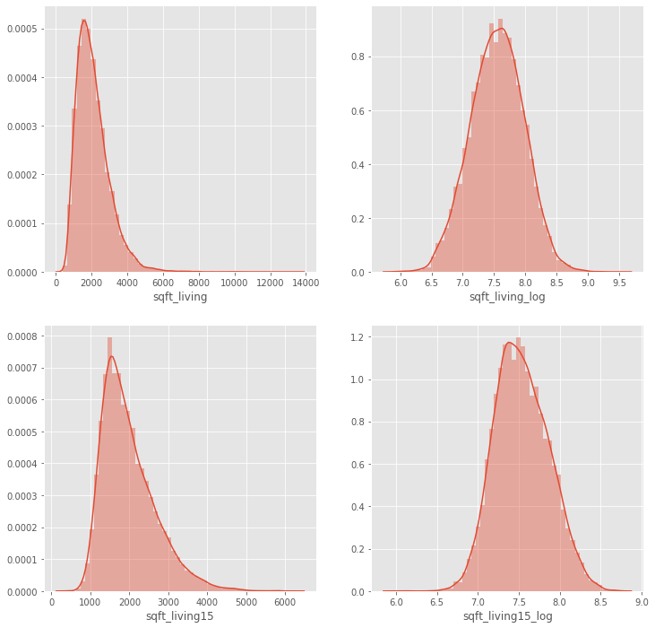


```python
df.head()
```


<div>
<style scoped>
    .dataframe tbody tr th:only-of-type {
        vertical-align: middle;
    }

    .dataframe tbody tr th {
        vertical-align: top;
    }

    .dataframe thead th {
        text-align: right;
    }
</style>
<table border="1" class="dataframe">
  <thead>
    <tr style="text-align: right;">
      <th></th>
      <th>price</th>
      <th>bedrooms</th>
      <th>bathrooms</th>
      <th>sqft_living</th>
      <th>sqft_lot</th>
      <th>floors</th>
      <th>waterfront</th>
      <th>view</th>
      <th>condition</th>
      <th>grade</th>
      <th>sqft_basement</th>
      <th>yr_built</th>
      <th>yr_renovated</th>
      <th>zipcode</th>
      <th>sqft_living15</th>
      <th>sqft_lot15</th>
      <th>wf</th>
      <th>viewed</th>
      <th>yr_range</th>
      <th>yr_category</th>
      <th>is_renovated</th>
      <th>sqft_living_log</th>
      <th>sqft_living15_log</th>
    </tr>
  </thead>
  <tbody>
    <tr>
      <td>0</td>
      <td>221900.0</td>
      <td>3</td>
      <td>1.00</td>
      <td>1180</td>
      <td>5650</td>
      <td>1.0</td>
      <td>0.0</td>
      <td>0.0</td>
      <td>3</td>
      <td>7</td>
      <td>0.0</td>
      <td>1955</td>
      <td>0.0</td>
      <td>98178</td>
      <td>1340</td>
      <td>5650</td>
      <td>0.0</td>
      <td>False</td>
      <td>(1951, 1975]</td>
      <td>2</td>
      <td>0</td>
      <td>7.073270</td>
      <td>7.200425</td>
    </tr>
    <tr>
      <td>1</td>
      <td>538000.0</td>
      <td>3</td>
      <td>2.25</td>
      <td>2570</td>
      <td>7242</td>
      <td>2.0</td>
      <td>0.0</td>
      <td>0.0</td>
      <td>3</td>
      <td>7</td>
      <td>400.0</td>
      <td>1951</td>
      <td>1991.0</td>
      <td>98125</td>
      <td>1690</td>
      <td>7639</td>
      <td>0.0</td>
      <td>False</td>
      <td>(1899, 1951]</td>
      <td>1</td>
      <td>1</td>
      <td>7.851661</td>
      <td>7.432484</td>
    </tr>
    <tr>
      <td>2</td>
      <td>180000.0</td>
      <td>2</td>
      <td>1.00</td>
      <td>770</td>
      <td>10000</td>
      <td>1.0</td>
      <td>0.0</td>
      <td>0.0</td>
      <td>3</td>
      <td>6</td>
      <td>0.0</td>
      <td>1933</td>
      <td>0.0</td>
      <td>98028</td>
      <td>2720</td>
      <td>8062</td>
      <td>0.0</td>
      <td>False</td>
      <td>(1899, 1951]</td>
      <td>1</td>
      <td>0</td>
      <td>6.646391</td>
      <td>7.908387</td>
    </tr>
    <tr>
      <td>3</td>
      <td>604000.0</td>
      <td>4</td>
      <td>3.00</td>
      <td>1960</td>
      <td>5000</td>
      <td>1.0</td>
      <td>0.0</td>
      <td>0.0</td>
      <td>5</td>
      <td>7</td>
      <td>910.0</td>
      <td>1965</td>
      <td>0.0</td>
      <td>98136</td>
      <td>1360</td>
      <td>5000</td>
      <td>0.0</td>
      <td>False</td>
      <td>(1951, 1975]</td>
      <td>2</td>
      <td>0</td>
      <td>7.580700</td>
      <td>7.215240</td>
    </tr>
    <tr>
      <td>4</td>
      <td>510000.0</td>
      <td>3</td>
      <td>2.00</td>
      <td>1680</td>
      <td>8080</td>
      <td>1.0</td>
      <td>0.0</td>
      <td>0.0</td>
      <td>3</td>
      <td>8</td>
      <td>0.0</td>
      <td>1987</td>
      <td>0.0</td>
      <td>98074</td>
      <td>1800</td>
      <td>7503</td>
      <td>0.0</td>
      <td>False</td>
      <td>(1975, 1997]</td>
      <td>3</td>
      <td>0</td>
      <td>7.426549</td>
      <td>7.495542</td>
    </tr>
  </tbody>
</table>
</div>


```python

```

## Scaling

Scale everything except the target and boolean variables.


```python
import warnings
warnings.filterwarnings('ignore')

scale_cols = ['bedrooms', 'bathrooms', 'sqft_living', 'sqft_lot', 'floors', 'view', 'condition',
              'grade', 'sqft_basement', 'sqft_living15', 'sqft_lot15', 'sqft_living_log',
              'sqft_living15_log']

scaler = StandardScaler()


for col in scale_cols:
    col_data = df[col].values
    stdscale = scaler.fit_transform(col_data.reshape(-1, 1))
    df['sca_'+col] = stdscale.flatten()
    
df.describe().round(3)    


```


<div>
<style scoped>
    .dataframe tbody tr th:only-of-type {
        vertical-align: middle;
    }

    .dataframe tbody tr th {
        vertical-align: top;
    }

    .dataframe thead th {
        text-align: right;
    }
</style>
<table border="1" class="dataframe">
  <thead>
    <tr style="text-align: right;">
      <th></th>
      <th>price</th>
      <th>bedrooms</th>
      <th>bathrooms</th>
      <th>sqft_living</th>
      <th>sqft_lot</th>
      <th>floors</th>
      <th>waterfront</th>
      <th>view</th>
      <th>condition</th>
      <th>grade</th>
      <th>sqft_basement</th>
      <th>yr_built</th>
      <th>yr_renovated</th>
      <th>zipcode</th>
      <th>sqft_living15</th>
      <th>sqft_lot15</th>
      <th>wf</th>
      <th>is_renovated</th>
      <th>sqft_living_log</th>
      <th>sqft_living15_log</th>
      <th>sca_bedrooms</th>
      <th>sca_bathrooms</th>
      <th>sca_sqft_living</th>
      <th>sca_sqft_lot</th>
      <th>sca_floors</th>
      <th>sca_view</th>
      <th>sca_condition</th>
      <th>sca_grade</th>
      <th>sca_sqft_basement</th>
      <th>sca_sqft_living15</th>
      <th>sca_sqft_lot15</th>
      <th>sca_sqft_living_log</th>
      <th>sca_sqft_living15_log</th>
    </tr>
  </thead>
  <tbody>
    <tr>
      <td>count</td>
      <td>21597.000</td>
      <td>21597.000</td>
      <td>21597.000</td>
      <td>21597.000</td>
      <td>21597.000</td>
      <td>21597.000</td>
      <td>21597.000</td>
      <td>21597.000</td>
      <td>21597.000</td>
      <td>21597.000</td>
      <td>21597.000</td>
      <td>21597.000</td>
      <td>21597.000</td>
      <td>21597.000</td>
      <td>21597.00</td>
      <td>21597.000</td>
      <td>21597.000</td>
      <td>21597.000</td>
      <td>21597.000</td>
      <td>21597.000</td>
      <td>21597.000</td>
      <td>21597.000</td>
      <td>21597.000</td>
      <td>21597.000</td>
      <td>21597.000</td>
      <td>21597.000</td>
      <td>21597.000</td>
      <td>21597.000</td>
      <td>21597.000</td>
      <td>21597.000</td>
      <td>21597.000</td>
      <td>21597.000</td>
      <td>21597.000</td>
    </tr>
    <tr>
      <td>mean</td>
      <td>540296.574</td>
      <td>3.373</td>
      <td>2.116</td>
      <td>2080.322</td>
      <td>15099.409</td>
      <td>1.494</td>
      <td>0.007</td>
      <td>0.233</td>
      <td>3.410</td>
      <td>7.658</td>
      <td>285.717</td>
      <td>1971.000</td>
      <td>68.758</td>
      <td>98077.952</td>
      <td>1986.62</td>
      <td>12758.284</td>
      <td>0.007</td>
      <td>0.034</td>
      <td>7.551</td>
      <td>7.539</td>
      <td>-0.000</td>
      <td>0.000</td>
      <td>-0.000</td>
      <td>0.000</td>
      <td>-0.000</td>
      <td>0.000</td>
      <td>0.000</td>
      <td>0.000</td>
      <td>-0.000</td>
      <td>0.000</td>
      <td>0.000</td>
      <td>-0.000</td>
      <td>-0.000</td>
    </tr>
    <tr>
      <td>std</td>
      <td>367368.140</td>
      <td>0.926</td>
      <td>0.769</td>
      <td>918.106</td>
      <td>41412.637</td>
      <td>0.540</td>
      <td>0.082</td>
      <td>0.765</td>
      <td>0.651</td>
      <td>1.173</td>
      <td>439.820</td>
      <td>29.375</td>
      <td>364.037</td>
      <td>53.513</td>
      <td>685.23</td>
      <td>27274.442</td>
      <td>0.082</td>
      <td>0.182</td>
      <td>0.424</td>
      <td>0.327</td>
      <td>1.000</td>
      <td>1.000</td>
      <td>1.000</td>
      <td>1.000</td>
      <td>1.000</td>
      <td>1.000</td>
      <td>1.000</td>
      <td>1.000</td>
      <td>1.000</td>
      <td>1.000</td>
      <td>1.000</td>
      <td>1.000</td>
      <td>1.000</td>
    </tr>
    <tr>
      <td>min</td>
      <td>78000.000</td>
      <td>1.000</td>
      <td>0.500</td>
      <td>370.000</td>
      <td>520.000</td>
      <td>1.000</td>
      <td>0.000</td>
      <td>0.000</td>
      <td>1.000</td>
      <td>3.000</td>
      <td>0.000</td>
      <td>1900.000</td>
      <td>0.000</td>
      <td>98001.000</td>
      <td>399.00</td>
      <td>651.000</td>
      <td>0.000</td>
      <td>0.000</td>
      <td>5.914</td>
      <td>5.989</td>
      <td>-2.562</td>
      <td>-2.101</td>
      <td>-1.863</td>
      <td>-0.352</td>
      <td>-0.916</td>
      <td>-0.305</td>
      <td>-3.704</td>
      <td>-3.970</td>
      <td>-0.650</td>
      <td>-2.317</td>
      <td>-0.444</td>
      <td>-3.860</td>
      <td>-4.735</td>
    </tr>
    <tr>
      <td>25%</td>
      <td>322000.000</td>
      <td>3.000</td>
      <td>1.750</td>
      <td>1430.000</td>
      <td>5040.000</td>
      <td>1.000</td>
      <td>0.000</td>
      <td>0.000</td>
      <td>3.000</td>
      <td>7.000</td>
      <td>0.000</td>
      <td>1951.000</td>
      <td>0.000</td>
      <td>98033.000</td>
      <td>1490.00</td>
      <td>5100.000</td>
      <td>0.000</td>
      <td>0.000</td>
      <td>7.265</td>
      <td>7.307</td>
      <td>-0.403</td>
      <td>-0.476</td>
      <td>-0.708</td>
      <td>-0.243</td>
      <td>-0.916</td>
      <td>-0.305</td>
      <td>-0.630</td>
      <td>-0.561</td>
      <td>-0.650</td>
      <td>-0.725</td>
      <td>-0.281</td>
      <td>-0.673</td>
      <td>-0.711</td>
    </tr>
    <tr>
      <td>50%</td>
      <td>450000.000</td>
      <td>3.000</td>
      <td>2.250</td>
      <td>1910.000</td>
      <td>7618.000</td>
      <td>1.500</td>
      <td>0.000</td>
      <td>0.000</td>
      <td>3.000</td>
      <td>7.000</td>
      <td>0.000</td>
      <td>1975.000</td>
      <td>0.000</td>
      <td>98065.000</td>
      <td>1840.00</td>
      <td>7620.000</td>
      <td>0.000</td>
      <td>0.000</td>
      <td>7.555</td>
      <td>7.518</td>
      <td>-0.403</td>
      <td>0.174</td>
      <td>-0.186</td>
      <td>-0.181</td>
      <td>0.011</td>
      <td>-0.305</td>
      <td>-0.630</td>
      <td>-0.561</td>
      <td>-0.650</td>
      <td>-0.214</td>
      <td>-0.188</td>
      <td>0.010</td>
      <td>-0.067</td>
    </tr>
    <tr>
      <td>75%</td>
      <td>645000.000</td>
      <td>4.000</td>
      <td>2.500</td>
      <td>2550.000</td>
      <td>10685.000</td>
      <td>2.000</td>
      <td>0.000</td>
      <td>0.000</td>
      <td>4.000</td>
      <td>8.000</td>
      <td>550.000</td>
      <td>1997.000</td>
      <td>0.000</td>
      <td>98118.000</td>
      <td>2360.00</td>
      <td>10083.000</td>
      <td>0.000</td>
      <td>0.000</td>
      <td>7.844</td>
      <td>7.766</td>
      <td>0.677</td>
      <td>0.500</td>
      <td>0.512</td>
      <td>-0.107</td>
      <td>0.937</td>
      <td>-0.305</td>
      <td>0.907</td>
      <td>0.292</td>
      <td>0.601</td>
      <td>0.545</td>
      <td>-0.098</td>
      <td>0.691</td>
      <td>0.693</td>
    </tr>
    <tr>
      <td>max</td>
      <td>7700000.000</td>
      <td>33.000</td>
      <td>8.000</td>
      <td>13540.000</td>
      <td>1651359.000</td>
      <td>3.500</td>
      <td>1.000</td>
      <td>4.000</td>
      <td>5.000</td>
      <td>13.000</td>
      <td>4820.000</td>
      <td>2015.000</td>
      <td>2015.000</td>
      <td>98199.000</td>
      <td>6210.00</td>
      <td>871200.000</td>
      <td>1.000</td>
      <td>1.000</td>
      <td>9.513</td>
      <td>8.734</td>
      <td>31.985</td>
      <td>7.652</td>
      <td>12.482</td>
      <td>39.512</td>
      <td>3.717</td>
      <td>4.926</td>
      <td>2.444</td>
      <td>4.554</td>
      <td>10.310</td>
      <td>6.164</td>
      <td>31.475</td>
      <td>4.627</td>
      <td>3.648</td>
    </tr>
  </tbody>
</table>
</div>


```python
df.shape
```


    (21597, 36)


## Drop Outliers


```python
def find_outliers(col):
    """Use scipy to calcualte absoliute Z-scores 
    and return boolean series where True indicates it is an outlier
    Args:
        col (Series): a series/column from your DataFrame
    Returns:
        idx_outliers (Series): series of  True/False for each row in col
        
    Ex:
    >> idx_outs = find_outliers(df['bedrooms'])
    >> df_clean = df.loc[idx_outs==False]"""
    from scipy import stats
    z = np.abs(stats.zscore(col))
    idx_outliers = np.where(z>3,True,False)
    return pd.Series(idx_outliers,index=col.index)

idx = find_outliers(df['price'])
idx


```


    0        False
    1        False
    2        False
    3        False
    4        False
             ...  
    21592    False
    21593    False
    21594    False
    21595    False
    21596    False
    Length: 21597, dtype: bool


```python
display(df.loc[idx==True].describe().round(3))
display(df.loc[idx==False].describe().round(3))
df = df.loc[idx==False]
```


<div>
<style scoped>
    .dataframe tbody tr th:only-of-type {
        vertical-align: middle;
    }

    .dataframe tbody tr th {
        vertical-align: top;
    }

    .dataframe thead th {
        text-align: right;
    }
</style>
<table border="1" class="dataframe">
  <thead>
    <tr style="text-align: right;">
      <th></th>
      <th>price</th>
      <th>bedrooms</th>
      <th>bathrooms</th>
      <th>sqft_living</th>
      <th>sqft_lot</th>
      <th>floors</th>
      <th>waterfront</th>
      <th>view</th>
      <th>condition</th>
      <th>grade</th>
      <th>sqft_basement</th>
      <th>yr_built</th>
      <th>yr_renovated</th>
      <th>zipcode</th>
      <th>sqft_living15</th>
      <th>sqft_lot15</th>
      <th>wf</th>
      <th>is_renovated</th>
      <th>sqft_living_log</th>
      <th>sqft_living15_log</th>
      <th>sca_bedrooms</th>
      <th>sca_bathrooms</th>
      <th>sca_sqft_living</th>
      <th>sca_sqft_lot</th>
      <th>sca_floors</th>
      <th>sca_view</th>
      <th>sca_condition</th>
      <th>sca_grade</th>
      <th>sca_sqft_basement</th>
      <th>sca_sqft_living15</th>
      <th>sca_sqft_lot15</th>
      <th>sca_sqft_living_log</th>
      <th>sca_sqft_living15_log</th>
    </tr>
  </thead>
  <tbody>
    <tr>
      <td>count</td>
      <td>406.000</td>
      <td>406.000</td>
      <td>406.000</td>
      <td>406.000</td>
      <td>406.000</td>
      <td>406.000</td>
      <td>406.000</td>
      <td>406.000</td>
      <td>406.000</td>
      <td>406.000</td>
      <td>406.000</td>
      <td>406.000</td>
      <td>406.000</td>
      <td>406.00</td>
      <td>406.000</td>
      <td>406.000</td>
      <td>406.000</td>
      <td>406.000</td>
      <td>406.000</td>
      <td>406.000</td>
      <td>406.000</td>
      <td>406.000</td>
      <td>406.000</td>
      <td>406.000</td>
      <td>406.000</td>
      <td>406.000</td>
      <td>406.000</td>
      <td>406.000</td>
      <td>406.000</td>
      <td>406.000</td>
      <td>406.000</td>
      <td>406.000</td>
      <td>406.000</td>
    </tr>
    <tr>
      <td>mean</td>
      <td>2277660.099</td>
      <td>4.266</td>
      <td>3.594</td>
      <td>4577.089</td>
      <td>29331.751</td>
      <td>1.872</td>
      <td>0.163</td>
      <td>1.717</td>
      <td>3.502</td>
      <td>10.404</td>
      <td>842.675</td>
      <td>1974.818</td>
      <td>250.970</td>
      <td>98060.32</td>
      <td>3355.771</td>
      <td>19364.182</td>
      <td>0.163</td>
      <td>0.126</td>
      <td>8.390</td>
      <td>8.088</td>
      <td>0.964</td>
      <td>1.922</td>
      <td>2.720</td>
      <td>0.344</td>
      <td>0.700</td>
      <td>1.940</td>
      <td>0.142</td>
      <td>2.341</td>
      <td>1.266</td>
      <td>1.998</td>
      <td>0.242</td>
      <td>1.978</td>
      <td>1.676</td>
    </tr>
    <tr>
      <td>std</td>
      <td>768348.039</td>
      <td>0.944</td>
      <td>0.978</td>
      <td>1395.282</td>
      <td>76438.853</td>
      <td>0.474</td>
      <td>0.369</td>
      <td>1.675</td>
      <td>0.726</td>
      <td>1.163</td>
      <td>809.210</td>
      <td>33.560</td>
      <td>662.969</td>
      <td>56.07</td>
      <td>815.443</td>
      <td>30513.711</td>
      <td>0.369</td>
      <td>0.332</td>
      <td>0.272</td>
      <td>0.250</td>
      <td>1.020</td>
      <td>1.272</td>
      <td>1.520</td>
      <td>1.846</td>
      <td>0.878</td>
      <td>2.191</td>
      <td>1.116</td>
      <td>0.991</td>
      <td>1.840</td>
      <td>1.190</td>
      <td>1.119</td>
      <td>0.641</td>
      <td>0.763</td>
    </tr>
    <tr>
      <td>min</td>
      <td>1650000.000</td>
      <td>2.000</td>
      <td>1.750</td>
      <td>2360.000</td>
      <td>1880.000</td>
      <td>1.000</td>
      <td>0.000</td>
      <td>0.000</td>
      <td>2.000</td>
      <td>7.000</td>
      <td>0.000</td>
      <td>1900.000</td>
      <td>0.000</td>
      <td>98004.00</td>
      <td>1490.000</td>
      <td>2199.000</td>
      <td>0.000</td>
      <td>0.000</td>
      <td>7.766</td>
      <td>7.307</td>
      <td>-1.482</td>
      <td>-0.476</td>
      <td>0.305</td>
      <td>-0.319</td>
      <td>-0.916</td>
      <td>-0.305</td>
      <td>-2.167</td>
      <td>-0.561</td>
      <td>-0.650</td>
      <td>-0.725</td>
      <td>-0.387</td>
      <td>0.509</td>
      <td>-0.711</td>
    </tr>
    <tr>
      <td>25%</td>
      <td>1792500.000</td>
      <td>4.000</td>
      <td>3.000</td>
      <td>3715.000</td>
      <td>8864.500</td>
      <td>2.000</td>
      <td>0.000</td>
      <td>0.000</td>
      <td>3.000</td>
      <td>10.000</td>
      <td>0.000</td>
      <td>1950.000</td>
      <td>0.000</td>
      <td>98006.00</td>
      <td>2870.000</td>
      <td>8557.250</td>
      <td>0.000</td>
      <td>0.000</td>
      <td>8.220</td>
      <td>7.962</td>
      <td>0.677</td>
      <td>1.150</td>
      <td>1.781</td>
      <td>-0.151</td>
      <td>0.937</td>
      <td>-0.305</td>
      <td>-0.630</td>
      <td>1.996</td>
      <td>-0.650</td>
      <td>1.289</td>
      <td>-0.154</td>
      <td>1.578</td>
      <td>1.290</td>
    </tr>
    <tr>
      <td>50%</td>
      <td>2000000.000</td>
      <td>4.000</td>
      <td>3.500</td>
      <td>4325.000</td>
      <td>14754.000</td>
      <td>2.000</td>
      <td>0.000</td>
      <td>2.000</td>
      <td>3.000</td>
      <td>10.000</td>
      <td>835.000</td>
      <td>1988.000</td>
      <td>0.000</td>
      <td>98040.00</td>
      <td>3290.000</td>
      <td>13224.500</td>
      <td>0.000</td>
      <td>0.000</td>
      <td>8.372</td>
      <td>8.099</td>
      <td>0.677</td>
      <td>1.800</td>
      <td>2.445</td>
      <td>-0.008</td>
      <td>0.937</td>
      <td>2.311</td>
      <td>-0.630</td>
      <td>1.996</td>
      <td>1.249</td>
      <td>1.902</td>
      <td>0.017</td>
      <td>1.937</td>
      <td>1.708</td>
    </tr>
    <tr>
      <td>75%</td>
      <td>2497500.000</td>
      <td>5.000</td>
      <td>4.250</td>
      <td>5150.000</td>
      <td>21241.000</td>
      <td>2.000</td>
      <td>0.000</td>
      <td>3.000</td>
      <td>4.000</td>
      <td>11.000</td>
      <td>1377.500</td>
      <td>2004.000</td>
      <td>0.000</td>
      <td>98112.00</td>
      <td>3847.500</td>
      <td>19273.250</td>
      <td>0.000</td>
      <td>0.000</td>
      <td>8.547</td>
      <td>8.255</td>
      <td>1.756</td>
      <td>2.775</td>
      <td>3.344</td>
      <td>0.148</td>
      <td>0.937</td>
      <td>3.618</td>
      <td>0.907</td>
      <td>2.849</td>
      <td>2.482</td>
      <td>2.716</td>
      <td>0.239</td>
      <td>2.348</td>
      <td>2.186</td>
    </tr>
    <tr>
      <td>max</td>
      <td>7700000.000</td>
      <td>8.000</td>
      <td>8.000</td>
      <td>13540.000</td>
      <td>920423.000</td>
      <td>3.500</td>
      <td>1.000</td>
      <td>4.000</td>
      <td>5.000</td>
      <td>13.000</td>
      <td>4820.000</td>
      <td>2015.000</td>
      <td>2014.000</td>
      <td>98199.00</td>
      <td>6210.000</td>
      <td>411962.000</td>
      <td>1.000</td>
      <td>1.000</td>
      <td>9.513</td>
      <td>8.734</td>
      <td>4.995</td>
      <td>7.652</td>
      <td>12.482</td>
      <td>21.862</td>
      <td>3.717</td>
      <td>4.926</td>
      <td>2.444</td>
      <td>4.554</td>
      <td>10.310</td>
      <td>6.164</td>
      <td>14.637</td>
      <td>4.627</td>
      <td>3.648</td>
    </tr>
  </tbody>
</table>
</div>


<div>
<style scoped>
    .dataframe tbody tr th:only-of-type {
        vertical-align: middle;
    }

    .dataframe tbody tr th {
        vertical-align: top;
    }

    .dataframe thead th {
        text-align: right;
    }
</style>
<table border="1" class="dataframe">
  <thead>
    <tr style="text-align: right;">
      <th></th>
      <th>price</th>
      <th>bedrooms</th>
      <th>bathrooms</th>
      <th>sqft_living</th>
      <th>sqft_lot</th>
      <th>floors</th>
      <th>waterfront</th>
      <th>view</th>
      <th>condition</th>
      <th>grade</th>
      <th>sqft_basement</th>
      <th>yr_built</th>
      <th>yr_renovated</th>
      <th>zipcode</th>
      <th>sqft_living15</th>
      <th>sqft_lot15</th>
      <th>wf</th>
      <th>is_renovated</th>
      <th>sqft_living_log</th>
      <th>sqft_living15_log</th>
      <th>sca_bedrooms</th>
      <th>sca_bathrooms</th>
      <th>sca_sqft_living</th>
      <th>sca_sqft_lot</th>
      <th>sca_floors</th>
      <th>sca_view</th>
      <th>sca_condition</th>
      <th>sca_grade</th>
      <th>sca_sqft_basement</th>
      <th>sca_sqft_living15</th>
      <th>sca_sqft_lot15</th>
      <th>sca_sqft_living_log</th>
      <th>sca_sqft_living15_log</th>
    </tr>
  </thead>
  <tbody>
    <tr>
      <td>count</td>
      <td>21191.000</td>
      <td>21191.000</td>
      <td>21191.000</td>
      <td>21191.000</td>
      <td>21191.000</td>
      <td>21191.000</td>
      <td>21191.000</td>
      <td>21191.000</td>
      <td>21191.000</td>
      <td>21191.000</td>
      <td>21191.000</td>
      <td>21191.000</td>
      <td>21191.000</td>
      <td>21191.000</td>
      <td>21191.000</td>
      <td>21191.000</td>
      <td>21191.000</td>
      <td>21191.000</td>
      <td>21191.000</td>
      <td>21191.000</td>
      <td>21191.000</td>
      <td>21191.000</td>
      <td>21191.000</td>
      <td>21191.000</td>
      <td>21191.000</td>
      <td>21191.000</td>
      <td>21191.000</td>
      <td>21191.000</td>
      <td>21191.000</td>
      <td>21191.000</td>
      <td>21191.000</td>
      <td>21191.000</td>
      <td>21191.000</td>
    </tr>
    <tr>
      <td>mean</td>
      <td>507010.292</td>
      <td>3.356</td>
      <td>2.088</td>
      <td>2032.486</td>
      <td>14826.730</td>
      <td>1.487</td>
      <td>0.004</td>
      <td>0.205</td>
      <td>3.408</td>
      <td>7.605</td>
      <td>275.046</td>
      <td>1970.927</td>
      <td>65.267</td>
      <td>98078.290</td>
      <td>1960.389</td>
      <td>12631.721</td>
      <td>0.004</td>
      <td>0.033</td>
      <td>7.535</td>
      <td>7.529</td>
      <td>-0.018</td>
      <td>-0.037</td>
      <td>-0.052</td>
      <td>-0.007</td>
      <td>-0.013</td>
      <td>-0.037</td>
      <td>-0.003</td>
      <td>-0.045</td>
      <td>-0.024</td>
      <td>-0.038</td>
      <td>-0.005</td>
      <td>-0.038</td>
      <td>-0.032</td>
    </tr>
    <tr>
      <td>std</td>
      <td>259462.210</td>
      <td>0.918</td>
      <td>0.736</td>
      <td>836.739</td>
      <td>40400.947</td>
      <td>0.538</td>
      <td>0.061</td>
      <td>0.707</td>
      <td>0.649</td>
      <td>1.109</td>
      <td>422.581</td>
      <td>29.285</td>
      <td>354.984</td>
      <td>53.407</td>
      <td>655.151</td>
      <td>27193.757</td>
      <td>0.061</td>
      <td>0.178</td>
      <td>0.410</td>
      <td>0.320</td>
      <td>0.991</td>
      <td>0.957</td>
      <td>0.911</td>
      <td>0.976</td>
      <td>0.997</td>
      <td>0.924</td>
      <td>0.997</td>
      <td>0.945</td>
      <td>0.961</td>
      <td>0.956</td>
      <td>0.997</td>
      <td>0.967</td>
      <td>0.976</td>
    </tr>
    <tr>
      <td>min</td>
      <td>78000.000</td>
      <td>1.000</td>
      <td>0.500</td>
      <td>370.000</td>
      <td>520.000</td>
      <td>1.000</td>
      <td>0.000</td>
      <td>0.000</td>
      <td>1.000</td>
      <td>3.000</td>
      <td>0.000</td>
      <td>1900.000</td>
      <td>0.000</td>
      <td>98001.000</td>
      <td>399.000</td>
      <td>651.000</td>
      <td>0.000</td>
      <td>0.000</td>
      <td>5.914</td>
      <td>5.989</td>
      <td>-2.562</td>
      <td>-2.101</td>
      <td>-1.863</td>
      <td>-0.352</td>
      <td>-0.916</td>
      <td>-0.305</td>
      <td>-3.704</td>
      <td>-3.970</td>
      <td>-0.650</td>
      <td>-2.317</td>
      <td>-0.444</td>
      <td>-3.860</td>
      <td>-4.735</td>
    </tr>
    <tr>
      <td>25%</td>
      <td>320000.000</td>
      <td>3.000</td>
      <td>1.500</td>
      <td>1410.000</td>
      <td>5005.500</td>
      <td>1.000</td>
      <td>0.000</td>
      <td>0.000</td>
      <td>3.000</td>
      <td>7.000</td>
      <td>0.000</td>
      <td>1951.000</td>
      <td>0.000</td>
      <td>98033.000</td>
      <td>1480.000</td>
      <td>5080.000</td>
      <td>0.000</td>
      <td>0.000</td>
      <td>7.251</td>
      <td>7.300</td>
      <td>-0.403</td>
      <td>-0.801</td>
      <td>-0.730</td>
      <td>-0.244</td>
      <td>-0.916</td>
      <td>-0.305</td>
      <td>-0.630</td>
      <td>-0.561</td>
      <td>-0.650</td>
      <td>-0.739</td>
      <td>-0.282</td>
      <td>-0.706</td>
      <td>-0.732</td>
    </tr>
    <tr>
      <td>50%</td>
      <td>447000.000</td>
      <td>3.000</td>
      <td>2.250</td>
      <td>1890.000</td>
      <td>7560.000</td>
      <td>1.000</td>
      <td>0.000</td>
      <td>0.000</td>
      <td>3.000</td>
      <td>7.000</td>
      <td>0.000</td>
      <td>1975.000</td>
      <td>0.000</td>
      <td>98065.000</td>
      <td>1820.000</td>
      <td>7576.000</td>
      <td>0.000</td>
      <td>0.000</td>
      <td>7.544</td>
      <td>7.507</td>
      <td>-0.403</td>
      <td>0.174</td>
      <td>-0.207</td>
      <td>-0.182</td>
      <td>-0.916</td>
      <td>-0.305</td>
      <td>-0.630</td>
      <td>-0.561</td>
      <td>-0.650</td>
      <td>-0.243</td>
      <td>-0.190</td>
      <td>-0.015</td>
      <td>-0.100</td>
    </tr>
    <tr>
      <td>75%</td>
      <td>627650.000</td>
      <td>4.000</td>
      <td>2.500</td>
      <td>2500.000</td>
      <td>10490.500</td>
      <td>2.000</td>
      <td>0.000</td>
      <td>0.000</td>
      <td>4.000</td>
      <td>8.000</td>
      <td>530.000</td>
      <td>1996.000</td>
      <td>0.000</td>
      <td>98118.000</td>
      <td>2330.000</td>
      <td>10000.000</td>
      <td>0.000</td>
      <td>0.000</td>
      <td>7.824</td>
      <td>7.754</td>
      <td>0.677</td>
      <td>0.500</td>
      <td>0.457</td>
      <td>-0.111</td>
      <td>0.937</td>
      <td>-0.305</td>
      <td>0.907</td>
      <td>0.292</td>
      <td>0.555</td>
      <td>0.501</td>
      <td>-0.101</td>
      <td>0.644</td>
      <td>0.654</td>
    </tr>
    <tr>
      <td>max</td>
      <td>1640000.000</td>
      <td>33.000</td>
      <td>7.500</td>
      <td>7480.000</td>
      <td>1651359.000</td>
      <td>3.500</td>
      <td>1.000</td>
      <td>4.000</td>
      <td>5.000</td>
      <td>12.000</td>
      <td>2850.000</td>
      <td>2015.000</td>
      <td>2015.000</td>
      <td>98199.000</td>
      <td>5790.000</td>
      <td>871200.000</td>
      <td>1.000</td>
      <td>1.000</td>
      <td>8.920</td>
      <td>8.664</td>
      <td>31.985</td>
      <td>7.002</td>
      <td>5.881</td>
      <td>39.512</td>
      <td>3.717</td>
      <td>4.926</td>
      <td>2.444</td>
      <td>3.701</td>
      <td>5.830</td>
      <td>5.551</td>
      <td>31.475</td>
      <td>3.228</td>
      <td>3.434</td>
    </tr>
  </tbody>
</table>
</div>


```python
df_outliers = pd.DataFrame()
for col in df.describe().columns:
    df_outliers[col] = find_outliers(df[col])
df_outliers.head()
```


<div>
<style scoped>
    .dataframe tbody tr th:only-of-type {
        vertical-align: middle;
    }

    .dataframe tbody tr th {
        vertical-align: top;
    }

    .dataframe thead th {
        text-align: right;
    }
</style>
<table border="1" class="dataframe">
  <thead>
    <tr style="text-align: right;">
      <th></th>
      <th>price</th>
      <th>bedrooms</th>
      <th>bathrooms</th>
      <th>sqft_living</th>
      <th>sqft_lot</th>
      <th>floors</th>
      <th>waterfront</th>
      <th>view</th>
      <th>condition</th>
      <th>grade</th>
      <th>sqft_basement</th>
      <th>yr_built</th>
      <th>yr_renovated</th>
      <th>zipcode</th>
      <th>sqft_living15</th>
      <th>sqft_lot15</th>
      <th>wf</th>
      <th>is_renovated</th>
      <th>sqft_living_log</th>
      <th>sqft_living15_log</th>
      <th>sca_bedrooms</th>
      <th>sca_bathrooms</th>
      <th>sca_sqft_living</th>
      <th>sca_sqft_lot</th>
      <th>sca_floors</th>
      <th>sca_view</th>
      <th>sca_condition</th>
      <th>sca_grade</th>
      <th>sca_sqft_basement</th>
      <th>sca_sqft_living15</th>
      <th>sca_sqft_lot15</th>
      <th>sca_sqft_living_log</th>
      <th>sca_sqft_living15_log</th>
    </tr>
  </thead>
  <tbody>
    <tr>
      <td>0</td>
      <td>False</td>
      <td>False</td>
      <td>False</td>
      <td>False</td>
      <td>False</td>
      <td>False</td>
      <td>False</td>
      <td>False</td>
      <td>False</td>
      <td>False</td>
      <td>False</td>
      <td>False</td>
      <td>False</td>
      <td>False</td>
      <td>False</td>
      <td>False</td>
      <td>False</td>
      <td>False</td>
      <td>False</td>
      <td>False</td>
      <td>False</td>
      <td>False</td>
      <td>False</td>
      <td>False</td>
      <td>False</td>
      <td>False</td>
      <td>False</td>
      <td>False</td>
      <td>False</td>
      <td>False</td>
      <td>False</td>
      <td>False</td>
      <td>False</td>
    </tr>
    <tr>
      <td>1</td>
      <td>False</td>
      <td>False</td>
      <td>False</td>
      <td>False</td>
      <td>False</td>
      <td>False</td>
      <td>False</td>
      <td>False</td>
      <td>False</td>
      <td>False</td>
      <td>False</td>
      <td>False</td>
      <td>True</td>
      <td>False</td>
      <td>False</td>
      <td>False</td>
      <td>False</td>
      <td>True</td>
      <td>False</td>
      <td>False</td>
      <td>False</td>
      <td>False</td>
      <td>False</td>
      <td>False</td>
      <td>False</td>
      <td>False</td>
      <td>False</td>
      <td>False</td>
      <td>False</td>
      <td>False</td>
      <td>False</td>
      <td>False</td>
      <td>False</td>
    </tr>
    <tr>
      <td>2</td>
      <td>False</td>
      <td>False</td>
      <td>False</td>
      <td>False</td>
      <td>False</td>
      <td>False</td>
      <td>False</td>
      <td>False</td>
      <td>False</td>
      <td>False</td>
      <td>False</td>
      <td>False</td>
      <td>False</td>
      <td>False</td>
      <td>False</td>
      <td>False</td>
      <td>False</td>
      <td>False</td>
      <td>False</td>
      <td>False</td>
      <td>False</td>
      <td>False</td>
      <td>False</td>
      <td>False</td>
      <td>False</td>
      <td>False</td>
      <td>False</td>
      <td>False</td>
      <td>False</td>
      <td>False</td>
      <td>False</td>
      <td>False</td>
      <td>False</td>
    </tr>
    <tr>
      <td>3</td>
      <td>False</td>
      <td>False</td>
      <td>False</td>
      <td>False</td>
      <td>False</td>
      <td>False</td>
      <td>False</td>
      <td>False</td>
      <td>False</td>
      <td>False</td>
      <td>False</td>
      <td>False</td>
      <td>False</td>
      <td>False</td>
      <td>False</td>
      <td>False</td>
      <td>False</td>
      <td>False</td>
      <td>False</td>
      <td>False</td>
      <td>False</td>
      <td>False</td>
      <td>False</td>
      <td>False</td>
      <td>False</td>
      <td>False</td>
      <td>False</td>
      <td>False</td>
      <td>False</td>
      <td>False</td>
      <td>False</td>
      <td>False</td>
      <td>False</td>
    </tr>
    <tr>
      <td>4</td>
      <td>False</td>
      <td>False</td>
      <td>False</td>
      <td>False</td>
      <td>False</td>
      <td>False</td>
      <td>False</td>
      <td>False</td>
      <td>False</td>
      <td>False</td>
      <td>False</td>
      <td>False</td>
      <td>False</td>
      <td>False</td>
      <td>False</td>
      <td>False</td>
      <td>False</td>
      <td>False</td>
      <td>False</td>
      <td>False</td>
      <td>False</td>
      <td>False</td>
      <td>False</td>
      <td>False</td>
      <td>False</td>
      <td>False</td>
      <td>False</td>
      <td>False</td>
      <td>False</td>
      <td>False</td>
      <td>False</td>
      <td>False</td>
      <td>False</td>
    </tr>
  </tbody>
</table>
</div>


```python
test_outs = df_outliers.apply(lambda x: np.any(x),axis=1)
```


```python
print(len(test_outs), df_outliers.shape)
test_outs
np.shape(test_outs)
```

    21191 (21191, 33)


    (21191,)


```python
df.shape
```


    (21191, 36)


```python
np.sum(test_outs)
```


    2536


```python
df.loc[test_outs==False].describe().round(3)
```


<div>
<style scoped>
    .dataframe tbody tr th:only-of-type {
        vertical-align: middle;
    }

    .dataframe tbody tr th {
        vertical-align: top;
    }

    .dataframe thead th {
        text-align: right;
    }
</style>
<table border="1" class="dataframe">
  <thead>
    <tr style="text-align: right;">
      <th></th>
      <th>price</th>
      <th>bedrooms</th>
      <th>bathrooms</th>
      <th>sqft_living</th>
      <th>sqft_lot</th>
      <th>floors</th>
      <th>waterfront</th>
      <th>view</th>
      <th>condition</th>
      <th>grade</th>
      <th>sqft_basement</th>
      <th>yr_built</th>
      <th>yr_renovated</th>
      <th>zipcode</th>
      <th>sqft_living15</th>
      <th>sqft_lot15</th>
      <th>wf</th>
      <th>is_renovated</th>
      <th>sqft_living_log</th>
      <th>sqft_living15_log</th>
      <th>sca_bedrooms</th>
      <th>sca_bathrooms</th>
      <th>sca_sqft_living</th>
      <th>sca_sqft_lot</th>
      <th>sca_floors</th>
      <th>sca_view</th>
      <th>sca_condition</th>
      <th>sca_grade</th>
      <th>sca_sqft_basement</th>
      <th>sca_sqft_living15</th>
      <th>sca_sqft_lot15</th>
      <th>sca_sqft_living_log</th>
      <th>sca_sqft_living15_log</th>
    </tr>
  </thead>
  <tbody>
    <tr>
      <td>count</td>
      <td>18655.000</td>
      <td>18655.000</td>
      <td>18655.000</td>
      <td>18655.000</td>
      <td>18655.000</td>
      <td>18655.000</td>
      <td>18655.0</td>
      <td>18655.000</td>
      <td>18655.000</td>
      <td>18655.000</td>
      <td>18655.000</td>
      <td>18655.000</td>
      <td>18655.0</td>
      <td>18655.000</td>
      <td>18655.000</td>
      <td>18655.000</td>
      <td>18655.0</td>
      <td>18655.0</td>
      <td>18655.000</td>
      <td>18655.000</td>
      <td>18655.000</td>
      <td>18655.000</td>
      <td>18655.000</td>
      <td>18655.000</td>
      <td>18655.000</td>
      <td>18655.000</td>
      <td>18655.000</td>
      <td>18655.000</td>
      <td>18655.000</td>
      <td>18655.000</td>
      <td>18655.000</td>
      <td>18655.000</td>
      <td>18655.000</td>
    </tr>
    <tr>
      <td>mean</td>
      <td>467430.582</td>
      <td>3.311</td>
      <td>2.023</td>
      <td>1922.376</td>
      <td>9825.017</td>
      <td>1.475</td>
      <td>0.0</td>
      <td>0.088</td>
      <td>3.419</td>
      <td>7.493</td>
      <td>243.632</td>
      <td>1971.575</td>
      <td>0.0</td>
      <td>98078.347</td>
      <td>1889.875</td>
      <td>9101.479</td>
      <td>0.0</td>
      <td>0.0</td>
      <td>7.492</td>
      <td>7.499</td>
      <td>-0.067</td>
      <td>-0.121</td>
      <td>-0.172</td>
      <td>-0.127</td>
      <td>-0.035</td>
      <td>-0.190</td>
      <td>0.014</td>
      <td>-0.141</td>
      <td>-0.096</td>
      <td>-0.141</td>
      <td>-0.134</td>
      <td>-0.139</td>
      <td>-0.123</td>
    </tr>
    <tr>
      <td>std</td>
      <td>207577.583</td>
      <td>0.841</td>
      <td>0.677</td>
      <td>710.718</td>
      <td>11390.237</td>
      <td>0.539</td>
      <td>0.0</td>
      <td>0.394</td>
      <td>0.646</td>
      <td>0.973</td>
      <td>376.714</td>
      <td>28.968</td>
      <td>0.0</td>
      <td>53.233</td>
      <td>578.449</td>
      <td>9114.839</td>
      <td>0.0</td>
      <td>0.0</td>
      <td>0.379</td>
      <td>0.299</td>
      <td>0.908</td>
      <td>0.881</td>
      <td>0.774</td>
      <td>0.275</td>
      <td>0.999</td>
      <td>0.515</td>
      <td>0.993</td>
      <td>0.829</td>
      <td>0.857</td>
      <td>0.844</td>
      <td>0.334</td>
      <td>0.894</td>
      <td>0.912</td>
    </tr>
    <tr>
      <td>min</td>
      <td>82000.000</td>
      <td>1.000</td>
      <td>0.500</td>
      <td>550.000</td>
      <td>520.000</td>
      <td>1.000</td>
      <td>0.0</td>
      <td>0.000</td>
      <td>2.000</td>
      <td>5.000</td>
      <td>0.000</td>
      <td>1900.000</td>
      <td>0.0</td>
      <td>98001.000</td>
      <td>720.000</td>
      <td>651.000</td>
      <td>0.0</td>
      <td>0.0</td>
      <td>6.310</td>
      <td>6.579</td>
      <td>-2.562</td>
      <td>-2.101</td>
      <td>-1.667</td>
      <td>-0.352</td>
      <td>-0.916</td>
      <td>-0.305</td>
      <td>-2.167</td>
      <td>-2.266</td>
      <td>-0.650</td>
      <td>-1.849</td>
      <td>-0.444</td>
      <td>-2.925</td>
      <td>-2.932</td>
    </tr>
    <tr>
      <td>25%</td>
      <td>310000.000</td>
      <td>3.000</td>
      <td>1.500</td>
      <td>1380.000</td>
      <td>5000.000</td>
      <td>1.000</td>
      <td>0.0</td>
      <td>0.000</td>
      <td>3.000</td>
      <td>7.000</td>
      <td>0.000</td>
      <td>1953.000</td>
      <td>0.0</td>
      <td>98033.000</td>
      <td>1460.000</td>
      <td>5000.000</td>
      <td>0.0</td>
      <td>0.0</td>
      <td>7.230</td>
      <td>7.286</td>
      <td>-0.403</td>
      <td>-0.801</td>
      <td>-0.763</td>
      <td>-0.244</td>
      <td>-0.916</td>
      <td>-0.305</td>
      <td>-0.630</td>
      <td>-0.561</td>
      <td>-0.650</td>
      <td>-0.769</td>
      <td>-0.284</td>
      <td>-0.756</td>
      <td>-0.774</td>
    </tr>
    <tr>
      <td>50%</td>
      <td>427005.000</td>
      <td>3.000</td>
      <td>2.000</td>
      <td>1820.000</td>
      <td>7350.000</td>
      <td>1.000</td>
      <td>0.0</td>
      <td>0.000</td>
      <td>3.000</td>
      <td>7.000</td>
      <td>0.000</td>
      <td>1975.000</td>
      <td>0.0</td>
      <td>98065.000</td>
      <td>1780.000</td>
      <td>7440.000</td>
      <td>0.0</td>
      <td>0.0</td>
      <td>7.507</td>
      <td>7.484</td>
      <td>-0.403</td>
      <td>-0.151</td>
      <td>-0.284</td>
      <td>-0.187</td>
      <td>-0.916</td>
      <td>-0.305</td>
      <td>-0.630</td>
      <td>-0.561</td>
      <td>-0.650</td>
      <td>-0.302</td>
      <td>-0.195</td>
      <td>-0.104</td>
      <td>-0.168</td>
    </tr>
    <tr>
      <td>75%</td>
      <td>585000.000</td>
      <td>4.000</td>
      <td>2.500</td>
      <td>2370.000</td>
      <td>9879.000</td>
      <td>2.000</td>
      <td>0.0</td>
      <td>0.000</td>
      <td>4.000</td>
      <td>8.000</td>
      <td>480.000</td>
      <td>1997.000</td>
      <td>0.0</td>
      <td>98118.000</td>
      <td>2240.000</td>
      <td>9600.000</td>
      <td>0.0</td>
      <td>0.0</td>
      <td>7.771</td>
      <td>7.714</td>
      <td>0.677</td>
      <td>0.500</td>
      <td>0.316</td>
      <td>-0.126</td>
      <td>0.937</td>
      <td>-0.305</td>
      <td>0.907</td>
      <td>0.292</td>
      <td>0.442</td>
      <td>0.370</td>
      <td>-0.116</td>
      <td>0.518</td>
      <td>0.534</td>
    </tr>
    <tr>
      <td>max</td>
      <td>1280000.000</td>
      <td>6.000</td>
      <td>4.250</td>
      <td>4530.000</td>
      <td>134489.000</td>
      <td>3.000</td>
      <td>0.0</td>
      <td>2.000</td>
      <td>5.000</td>
      <td>10.000</td>
      <td>1540.000</td>
      <td>2015.000</td>
      <td>0.0</td>
      <td>98199.000</td>
      <td>3920.000</td>
      <td>93825.000</td>
      <td>0.0</td>
      <td>0.0</td>
      <td>8.418</td>
      <td>8.274</td>
      <td>2.836</td>
      <td>2.775</td>
      <td>2.668</td>
      <td>2.883</td>
      <td>2.790</td>
      <td>2.311</td>
      <td>2.444</td>
      <td>1.996</td>
      <td>2.852</td>
      <td>2.822</td>
      <td>2.972</td>
      <td>2.046</td>
      <td>2.243</td>
    </tr>
  </tbody>
</table>
</div>


```python
df_outliers.describe()
```


<div>
<style scoped>
    .dataframe tbody tr th:only-of-type {
        vertical-align: middle;
    }

    .dataframe tbody tr th {
        vertical-align: top;
    }

    .dataframe thead th {
        text-align: right;
    }
</style>
<table border="1" class="dataframe">
  <thead>
    <tr style="text-align: right;">
      <th></th>
      <th>price</th>
      <th>bedrooms</th>
      <th>bathrooms</th>
      <th>sqft_living</th>
      <th>sqft_lot</th>
      <th>floors</th>
      <th>waterfront</th>
      <th>view</th>
      <th>condition</th>
      <th>grade</th>
      <th>sqft_basement</th>
      <th>yr_built</th>
      <th>yr_renovated</th>
      <th>zipcode</th>
      <th>sqft_living15</th>
      <th>sqft_lot15</th>
      <th>wf</th>
      <th>is_renovated</th>
      <th>sqft_living_log</th>
      <th>sqft_living15_log</th>
      <th>sca_bedrooms</th>
      <th>sca_bathrooms</th>
      <th>sca_sqft_living</th>
      <th>sca_sqft_lot</th>
      <th>sca_floors</th>
      <th>sca_view</th>
      <th>sca_condition</th>
      <th>sca_grade</th>
      <th>sca_sqft_basement</th>
      <th>sca_sqft_living15</th>
      <th>sca_sqft_lot15</th>
      <th>sca_sqft_living_log</th>
      <th>sca_sqft_living15_log</th>
    </tr>
  </thead>
  <tbody>
    <tr>
      <td>count</td>
      <td>21191</td>
      <td>21191</td>
      <td>21191</td>
      <td>21191</td>
      <td>21191</td>
      <td>21191</td>
      <td>21191</td>
      <td>21191</td>
      <td>21191</td>
      <td>21191</td>
      <td>21191</td>
      <td>21191</td>
      <td>21191</td>
      <td>21191</td>
      <td>21191</td>
      <td>21191</td>
      <td>21191</td>
      <td>21191</td>
      <td>21191</td>
      <td>21191</td>
      <td>21191</td>
      <td>21191</td>
      <td>21191</td>
      <td>21191</td>
      <td>21191</td>
      <td>21191</td>
      <td>21191</td>
      <td>21191</td>
      <td>21191</td>
      <td>21191</td>
      <td>21191</td>
      <td>21191</td>
      <td>21191</td>
    </tr>
    <tr>
      <td>unique</td>
      <td>2</td>
      <td>2</td>
      <td>2</td>
      <td>2</td>
      <td>2</td>
      <td>2</td>
      <td>2</td>
      <td>2</td>
      <td>2</td>
      <td>2</td>
      <td>2</td>
      <td>1</td>
      <td>2</td>
      <td>1</td>
      <td>2</td>
      <td>2</td>
      <td>2</td>
      <td>2</td>
      <td>2</td>
      <td>2</td>
      <td>2</td>
      <td>2</td>
      <td>2</td>
      <td>2</td>
      <td>2</td>
      <td>2</td>
      <td>2</td>
      <td>2</td>
      <td>2</td>
      <td>2</td>
      <td>2</td>
      <td>2</td>
      <td>2</td>
    </tr>
    <tr>
      <td>top</td>
      <td>False</td>
      <td>False</td>
      <td>False</td>
      <td>False</td>
      <td>False</td>
      <td>False</td>
      <td>False</td>
      <td>False</td>
      <td>False</td>
      <td>False</td>
      <td>False</td>
      <td>False</td>
      <td>False</td>
      <td>False</td>
      <td>False</td>
      <td>False</td>
      <td>False</td>
      <td>False</td>
      <td>False</td>
      <td>False</td>
      <td>False</td>
      <td>False</td>
      <td>False</td>
      <td>False</td>
      <td>False</td>
      <td>False</td>
      <td>False</td>
      <td>False</td>
      <td>False</td>
      <td>False</td>
      <td>False</td>
      <td>False</td>
      <td>False</td>
    </tr>
    <tr>
      <td>freq</td>
      <td>20774</td>
      <td>21139</td>
      <td>21081</td>
      <td>20997</td>
      <td>20852</td>
      <td>21185</td>
      <td>21111</td>
      <td>20522</td>
      <td>21162</td>
      <td>20848</td>
      <td>20965</td>
      <td>21191</td>
      <td>20498</td>
      <td>21191</td>
      <td>20976</td>
      <td>20837</td>
      <td>21111</td>
      <td>20498</td>
      <td>21155</td>
      <td>21160</td>
      <td>21139</td>
      <td>21081</td>
      <td>20997</td>
      <td>20852</td>
      <td>21185</td>
      <td>20522</td>
      <td>21162</td>
      <td>20848</td>
      <td>20965</td>
      <td>20976</td>
      <td>20837</td>
      <td>21155</td>
      <td>21160</td>
    </tr>
  </tbody>
</table>
</div>


```python
df_clean = df.loc[test_outs==False]
df_clean.describe().round(3)
```


<div>
<style scoped>
    .dataframe tbody tr th:only-of-type {
        vertical-align: middle;
    }

    .dataframe tbody tr th {
        vertical-align: top;
    }

    .dataframe thead th {
        text-align: right;
    }
</style>
<table border="1" class="dataframe">
  <thead>
    <tr style="text-align: right;">
      <th></th>
      <th>price</th>
      <th>bedrooms</th>
      <th>bathrooms</th>
      <th>sqft_living</th>
      <th>sqft_lot</th>
      <th>floors</th>
      <th>waterfront</th>
      <th>view</th>
      <th>condition</th>
      <th>grade</th>
      <th>sqft_basement</th>
      <th>yr_built</th>
      <th>yr_renovated</th>
      <th>zipcode</th>
      <th>sqft_living15</th>
      <th>sqft_lot15</th>
      <th>wf</th>
      <th>is_renovated</th>
      <th>sqft_living_log</th>
      <th>sqft_living15_log</th>
      <th>sca_bedrooms</th>
      <th>sca_bathrooms</th>
      <th>sca_sqft_living</th>
      <th>sca_sqft_lot</th>
      <th>sca_floors</th>
      <th>sca_view</th>
      <th>sca_condition</th>
      <th>sca_grade</th>
      <th>sca_sqft_basement</th>
      <th>sca_sqft_living15</th>
      <th>sca_sqft_lot15</th>
      <th>sca_sqft_living_log</th>
      <th>sca_sqft_living15_log</th>
    </tr>
  </thead>
  <tbody>
    <tr>
      <td>count</td>
      <td>18655.000</td>
      <td>18655.000</td>
      <td>18655.000</td>
      <td>18655.000</td>
      <td>18655.000</td>
      <td>18655.000</td>
      <td>18655.0</td>
      <td>18655.000</td>
      <td>18655.000</td>
      <td>18655.000</td>
      <td>18655.000</td>
      <td>18655.000</td>
      <td>18655.0</td>
      <td>18655.000</td>
      <td>18655.000</td>
      <td>18655.000</td>
      <td>18655.0</td>
      <td>18655.0</td>
      <td>18655.000</td>
      <td>18655.000</td>
      <td>18655.000</td>
      <td>18655.000</td>
      <td>18655.000</td>
      <td>18655.000</td>
      <td>18655.000</td>
      <td>18655.000</td>
      <td>18655.000</td>
      <td>18655.000</td>
      <td>18655.000</td>
      <td>18655.000</td>
      <td>18655.000</td>
      <td>18655.000</td>
      <td>18655.000</td>
    </tr>
    <tr>
      <td>mean</td>
      <td>467430.582</td>
      <td>3.311</td>
      <td>2.023</td>
      <td>1922.376</td>
      <td>9825.017</td>
      <td>1.475</td>
      <td>0.0</td>
      <td>0.088</td>
      <td>3.419</td>
      <td>7.493</td>
      <td>243.632</td>
      <td>1971.575</td>
      <td>0.0</td>
      <td>98078.347</td>
      <td>1889.875</td>
      <td>9101.479</td>
      <td>0.0</td>
      <td>0.0</td>
      <td>7.492</td>
      <td>7.499</td>
      <td>-0.067</td>
      <td>-0.121</td>
      <td>-0.172</td>
      <td>-0.127</td>
      <td>-0.035</td>
      <td>-0.190</td>
      <td>0.014</td>
      <td>-0.141</td>
      <td>-0.096</td>
      <td>-0.141</td>
      <td>-0.134</td>
      <td>-0.139</td>
      <td>-0.123</td>
    </tr>
    <tr>
      <td>std</td>
      <td>207577.583</td>
      <td>0.841</td>
      <td>0.677</td>
      <td>710.718</td>
      <td>11390.237</td>
      <td>0.539</td>
      <td>0.0</td>
      <td>0.394</td>
      <td>0.646</td>
      <td>0.973</td>
      <td>376.714</td>
      <td>28.968</td>
      <td>0.0</td>
      <td>53.233</td>
      <td>578.449</td>
      <td>9114.839</td>
      <td>0.0</td>
      <td>0.0</td>
      <td>0.379</td>
      <td>0.299</td>
      <td>0.908</td>
      <td>0.881</td>
      <td>0.774</td>
      <td>0.275</td>
      <td>0.999</td>
      <td>0.515</td>
      <td>0.993</td>
      <td>0.829</td>
      <td>0.857</td>
      <td>0.844</td>
      <td>0.334</td>
      <td>0.894</td>
      <td>0.912</td>
    </tr>
    <tr>
      <td>min</td>
      <td>82000.000</td>
      <td>1.000</td>
      <td>0.500</td>
      <td>550.000</td>
      <td>520.000</td>
      <td>1.000</td>
      <td>0.0</td>
      <td>0.000</td>
      <td>2.000</td>
      <td>5.000</td>
      <td>0.000</td>
      <td>1900.000</td>
      <td>0.0</td>
      <td>98001.000</td>
      <td>720.000</td>
      <td>651.000</td>
      <td>0.0</td>
      <td>0.0</td>
      <td>6.310</td>
      <td>6.579</td>
      <td>-2.562</td>
      <td>-2.101</td>
      <td>-1.667</td>
      <td>-0.352</td>
      <td>-0.916</td>
      <td>-0.305</td>
      <td>-2.167</td>
      <td>-2.266</td>
      <td>-0.650</td>
      <td>-1.849</td>
      <td>-0.444</td>
      <td>-2.925</td>
      <td>-2.932</td>
    </tr>
    <tr>
      <td>25%</td>
      <td>310000.000</td>
      <td>3.000</td>
      <td>1.500</td>
      <td>1380.000</td>
      <td>5000.000</td>
      <td>1.000</td>
      <td>0.0</td>
      <td>0.000</td>
      <td>3.000</td>
      <td>7.000</td>
      <td>0.000</td>
      <td>1953.000</td>
      <td>0.0</td>
      <td>98033.000</td>
      <td>1460.000</td>
      <td>5000.000</td>
      <td>0.0</td>
      <td>0.0</td>
      <td>7.230</td>
      <td>7.286</td>
      <td>-0.403</td>
      <td>-0.801</td>
      <td>-0.763</td>
      <td>-0.244</td>
      <td>-0.916</td>
      <td>-0.305</td>
      <td>-0.630</td>
      <td>-0.561</td>
      <td>-0.650</td>
      <td>-0.769</td>
      <td>-0.284</td>
      <td>-0.756</td>
      <td>-0.774</td>
    </tr>
    <tr>
      <td>50%</td>
      <td>427005.000</td>
      <td>3.000</td>
      <td>2.000</td>
      <td>1820.000</td>
      <td>7350.000</td>
      <td>1.000</td>
      <td>0.0</td>
      <td>0.000</td>
      <td>3.000</td>
      <td>7.000</td>
      <td>0.000</td>
      <td>1975.000</td>
      <td>0.0</td>
      <td>98065.000</td>
      <td>1780.000</td>
      <td>7440.000</td>
      <td>0.0</td>
      <td>0.0</td>
      <td>7.507</td>
      <td>7.484</td>
      <td>-0.403</td>
      <td>-0.151</td>
      <td>-0.284</td>
      <td>-0.187</td>
      <td>-0.916</td>
      <td>-0.305</td>
      <td>-0.630</td>
      <td>-0.561</td>
      <td>-0.650</td>
      <td>-0.302</td>
      <td>-0.195</td>
      <td>-0.104</td>
      <td>-0.168</td>
    </tr>
    <tr>
      <td>75%</td>
      <td>585000.000</td>
      <td>4.000</td>
      <td>2.500</td>
      <td>2370.000</td>
      <td>9879.000</td>
      <td>2.000</td>
      <td>0.0</td>
      <td>0.000</td>
      <td>4.000</td>
      <td>8.000</td>
      <td>480.000</td>
      <td>1997.000</td>
      <td>0.0</td>
      <td>98118.000</td>
      <td>2240.000</td>
      <td>9600.000</td>
      <td>0.0</td>
      <td>0.0</td>
      <td>7.771</td>
      <td>7.714</td>
      <td>0.677</td>
      <td>0.500</td>
      <td>0.316</td>
      <td>-0.126</td>
      <td>0.937</td>
      <td>-0.305</td>
      <td>0.907</td>
      <td>0.292</td>
      <td>0.442</td>
      <td>0.370</td>
      <td>-0.116</td>
      <td>0.518</td>
      <td>0.534</td>
    </tr>
    <tr>
      <td>max</td>
      <td>1280000.000</td>
      <td>6.000</td>
      <td>4.250</td>
      <td>4530.000</td>
      <td>134489.000</td>
      <td>3.000</td>
      <td>0.0</td>
      <td>2.000</td>
      <td>5.000</td>
      <td>10.000</td>
      <td>1540.000</td>
      <td>2015.000</td>
      <td>0.0</td>
      <td>98199.000</td>
      <td>3920.000</td>
      <td>93825.000</td>
      <td>0.0</td>
      <td>0.0</td>
      <td>8.418</td>
      <td>8.274</td>
      <td>2.836</td>
      <td>2.775</td>
      <td>2.668</td>
      <td>2.883</td>
      <td>2.790</td>
      <td>2.311</td>
      <td>2.444</td>
      <td>1.996</td>
      <td>2.852</td>
      <td>2.822</td>
      <td>2.972</td>
      <td>2.046</td>
      <td>2.243</td>
    </tr>
  </tbody>
</table>
</div>


```python
df.describe().round(3)
```


<div>
<style scoped>
    .dataframe tbody tr th:only-of-type {
        vertical-align: middle;
    }

    .dataframe tbody tr th {
        vertical-align: top;
    }

    .dataframe thead th {
        text-align: right;
    }
</style>
<table border="1" class="dataframe">
  <thead>
    <tr style="text-align: right;">
      <th></th>
      <th>price</th>
      <th>bedrooms</th>
      <th>bathrooms</th>
      <th>sqft_living</th>
      <th>sqft_lot</th>
      <th>floors</th>
      <th>waterfront</th>
      <th>view</th>
      <th>condition</th>
      <th>grade</th>
      <th>sqft_basement</th>
      <th>yr_built</th>
      <th>yr_renovated</th>
      <th>zipcode</th>
      <th>sqft_living15</th>
      <th>sqft_lot15</th>
      <th>wf</th>
      <th>is_renovated</th>
      <th>sqft_living_log</th>
      <th>sqft_living15_log</th>
      <th>sca_bedrooms</th>
      <th>sca_bathrooms</th>
      <th>sca_sqft_living</th>
      <th>sca_sqft_lot</th>
      <th>sca_floors</th>
      <th>sca_view</th>
      <th>sca_condition</th>
      <th>sca_grade</th>
      <th>sca_sqft_basement</th>
      <th>sca_sqft_living15</th>
      <th>sca_sqft_lot15</th>
      <th>sca_sqft_living_log</th>
      <th>sca_sqft_living15_log</th>
    </tr>
  </thead>
  <tbody>
    <tr>
      <td>count</td>
      <td>21191.000</td>
      <td>21191.000</td>
      <td>21191.000</td>
      <td>21191.000</td>
      <td>21191.000</td>
      <td>21191.000</td>
      <td>21191.000</td>
      <td>21191.000</td>
      <td>21191.000</td>
      <td>21191.000</td>
      <td>21191.000</td>
      <td>21191.000</td>
      <td>21191.000</td>
      <td>21191.000</td>
      <td>21191.000</td>
      <td>21191.000</td>
      <td>21191.000</td>
      <td>21191.000</td>
      <td>21191.000</td>
      <td>21191.000</td>
      <td>21191.000</td>
      <td>21191.000</td>
      <td>21191.000</td>
      <td>21191.000</td>
      <td>21191.000</td>
      <td>21191.000</td>
      <td>21191.000</td>
      <td>21191.000</td>
      <td>21191.000</td>
      <td>21191.000</td>
      <td>21191.000</td>
      <td>21191.000</td>
      <td>21191.000</td>
    </tr>
    <tr>
      <td>mean</td>
      <td>507010.292</td>
      <td>3.356</td>
      <td>2.088</td>
      <td>2032.486</td>
      <td>14826.730</td>
      <td>1.487</td>
      <td>0.004</td>
      <td>0.205</td>
      <td>3.408</td>
      <td>7.605</td>
      <td>275.046</td>
      <td>1970.927</td>
      <td>65.267</td>
      <td>98078.290</td>
      <td>1960.389</td>
      <td>12631.721</td>
      <td>0.004</td>
      <td>0.033</td>
      <td>7.535</td>
      <td>7.529</td>
      <td>-0.018</td>
      <td>-0.037</td>
      <td>-0.052</td>
      <td>-0.007</td>
      <td>-0.013</td>
      <td>-0.037</td>
      <td>-0.003</td>
      <td>-0.045</td>
      <td>-0.024</td>
      <td>-0.038</td>
      <td>-0.005</td>
      <td>-0.038</td>
      <td>-0.032</td>
    </tr>
    <tr>
      <td>std</td>
      <td>259462.210</td>
      <td>0.918</td>
      <td>0.736</td>
      <td>836.739</td>
      <td>40400.947</td>
      <td>0.538</td>
      <td>0.061</td>
      <td>0.707</td>
      <td>0.649</td>
      <td>1.109</td>
      <td>422.581</td>
      <td>29.285</td>
      <td>354.984</td>
      <td>53.407</td>
      <td>655.151</td>
      <td>27193.757</td>
      <td>0.061</td>
      <td>0.178</td>
      <td>0.410</td>
      <td>0.320</td>
      <td>0.991</td>
      <td>0.957</td>
      <td>0.911</td>
      <td>0.976</td>
      <td>0.997</td>
      <td>0.924</td>
      <td>0.997</td>
      <td>0.945</td>
      <td>0.961</td>
      <td>0.956</td>
      <td>0.997</td>
      <td>0.967</td>
      <td>0.976</td>
    </tr>
    <tr>
      <td>min</td>
      <td>78000.000</td>
      <td>1.000</td>
      <td>0.500</td>
      <td>370.000</td>
      <td>520.000</td>
      <td>1.000</td>
      <td>0.000</td>
      <td>0.000</td>
      <td>1.000</td>
      <td>3.000</td>
      <td>0.000</td>
      <td>1900.000</td>
      <td>0.000</td>
      <td>98001.000</td>
      <td>399.000</td>
      <td>651.000</td>
      <td>0.000</td>
      <td>0.000</td>
      <td>5.914</td>
      <td>5.989</td>
      <td>-2.562</td>
      <td>-2.101</td>
      <td>-1.863</td>
      <td>-0.352</td>
      <td>-0.916</td>
      <td>-0.305</td>
      <td>-3.704</td>
      <td>-3.970</td>
      <td>-0.650</td>
      <td>-2.317</td>
      <td>-0.444</td>
      <td>-3.860</td>
      <td>-4.735</td>
    </tr>
    <tr>
      <td>25%</td>
      <td>320000.000</td>
      <td>3.000</td>
      <td>1.500</td>
      <td>1410.000</td>
      <td>5005.500</td>
      <td>1.000</td>
      <td>0.000</td>
      <td>0.000</td>
      <td>3.000</td>
      <td>7.000</td>
      <td>0.000</td>
      <td>1951.000</td>
      <td>0.000</td>
      <td>98033.000</td>
      <td>1480.000</td>
      <td>5080.000</td>
      <td>0.000</td>
      <td>0.000</td>
      <td>7.251</td>
      <td>7.300</td>
      <td>-0.403</td>
      <td>-0.801</td>
      <td>-0.730</td>
      <td>-0.244</td>
      <td>-0.916</td>
      <td>-0.305</td>
      <td>-0.630</td>
      <td>-0.561</td>
      <td>-0.650</td>
      <td>-0.739</td>
      <td>-0.282</td>
      <td>-0.706</td>
      <td>-0.732</td>
    </tr>
    <tr>
      <td>50%</td>
      <td>447000.000</td>
      <td>3.000</td>
      <td>2.250</td>
      <td>1890.000</td>
      <td>7560.000</td>
      <td>1.000</td>
      <td>0.000</td>
      <td>0.000</td>
      <td>3.000</td>
      <td>7.000</td>
      <td>0.000</td>
      <td>1975.000</td>
      <td>0.000</td>
      <td>98065.000</td>
      <td>1820.000</td>
      <td>7576.000</td>
      <td>0.000</td>
      <td>0.000</td>
      <td>7.544</td>
      <td>7.507</td>
      <td>-0.403</td>
      <td>0.174</td>
      <td>-0.207</td>
      <td>-0.182</td>
      <td>-0.916</td>
      <td>-0.305</td>
      <td>-0.630</td>
      <td>-0.561</td>
      <td>-0.650</td>
      <td>-0.243</td>
      <td>-0.190</td>
      <td>-0.015</td>
      <td>-0.100</td>
    </tr>
    <tr>
      <td>75%</td>
      <td>627650.000</td>
      <td>4.000</td>
      <td>2.500</td>
      <td>2500.000</td>
      <td>10490.500</td>
      <td>2.000</td>
      <td>0.000</td>
      <td>0.000</td>
      <td>4.000</td>
      <td>8.000</td>
      <td>530.000</td>
      <td>1996.000</td>
      <td>0.000</td>
      <td>98118.000</td>
      <td>2330.000</td>
      <td>10000.000</td>
      <td>0.000</td>
      <td>0.000</td>
      <td>7.824</td>
      <td>7.754</td>
      <td>0.677</td>
      <td>0.500</td>
      <td>0.457</td>
      <td>-0.111</td>
      <td>0.937</td>
      <td>-0.305</td>
      <td>0.907</td>
      <td>0.292</td>
      <td>0.555</td>
      <td>0.501</td>
      <td>-0.101</td>
      <td>0.644</td>
      <td>0.654</td>
    </tr>
    <tr>
      <td>max</td>
      <td>1640000.000</td>
      <td>33.000</td>
      <td>7.500</td>
      <td>7480.000</td>
      <td>1651359.000</td>
      <td>3.500</td>
      <td>1.000</td>
      <td>4.000</td>
      <td>5.000</td>
      <td>12.000</td>
      <td>2850.000</td>
      <td>2015.000</td>
      <td>2015.000</td>
      <td>98199.000</td>
      <td>5790.000</td>
      <td>871200.000</td>
      <td>1.000</td>
      <td>1.000</td>
      <td>8.920</td>
      <td>8.664</td>
      <td>31.985</td>
      <td>7.002</td>
      <td>5.881</td>
      <td>39.512</td>
      <td>3.717</td>
      <td>4.926</td>
      <td>2.444</td>
      <td>3.701</td>
      <td>5.830</td>
      <td>5.551</td>
      <td>31.475</td>
      <td>3.228</td>
      <td>3.434</td>
    </tr>
  </tbody>
</table>
</div>


```python
df_clean.describe()
```


<div>
<style scoped>
    .dataframe tbody tr th:only-of-type {
        vertical-align: middle;
    }

    .dataframe tbody tr th {
        vertical-align: top;
    }

    .dataframe thead th {
        text-align: right;
    }
</style>
<table border="1" class="dataframe">
  <thead>
    <tr style="text-align: right;">
      <th></th>
      <th>price</th>
      <th>bedrooms</th>
      <th>bathrooms</th>
      <th>sqft_living</th>
      <th>sqft_lot</th>
      <th>floors</th>
      <th>waterfront</th>
      <th>view</th>
      <th>condition</th>
      <th>grade</th>
      <th>sqft_basement</th>
      <th>yr_built</th>
      <th>yr_renovated</th>
      <th>zipcode</th>
      <th>sqft_living15</th>
      <th>sqft_lot15</th>
      <th>wf</th>
      <th>is_renovated</th>
      <th>sqft_living_log</th>
      <th>sqft_living15_log</th>
      <th>sca_bedrooms</th>
      <th>sca_bathrooms</th>
      <th>sca_sqft_living</th>
      <th>sca_sqft_lot</th>
      <th>sca_floors</th>
      <th>sca_view</th>
      <th>sca_condition</th>
      <th>sca_grade</th>
      <th>sca_sqft_basement</th>
      <th>sca_sqft_living15</th>
      <th>sca_sqft_lot15</th>
      <th>sca_sqft_living_log</th>
      <th>sca_sqft_living15_log</th>
    </tr>
  </thead>
  <tbody>
    <tr>
      <td>count</td>
      <td>1.865500e+04</td>
      <td>18655.000000</td>
      <td>18655.000000</td>
      <td>18655.000000</td>
      <td>18655.000000</td>
      <td>18655.000000</td>
      <td>18655.0</td>
      <td>18655.000000</td>
      <td>18655.000000</td>
      <td>18655.000000</td>
      <td>18655.000000</td>
      <td>18655.000000</td>
      <td>18655.0</td>
      <td>18655.000000</td>
      <td>18655.000000</td>
      <td>18655.000000</td>
      <td>18655.0</td>
      <td>18655.0</td>
      <td>18655.000000</td>
      <td>18655.000000</td>
      <td>18655.000000</td>
      <td>18655.000000</td>
      <td>18655.000000</td>
      <td>18655.000000</td>
      <td>18655.000000</td>
      <td>18655.000000</td>
      <td>18655.000000</td>
      <td>18655.000000</td>
      <td>18655.000000</td>
      <td>18655.000000</td>
      <td>18655.000000</td>
      <td>18655.000000</td>
      <td>18655.000000</td>
    </tr>
    <tr>
      <td>mean</td>
      <td>4.674306e+05</td>
      <td>3.310855</td>
      <td>2.022661</td>
      <td>1922.376253</td>
      <td>9825.017261</td>
      <td>1.475449</td>
      <td>0.0</td>
      <td>0.088073</td>
      <td>3.419137</td>
      <td>7.492951</td>
      <td>243.632485</td>
      <td>1971.574752</td>
      <td>0.0</td>
      <td>98078.346717</td>
      <td>1889.875422</td>
      <td>9101.479282</td>
      <td>0.0</td>
      <td>0.0</td>
      <td>7.491752</td>
      <td>7.499351</td>
      <td>-0.067307</td>
      <td>-0.121156</td>
      <td>-0.172038</td>
      <td>-0.127365</td>
      <td>-0.034553</td>
      <td>-0.189769</td>
      <td>0.014314</td>
      <td>-0.140614</td>
      <td>-0.095687</td>
      <td>-0.141189</td>
      <td>-0.134077</td>
      <td>-0.139016</td>
      <td>-0.122589</td>
    </tr>
    <tr>
      <td>std</td>
      <td>2.075776e+05</td>
      <td>0.841215</td>
      <td>0.677349</td>
      <td>710.717642</td>
      <td>11390.236520</td>
      <td>0.538919</td>
      <td>0.0</td>
      <td>0.393627</td>
      <td>0.645882</td>
      <td>0.972850</td>
      <td>376.714254</td>
      <td>28.967732</td>
      <td>0.0</td>
      <td>53.233162</td>
      <td>578.449276</td>
      <td>9114.839090</td>
      <td>0.0</td>
      <td>0.0</td>
      <td>0.379132</td>
      <td>0.298795</td>
      <td>0.908167</td>
      <td>0.880856</td>
      <td>0.774131</td>
      <td>0.275049</td>
      <td>0.998608</td>
      <td>0.514778</td>
      <td>0.992854</td>
      <td>0.829247</td>
      <td>0.856539</td>
      <td>0.844187</td>
      <td>0.334197</td>
      <td>0.893798</td>
      <td>0.912463</td>
    </tr>
    <tr>
      <td>min</td>
      <td>8.200000e+04</td>
      <td>1.000000</td>
      <td>0.500000</td>
      <td>550.000000</td>
      <td>520.000000</td>
      <td>1.000000</td>
      <td>0.0</td>
      <td>0.000000</td>
      <td>2.000000</td>
      <td>5.000000</td>
      <td>0.000000</td>
      <td>1900.000000</td>
      <td>0.0</td>
      <td>98001.000000</td>
      <td>720.000000</td>
      <td>651.000000</td>
      <td>0.0</td>
      <td>0.0</td>
      <td>6.309918</td>
      <td>6.579251</td>
      <td>-2.562083</td>
      <td>-2.101296</td>
      <td>-1.666863</td>
      <td>-0.352060</td>
      <td>-0.915552</td>
      <td>-0.304949</td>
      <td>-2.167193</td>
      <td>-2.265579</td>
      <td>-0.649637</td>
      <td>-1.848502</td>
      <td>-0.443916</td>
      <td>-2.925170</td>
      <td>-2.932400</td>
    </tr>
    <tr>
      <td>25%</td>
      <td>3.100000e+05</td>
      <td>3.000000</td>
      <td>1.500000</td>
      <td>1380.000000</td>
      <td>5000.000000</td>
      <td>1.000000</td>
      <td>0.0</td>
      <td>0.000000</td>
      <td>3.000000</td>
      <td>7.000000</td>
      <td>0.000000</td>
      <td>1953.000000</td>
      <td>0.0</td>
      <td>98033.000000</td>
      <td>1460.000000</td>
      <td>5000.000000</td>
      <td>0.0</td>
      <td>0.0</td>
      <td>7.229839</td>
      <td>7.286192</td>
      <td>-0.402903</td>
      <td>-0.800849</td>
      <td>-0.762807</td>
      <td>-0.243878</td>
      <td>-0.915552</td>
      <td>-0.304949</td>
      <td>-0.629986</td>
      <td>-0.560800</td>
      <td>-0.649637</td>
      <td>-0.768548</td>
      <td>-0.284459</td>
      <td>-0.756473</td>
      <td>-0.773537</td>
    </tr>
    <tr>
      <td>50%</td>
      <td>4.270050e+05</td>
      <td>3.000000</td>
      <td>2.000000</td>
      <td>1820.000000</td>
      <td>7350.000000</td>
      <td>1.000000</td>
      <td>0.0</td>
      <td>0.000000</td>
      <td>3.000000</td>
      <td>7.000000</td>
      <td>0.000000</td>
      <td>1975.000000</td>
      <td>0.0</td>
      <td>98065.000000</td>
      <td>1780.000000</td>
      <td>7440.000000</td>
      <td>0.0</td>
      <td>0.0</td>
      <td>7.506592</td>
      <td>7.484369</td>
      <td>-0.402903</td>
      <td>-0.150626</td>
      <td>-0.283549</td>
      <td>-0.187131</td>
      <td>-0.915552</td>
      <td>-0.304949</td>
      <td>-0.629986</td>
      <td>-0.560800</td>
      <td>-0.649637</td>
      <td>-0.301541</td>
      <td>-0.194996</td>
      <td>-0.104033</td>
      <td>-0.168342</td>
    </tr>
    <tr>
      <td>75%</td>
      <td>5.850000e+05</td>
      <td>4.000000</td>
      <td>2.500000</td>
      <td>2370.000000</td>
      <td>9879.000000</td>
      <td>2.000000</td>
      <td>0.0</td>
      <td>0.000000</td>
      <td>4.000000</td>
      <td>8.000000</td>
      <td>480.000000</td>
      <td>1997.000000</td>
      <td>0.0</td>
      <td>98118.000000</td>
      <td>2240.000000</td>
      <td>9600.000000</td>
      <td>0.0</td>
      <td>0.0</td>
      <td>7.770645</td>
      <td>7.714231</td>
      <td>0.676687</td>
      <td>0.499597</td>
      <td>0.315524</td>
      <td>-0.126061</td>
      <td>0.937431</td>
      <td>-0.304949</td>
      <td>0.907220</td>
      <td>0.291589</td>
      <td>0.441744</td>
      <td>0.369781</td>
      <td>-0.115799</td>
      <td>0.518469</td>
      <td>0.533615</td>
    </tr>
    <tr>
      <td>max</td>
      <td>1.280000e+06</td>
      <td>6.000000</td>
      <td>4.250000</td>
      <td>4530.000000</td>
      <td>134489.000000</td>
      <td>3.000000</td>
      <td>0.0</td>
      <td>2.000000</td>
      <td>5.000000</td>
      <td>10.000000</td>
      <td>1540.000000</td>
      <td>2015.000000</td>
      <td>0.0</td>
      <td>98199.000000</td>
      <td>3920.000000</td>
      <td>93825.000000</td>
      <td>0.0</td>
      <td>0.0</td>
      <td>8.418477</td>
      <td>8.273847</td>
      <td>2.835867</td>
      <td>2.775379</td>
      <td>2.668248</td>
      <td>2.882993</td>
      <td>2.790414</td>
      <td>2.310610</td>
      <td>2.444427</td>
      <td>1.996368</td>
      <td>2.851878</td>
      <td>2.821568</td>
      <td>2.972328</td>
      <td>2.045722</td>
      <td>2.242576</td>
    </tr>
  </tbody>
</table>
</div>


Drop columns that are duplicates with transformed columns.


```python
drop_cols = ['sqft_living_log','sqft_living15_log', 'sqft_living15', 'bedrooms', 
             'bathrooms', 'sqft_living', 'sqft_lot', 'floors', 'waterfront', 'view',
             'condition', 'grade', 'sqft_basement', 'yr_built', 'yr_renovated', 'sqft_living', 
             'sqft_lot15', 'yr_range', 'sca_sqft_living', 'sca_sqft_living15']

df_clean.drop(drop_cols,axis=1,inplace=True) 
```


```python
display(df_clean.describe().round(3))
display(df_clean.shape)
```


<div>
<style scoped>
    .dataframe tbody tr th:only-of-type {
        vertical-align: middle;
    }

    .dataframe tbody tr th {
        vertical-align: top;
    }

    .dataframe thead th {
        text-align: right;
    }
</style>
<table border="1" class="dataframe">
  <thead>
    <tr style="text-align: right;">
      <th></th>
      <th>price</th>
      <th>zipcode</th>
      <th>wf</th>
      <th>is_renovated</th>
      <th>sca_bedrooms</th>
      <th>sca_bathrooms</th>
      <th>sca_sqft_lot</th>
      <th>sca_floors</th>
      <th>sca_view</th>
      <th>sca_condition</th>
      <th>sca_grade</th>
      <th>sca_sqft_basement</th>
      <th>sca_sqft_lot15</th>
      <th>sca_sqft_living_log</th>
      <th>sca_sqft_living15_log</th>
    </tr>
  </thead>
  <tbody>
    <tr>
      <td>count</td>
      <td>18655.000</td>
      <td>18655.000</td>
      <td>18655.0</td>
      <td>18655.0</td>
      <td>18655.000</td>
      <td>18655.000</td>
      <td>18655.000</td>
      <td>18655.000</td>
      <td>18655.000</td>
      <td>18655.000</td>
      <td>18655.000</td>
      <td>18655.000</td>
      <td>18655.000</td>
      <td>18655.000</td>
      <td>18655.000</td>
    </tr>
    <tr>
      <td>mean</td>
      <td>467430.582</td>
      <td>98078.347</td>
      <td>0.0</td>
      <td>0.0</td>
      <td>-0.067</td>
      <td>-0.121</td>
      <td>-0.127</td>
      <td>-0.035</td>
      <td>-0.190</td>
      <td>0.014</td>
      <td>-0.141</td>
      <td>-0.096</td>
      <td>-0.134</td>
      <td>-0.139</td>
      <td>-0.123</td>
    </tr>
    <tr>
      <td>std</td>
      <td>207577.583</td>
      <td>53.233</td>
      <td>0.0</td>
      <td>0.0</td>
      <td>0.908</td>
      <td>0.881</td>
      <td>0.275</td>
      <td>0.999</td>
      <td>0.515</td>
      <td>0.993</td>
      <td>0.829</td>
      <td>0.857</td>
      <td>0.334</td>
      <td>0.894</td>
      <td>0.912</td>
    </tr>
    <tr>
      <td>min</td>
      <td>82000.000</td>
      <td>98001.000</td>
      <td>0.0</td>
      <td>0.0</td>
      <td>-2.562</td>
      <td>-2.101</td>
      <td>-0.352</td>
      <td>-0.916</td>
      <td>-0.305</td>
      <td>-2.167</td>
      <td>-2.266</td>
      <td>-0.650</td>
      <td>-0.444</td>
      <td>-2.925</td>
      <td>-2.932</td>
    </tr>
    <tr>
      <td>25%</td>
      <td>310000.000</td>
      <td>98033.000</td>
      <td>0.0</td>
      <td>0.0</td>
      <td>-0.403</td>
      <td>-0.801</td>
      <td>-0.244</td>
      <td>-0.916</td>
      <td>-0.305</td>
      <td>-0.630</td>
      <td>-0.561</td>
      <td>-0.650</td>
      <td>-0.284</td>
      <td>-0.756</td>
      <td>-0.774</td>
    </tr>
    <tr>
      <td>50%</td>
      <td>427005.000</td>
      <td>98065.000</td>
      <td>0.0</td>
      <td>0.0</td>
      <td>-0.403</td>
      <td>-0.151</td>
      <td>-0.187</td>
      <td>-0.916</td>
      <td>-0.305</td>
      <td>-0.630</td>
      <td>-0.561</td>
      <td>-0.650</td>
      <td>-0.195</td>
      <td>-0.104</td>
      <td>-0.168</td>
    </tr>
    <tr>
      <td>75%</td>
      <td>585000.000</td>
      <td>98118.000</td>
      <td>0.0</td>
      <td>0.0</td>
      <td>0.677</td>
      <td>0.500</td>
      <td>-0.126</td>
      <td>0.937</td>
      <td>-0.305</td>
      <td>0.907</td>
      <td>0.292</td>
      <td>0.442</td>
      <td>-0.116</td>
      <td>0.518</td>
      <td>0.534</td>
    </tr>
    <tr>
      <td>max</td>
      <td>1280000.000</td>
      <td>98199.000</td>
      <td>0.0</td>
      <td>0.0</td>
      <td>2.836</td>
      <td>2.775</td>
      <td>2.883</td>
      <td>2.790</td>
      <td>2.311</td>
      <td>2.444</td>
      <td>1.996</td>
      <td>2.852</td>
      <td>2.972</td>
      <td>2.046</td>
      <td>2.243</td>
    </tr>
  </tbody>
</table>
</div>


    (18655, 17)


```python
def histograms(df):
    plt.style.use('ggplot')
    for column in df.describe():
        fig = plt.figure(figsize=(12, 5))
        
        ax = fig.add_subplot(121)
        ax.hist(df[column], density=True, label = column+' histogram', bins=20)
        ax.set_title(column.capitalize())

        ax.legend()
        
        fig.tight_layout()
```


```python
histograms(df_clean)
```


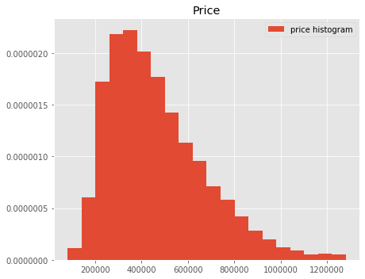


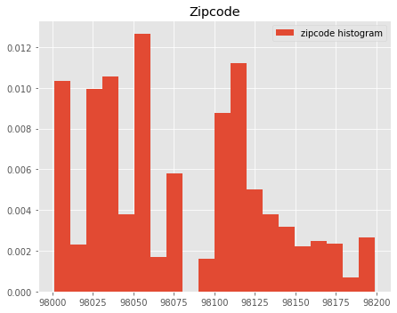


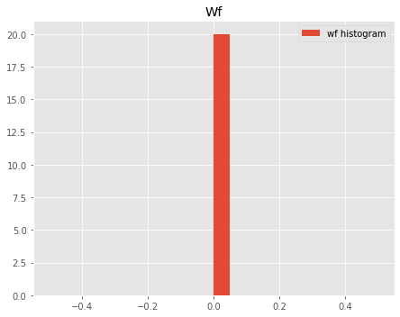


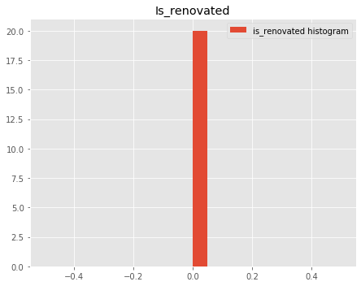


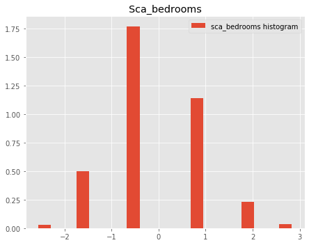


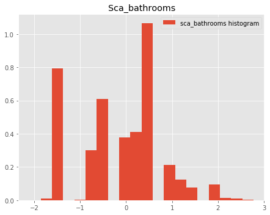


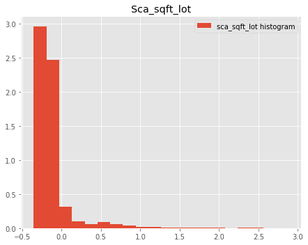


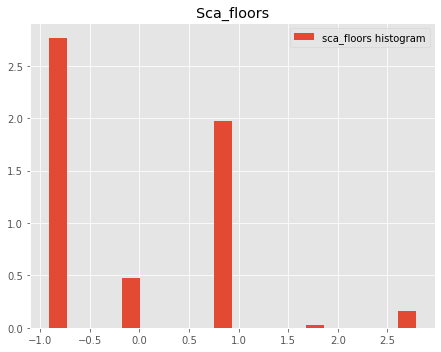


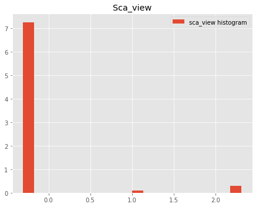


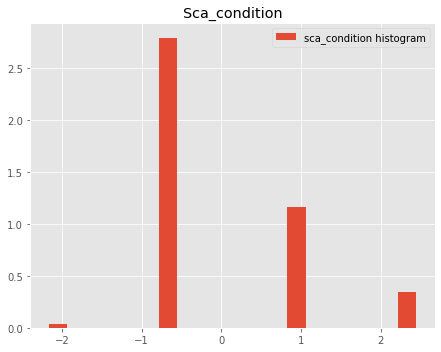


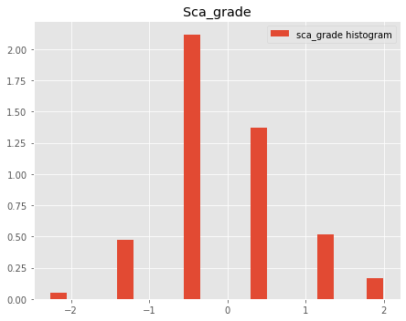


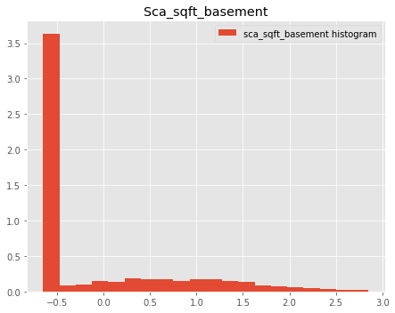


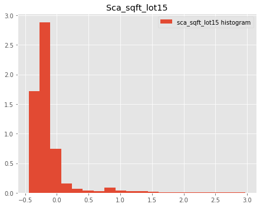


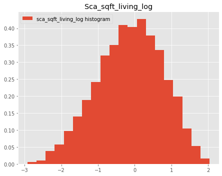


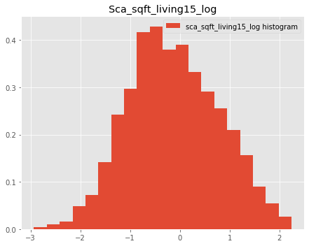


## Correlation Post Transformation


```python
corr = df_clean.corr()

def corrplot(corr,figsize=(20,20)):
    fig, ax = plt.subplots(figsize=figsize)

    mask = np.zeros_like(corr, dtype=np.bool)
    idx = np.triu_indices_from(mask)
    mask[idx] = True

    sns.heatmap(np.abs(corr),square=True,mask=mask,cmap="Blues",annot=True,ax=ax)
    ax.set_ylim(len(corr), -.5, .5)
    return fig, ax

corrplot(corr.round(3))
```


    (<Figure size 1440x1440 with 2 Axes>,
     <matplotlib.axes._subplots.AxesSubplot at 0x1a23e06f60>)


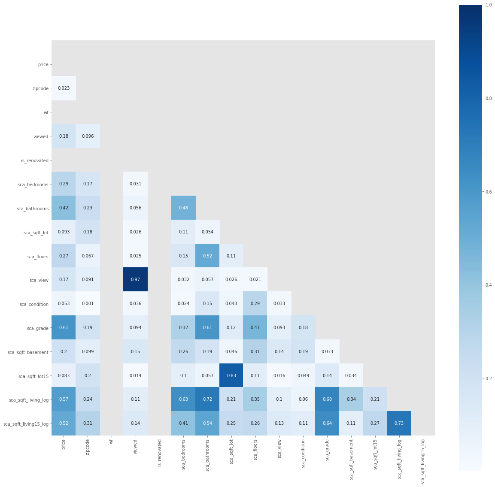


```python
df_clean.isna().sum()
```


    price                    0
    zipcode                  0
    wf                       0
    viewed                   0
    yr_category              0
    is_renovated             0
    sca_bedrooms             0
    sca_bathrooms            0
    sca_sqft_lot             0
    sca_floors               0
    sca_view                 0
    sca_condition            0
    sca_grade                0
    sca_sqft_basement        0
    sca_sqft_lot15           0
    sca_sqft_living_log      0
    sca_sqft_living15_log    0
    dtype: int64


```python
df_clean.info()
```

    <class 'pandas.core.frame.DataFrame'>
    Int64Index: 18655 entries, 0 to 21596
    Data columns (total 17 columns):
    price                    18655 non-null float64
    zipcode                  18655 non-null int64
    wf                       18655 non-null float64
    viewed                   18655 non-null bool
    yr_category              18655 non-null category
    is_renovated             18655 non-null int64
    sca_bedrooms             18655 non-null float64
    sca_bathrooms            18655 non-null float64
    sca_sqft_lot             18655 non-null float64
    sca_floors               18655 non-null float64
    sca_view                 18655 non-null float64
    sca_condition            18655 non-null float64
    sca_grade                18655 non-null float64
    sca_sqft_basement        18655 non-null float64
    sca_sqft_lot15           18655 non-null float64
    sca_sqft_living_log      18655 non-null float64
    sca_sqft_living15_log    18655 non-null float64
    dtypes: bool(1), category(1), float64(13), int64(2)
    memory usage: 2.3 MB


# MODEL


```python
pred1 = ['C(zipcode)', 'wf', 'is_renovated','sca_bedrooms',
         'sca_bathrooms', 'sca_sqft_lot', 'sca_floors', 'C(viewed)',
         'sca_condition', 'sca_grade', 'sca_sqft_basement', 'sca_sqft_lot15', 
         'sca_sqft_living_log', 'sca_sqft_living15_log']
```


```python
f1 = '+'.join(pred1)
f1
```


    'C(zipcode)+wf+is_renovated+sca_bedrooms+sca_bathrooms+sca_sqft_lot+sca_floors+C(viewed)+sca_condition+sca_grade+sca_sqft_basement+sca_sqft_lot15+sca_sqft_living_log+sca_sqft_living15_log'


```python
import statsmodels.formula.api as smf
f ='price~'+f1
model = smf.ols(formula=f, data=df_clean).fit()
model.summary()
```


<table class="simpletable">
<caption>OLS Regression Results</caption>
<tr>
  <th>Dep. Variable:</th>          <td>price</td>      <th>  R-squared:         </th>  <td>   0.818</td>  
</tr>
<tr>
  <th>Model:</th>                   <td>OLS</td>       <th>  Adj. R-squared:    </th>  <td>   0.817</td>  
</tr>
<tr>
  <th>Method:</th>             <td>Least Squares</td>  <th>  F-statistic:       </th>  <td>   1044.</td>  
</tr>
<tr>
  <th>Date:</th>             <td>Tue, 03 Dec 2019</td> <th>  Prob (F-statistic):</th>   <td>  0.00</td>   
</tr>
<tr>
  <th>Time:</th>                 <td>12:39:23</td>     <th>  Log-Likelihood:    </th> <td>-2.3898e+05</td>
</tr>
<tr>
  <th>No. Observations:</th>      <td> 18655</td>      <th>  AIC:               </th>  <td>4.781e+05</td> 
</tr>
<tr>
  <th>Df Residuals:</th>          <td> 18574</td>      <th>  BIC:               </th>  <td>4.787e+05</td> 
</tr>
<tr>
  <th>Df Model:</th>              <td>    80</td>      <th>                     </th>      <td> </td>     
</tr>
<tr>
  <th>Covariance Type:</th>      <td>nonrobust</td>    <th>                     </th>      <td> </td>     
</tr>
</table>
<table class="simpletable">
<tr>
            <td></td>               <th>coef</th>     <th>std err</th>      <th>t</th>      <th>P>|t|</th>  <th>[0.025</th>    <th>0.975]</th>  
</tr>
<tr>
  <th>Intercept</th>             <td> 3.071e+05</td> <td> 4790.120</td> <td>   64.108</td> <td> 0.000</td> <td> 2.98e+05</td> <td> 3.16e+05</td>
</tr>
<tr>
  <th>C(zipcode)[T.98002]</th>   <td> 2.048e+04</td> <td> 8035.653</td> <td>    2.549</td> <td> 0.011</td> <td> 4728.722</td> <td> 3.62e+04</td>
</tr>
<tr>
  <th>C(zipcode)[T.98003]</th>   <td>-2650.5864</td> <td> 7244.747</td> <td>   -0.366</td> <td> 0.714</td> <td>-1.69e+04</td> <td> 1.15e+04</td>
</tr>
<tr>
  <th>C(zipcode)[T.98004]</th>   <td> 5.347e+05</td> <td> 8493.887</td> <td>   62.946</td> <td> 0.000</td> <td> 5.18e+05</td> <td> 5.51e+05</td>
</tr>
<tr>
  <th>C(zipcode)[T.98005]</th>   <td>  3.42e+05</td> <td> 9011.620</td> <td>   37.949</td> <td> 0.000</td> <td> 3.24e+05</td> <td>  3.6e+05</td>
</tr>
<tr>
  <th>C(zipcode)[T.98006]</th>   <td>  2.81e+05</td> <td> 6840.137</td> <td>   41.088</td> <td> 0.000</td> <td> 2.68e+05</td> <td> 2.94e+05</td>
</tr>
<tr>
  <th>C(zipcode)[T.98007]</th>   <td> 2.614e+05</td> <td> 9114.786</td> <td>   28.673</td> <td> 0.000</td> <td> 2.43e+05</td> <td> 2.79e+05</td>
</tr>
<tr>
  <th>C(zipcode)[T.98008]</th>   <td> 2.365e+05</td> <td> 7388.787</td> <td>   32.002</td> <td> 0.000</td> <td> 2.22e+05</td> <td> 2.51e+05</td>
</tr>
<tr>
  <th>C(zipcode)[T.98010]</th>   <td> 9.283e+04</td> <td> 1.17e+04</td> <td>    7.949</td> <td> 0.000</td> <td> 6.99e+04</td> <td> 1.16e+05</td>
</tr>
<tr>
  <th>C(zipcode)[T.98011]</th>   <td>  1.49e+05</td> <td> 8148.824</td> <td>   18.279</td> <td> 0.000</td> <td> 1.33e+05</td> <td> 1.65e+05</td>
</tr>
<tr>
  <th>C(zipcode)[T.98014]</th>   <td> 1.161e+05</td> <td> 1.11e+04</td> <td>   10.480</td> <td> 0.000</td> <td> 9.44e+04</td> <td> 1.38e+05</td>
</tr>
<tr>
  <th>C(zipcode)[T.98019]</th>   <td> 9.492e+04</td> <td> 8488.153</td> <td>   11.183</td> <td> 0.000</td> <td> 7.83e+04</td> <td> 1.12e+05</td>
</tr>
<tr>
  <th>C(zipcode)[T.98022]</th>   <td> 2071.1733</td> <td> 8585.993</td> <td>    0.241</td> <td> 0.809</td> <td>-1.48e+04</td> <td> 1.89e+04</td>
</tr>
<tr>
  <th>C(zipcode)[T.98023]</th>   <td>-1.645e+04</td> <td> 6285.282</td> <td>   -2.618</td> <td> 0.009</td> <td>-2.88e+04</td> <td>-4132.106</td>
</tr>
<tr>
  <th>C(zipcode)[T.98024]</th>   <td> 1.518e+05</td> <td> 1.43e+04</td> <td>   10.614</td> <td> 0.000</td> <td> 1.24e+05</td> <td>  1.8e+05</td>
</tr>
<tr>
  <th>C(zipcode)[T.98027]</th>   <td> 2.036e+05</td> <td> 6848.515</td> <td>   29.723</td> <td> 0.000</td> <td>  1.9e+05</td> <td> 2.17e+05</td>
</tr>
<tr>
  <th>C(zipcode)[T.98028]</th>   <td> 1.361e+05</td> <td> 7224.396</td> <td>   18.841</td> <td> 0.000</td> <td> 1.22e+05</td> <td>  1.5e+05</td>
</tr>
<tr>
  <th>C(zipcode)[T.98029]</th>   <td>  2.29e+05</td> <td> 7034.671</td> <td>   32.549</td> <td> 0.000</td> <td> 2.15e+05</td> <td> 2.43e+05</td>
</tr>
<tr>
  <th>C(zipcode)[T.98030]</th>   <td> 2515.8696</td> <td> 7369.955</td> <td>    0.341</td> <td> 0.733</td> <td>-1.19e+04</td> <td>  1.7e+04</td>
</tr>
<tr>
  <th>C(zipcode)[T.98031]</th>   <td> 6600.4871</td> <td> 7234.928</td> <td>    0.912</td> <td> 0.362</td> <td>-7580.636</td> <td> 2.08e+04</td>
</tr>
<tr>
  <th>C(zipcode)[T.98032]</th>   <td> 4896.2559</td> <td> 9421.741</td> <td>    0.520</td> <td> 0.603</td> <td>-1.36e+04</td> <td> 2.34e+04</td>
</tr>
<tr>
  <th>C(zipcode)[T.98033]</th>   <td> 3.353e+05</td> <td> 6739.767</td> <td>   49.754</td> <td> 0.000</td> <td> 3.22e+05</td> <td> 3.49e+05</td>
</tr>
<tr>
  <th>C(zipcode)[T.98034]</th>   <td> 1.886e+05</td> <td> 6200.227</td> <td>   30.416</td> <td> 0.000</td> <td> 1.76e+05</td> <td> 2.01e+05</td>
</tr>
<tr>
  <th>C(zipcode)[T.98038]</th>   <td> 3.322e+04</td> <td> 6156.302</td> <td>    5.396</td> <td> 0.000</td> <td> 2.12e+04</td> <td> 4.53e+04</td>
</tr>
<tr>
  <th>C(zipcode)[T.98039]</th>   <td>  6.73e+05</td> <td> 3.18e+04</td> <td>   21.184</td> <td> 0.000</td> <td> 6.11e+05</td> <td> 7.35e+05</td>
</tr>
<tr>
  <th>C(zipcode)[T.98040]</th>   <td> 4.511e+05</td> <td> 8627.475</td> <td>   52.285</td> <td> 0.000</td> <td> 4.34e+05</td> <td> 4.68e+05</td>
</tr>
<tr>
  <th>C(zipcode)[T.98042]</th>   <td> 4170.7247</td> <td> 6175.481</td> <td>    0.675</td> <td> 0.499</td> <td>-7933.785</td> <td> 1.63e+04</td>
</tr>
<tr>
  <th>C(zipcode)[T.98045]</th>   <td> 1.071e+05</td> <td> 8138.186</td> <td>   13.161</td> <td> 0.000</td> <td> 9.12e+04</td> <td> 1.23e+05</td>
</tr>
<tr>
  <th>C(zipcode)[T.98052]</th>   <td> 2.599e+05</td> <td> 6167.518</td> <td>   42.140</td> <td> 0.000</td> <td> 2.48e+05</td> <td> 2.72e+05</td>
</tr>
<tr>
  <th>C(zipcode)[T.98053]</th>   <td> 2.429e+05</td> <td> 6896.170</td> <td>   35.225</td> <td> 0.000</td> <td> 2.29e+05</td> <td> 2.56e+05</td>
</tr>
<tr>
  <th>C(zipcode)[T.98055]</th>   <td> 4.904e+04</td> <td> 7345.893</td> <td>    6.676</td> <td> 0.000</td> <td> 3.46e+04</td> <td> 6.34e+04</td>
</tr>
<tr>
  <th>C(zipcode)[T.98056]</th>   <td> 1.106e+05</td> <td> 6569.333</td> <td>   16.840</td> <td> 0.000</td> <td> 9.77e+04</td> <td> 1.24e+05</td>
</tr>
<tr>
  <th>C(zipcode)[T.98058]</th>   <td> 3.418e+04</td> <td> 6440.315</td> <td>    5.308</td> <td> 0.000</td> <td> 2.16e+04</td> <td> 4.68e+04</td>
</tr>
<tr>
  <th>C(zipcode)[T.98059]</th>   <td> 9.422e+04</td> <td> 6519.671</td> <td>   14.451</td> <td> 0.000</td> <td> 8.14e+04</td> <td> 1.07e+05</td>
</tr>
<tr>
  <th>C(zipcode)[T.98065]</th>   <td> 1.393e+05</td> <td> 7278.012</td> <td>   19.144</td> <td> 0.000</td> <td> 1.25e+05</td> <td> 1.54e+05</td>
</tr>
<tr>
  <th>C(zipcode)[T.98070]</th>   <td> 1.211e+05</td> <td> 1.41e+04</td> <td>    8.586</td> <td> 0.000</td> <td> 9.34e+04</td> <td> 1.49e+05</td>
</tr>
<tr>
  <th>C(zipcode)[T.98072]</th>   <td>  1.73e+05</td> <td> 7506.117</td> <td>   23.052</td> <td> 0.000</td> <td> 1.58e+05</td> <td> 1.88e+05</td>
</tr>
<tr>
  <th>C(zipcode)[T.98074]</th>   <td> 2.273e+05</td> <td> 6659.318</td> <td>   34.128</td> <td> 0.000</td> <td> 2.14e+05</td> <td>  2.4e+05</td>
</tr>
<tr>
  <th>C(zipcode)[T.98075]</th>   <td> 2.512e+05</td> <td> 7164.044</td> <td>   35.065</td> <td> 0.000</td> <td> 2.37e+05</td> <td> 2.65e+05</td>
</tr>
<tr>
  <th>C(zipcode)[T.98077]</th>   <td> 1.696e+05</td> <td> 9020.790</td> <td>   18.798</td> <td> 0.000</td> <td> 1.52e+05</td> <td> 1.87e+05</td>
</tr>
<tr>
  <th>C(zipcode)[T.98092]</th>   <td>-2.451e+04</td> <td> 7034.439</td> <td>   -3.484</td> <td> 0.000</td> <td>-3.83e+04</td> <td>-1.07e+04</td>
</tr>
<tr>
  <th>C(zipcode)[T.98102]</th>   <td>  4.47e+05</td> <td> 1.09e+04</td> <td>   41.176</td> <td> 0.000</td> <td> 4.26e+05</td> <td> 4.68e+05</td>
</tr>
<tr>
  <th>C(zipcode)[T.98103]</th>   <td> 3.444e+05</td> <td> 6238.893</td> <td>   55.199</td> <td> 0.000</td> <td> 3.32e+05</td> <td> 3.57e+05</td>
</tr>
<tr>
  <th>C(zipcode)[T.98105]</th>   <td> 4.155e+05</td> <td> 8312.433</td> <td>   49.987</td> <td> 0.000</td> <td> 3.99e+05</td> <td> 4.32e+05</td>
</tr>
<tr>
  <th>C(zipcode)[T.98106]</th>   <td> 1.474e+05</td> <td> 6995.149</td> <td>   21.075</td> <td> 0.000</td> <td> 1.34e+05</td> <td> 1.61e+05</td>
</tr>
<tr>
  <th>C(zipcode)[T.98107]</th>   <td>   3.4e+05</td> <td> 7553.126</td> <td>   45.019</td> <td> 0.000</td> <td> 3.25e+05</td> <td> 3.55e+05</td>
</tr>
<tr>
  <th>C(zipcode)[T.98108]</th>   <td> 1.388e+05</td> <td> 8216.014</td> <td>   16.895</td> <td> 0.000</td> <td> 1.23e+05</td> <td> 1.55e+05</td>
</tr>
<tr>
  <th>C(zipcode)[T.98109]</th>   <td> 4.529e+05</td> <td> 1.08e+04</td> <td>   42.082</td> <td> 0.000</td> <td> 4.32e+05</td> <td> 4.74e+05</td>
</tr>
<tr>
  <th>C(zipcode)[T.98112]</th>   <td> 4.922e+05</td> <td> 8374.363</td> <td>   58.779</td> <td> 0.000</td> <td> 4.76e+05</td> <td> 5.09e+05</td>
</tr>
<tr>
  <th>C(zipcode)[T.98115]</th>   <td> 3.442e+05</td> <td> 6212.814</td> <td>   55.397</td> <td> 0.000</td> <td> 3.32e+05</td> <td> 3.56e+05</td>
</tr>
<tr>
  <th>C(zipcode)[T.98116]</th>   <td> 3.124e+05</td> <td> 7311.028</td> <td>   42.724</td> <td> 0.000</td> <td> 2.98e+05</td> <td> 3.27e+05</td>
</tr>
<tr>
  <th>C(zipcode)[T.98117]</th>   <td> 3.397e+05</td> <td> 6274.794</td> <td>   54.142</td> <td> 0.000</td> <td> 3.27e+05</td> <td> 3.52e+05</td>
</tr>
<tr>
  <th>C(zipcode)[T.98118]</th>   <td> 1.888e+05</td> <td> 6396.076</td> <td>   29.523</td> <td> 0.000</td> <td> 1.76e+05</td> <td> 2.01e+05</td>
</tr>
<tr>
  <th>C(zipcode)[T.98119]</th>   <td> 4.266e+05</td> <td> 8897.780</td> <td>   47.945</td> <td> 0.000</td> <td> 4.09e+05</td> <td> 4.44e+05</td>
</tr>
<tr>
  <th>C(zipcode)[T.98122]</th>   <td> 3.388e+05</td> <td> 7536.457</td> <td>   44.956</td> <td> 0.000</td> <td> 3.24e+05</td> <td> 3.54e+05</td>
</tr>
<tr>
  <th>C(zipcode)[T.98125]</th>   <td> 2.142e+05</td> <td> 6677.784</td> <td>   32.071</td> <td> 0.000</td> <td> 2.01e+05</td> <td> 2.27e+05</td>
</tr>
<tr>
  <th>C(zipcode)[T.98126]</th>   <td> 2.174e+05</td> <td> 6999.163</td> <td>   31.056</td> <td> 0.000</td> <td> 2.04e+05</td> <td> 2.31e+05</td>
</tr>
<tr>
  <th>C(zipcode)[T.98133]</th>   <td> 1.668e+05</td> <td> 6314.873</td> <td>   26.417</td> <td> 0.000</td> <td> 1.54e+05</td> <td> 1.79e+05</td>
</tr>
<tr>
  <th>C(zipcode)[T.98136]</th>   <td> 2.705e+05</td> <td> 7690.360</td> <td>   35.174</td> <td> 0.000</td> <td> 2.55e+05</td> <td> 2.86e+05</td>
</tr>
<tr>
  <th>C(zipcode)[T.98144]</th>   <td> 2.592e+05</td> <td> 7143.839</td> <td>   36.277</td> <td> 0.000</td> <td> 2.45e+05</td> <td> 2.73e+05</td>
</tr>
<tr>
  <th>C(zipcode)[T.98146]</th>   <td> 1.256e+05</td> <td> 7473.583</td> <td>   16.805</td> <td> 0.000</td> <td> 1.11e+05</td> <td>  1.4e+05</td>
</tr>
<tr>
  <th>C(zipcode)[T.98148]</th>   <td> 6.504e+04</td> <td>  1.3e+04</td> <td>    5.005</td> <td> 0.000</td> <td> 3.96e+04</td> <td> 9.05e+04</td>
</tr>
<tr>
  <th>C(zipcode)[T.98155]</th>   <td> 1.535e+05</td> <td> 6501.547</td> <td>   23.605</td> <td> 0.000</td> <td> 1.41e+05</td> <td> 1.66e+05</td>
</tr>
<tr>
  <th>C(zipcode)[T.98166]</th>   <td> 1.113e+05</td> <td> 7909.564</td> <td>   14.072</td> <td> 0.000</td> <td> 9.58e+04</td> <td> 1.27e+05</td>
</tr>
<tr>
  <th>C(zipcode)[T.98168]</th>   <td> 7.084e+04</td> <td> 7342.076</td> <td>    9.648</td> <td> 0.000</td> <td> 5.64e+04</td> <td> 8.52e+04</td>
</tr>
<tr>
  <th>C(zipcode)[T.98177]</th>   <td>   2.2e+05</td> <td> 7928.809</td> <td>   27.750</td> <td> 0.000</td> <td> 2.04e+05</td> <td> 2.36e+05</td>
</tr>
<tr>
  <th>C(zipcode)[T.98178]</th>   <td> 6.867e+04</td> <td> 7582.472</td> <td>    9.056</td> <td> 0.000</td> <td> 5.38e+04</td> <td> 8.35e+04</td>
</tr>
<tr>
  <th>C(zipcode)[T.98188]</th>   <td> 4.927e+04</td> <td> 9219.436</td> <td>    5.345</td> <td> 0.000</td> <td> 3.12e+04</td> <td> 6.73e+04</td>
</tr>
<tr>
  <th>C(zipcode)[T.98198]</th>   <td> 2.993e+04</td> <td> 7504.979</td> <td>    3.989</td> <td> 0.000</td> <td> 1.52e+04</td> <td> 4.46e+04</td>
</tr>
<tr>
  <th>C(zipcode)[T.98199]</th>   <td> 3.808e+05</td> <td> 7449.222</td> <td>   51.119</td> <td> 0.000</td> <td> 3.66e+05</td> <td> 3.95e+05</td>
</tr>
<tr>
  <th>C(viewed)[T.True]</th>     <td> 6.675e+04</td> <td> 3125.243</td> <td>   21.360</td> <td> 0.000</td> <td> 6.06e+04</td> <td> 7.29e+04</td>
</tr>
<tr>
  <th>wf</th>                    <td>-2.361e-10</td> <td> 4.28e-12</td> <td>  -55.158</td> <td> 0.000</td> <td>-2.44e-10</td> <td>-2.28e-10</td>
</tr>
<tr>
  <th>is_renovated</th>          <td>-4.991e-11</td> <td> 3.07e-12</td> <td>  -16.246</td> <td> 0.000</td> <td>-5.59e-11</td> <td>-4.39e-11</td>
</tr>
<tr>
  <th>sca_bedrooms</th>          <td>-1330.0650</td> <td>  967.157</td> <td>   -1.375</td> <td> 0.169</td> <td>-3225.781</td> <td>  565.651</td>
</tr>
<tr>
  <th>sca_bathrooms</th>         <td> 5034.0941</td> <td> 1225.893</td> <td>    4.106</td> <td> 0.000</td> <td> 2631.232</td> <td> 7436.957</td>
</tr>
<tr>
  <th>sca_sqft_lot</th>          <td> 5.434e+04</td> <td> 4253.228</td> <td>   12.775</td> <td> 0.000</td> <td>  4.6e+04</td> <td> 6.27e+04</td>
</tr>
<tr>
  <th>sca_floors</th>            <td>-1.179e+04</td> <td>  993.753</td> <td>  -11.860</td> <td> 0.000</td> <td>-1.37e+04</td> <td>-9837.675</td>
</tr>
<tr>
  <th>sca_condition</th>         <td> 1.806e+04</td> <td>  719.439</td> <td>   25.105</td> <td> 0.000</td> <td> 1.67e+04</td> <td> 1.95e+04</td>
</tr>
<tr>
  <th>sca_grade</th>             <td> 5.295e+04</td> <td> 1299.956</td> <td>   40.733</td> <td> 0.000</td> <td> 5.04e+04</td> <td> 5.55e+04</td>
</tr>
<tr>
  <th>sca_sqft_basement</th>     <td>-2.199e+04</td> <td> 1073.124</td> <td>  -20.487</td> <td> 0.000</td> <td>-2.41e+04</td> <td>-1.99e+04</td>
</tr>
<tr>
  <th>sca_sqft_lot15</th>        <td>-1.484e+04</td> <td> 3634.412</td> <td>   -4.084</td> <td> 0.000</td> <td> -2.2e+04</td> <td>-7718.224</td>
</tr>
<tr>
  <th>sca_sqft_living_log</th>   <td> 8.957e+04</td> <td> 1687.662</td> <td>   53.073</td> <td> 0.000</td> <td> 8.63e+04</td> <td> 9.29e+04</td>
</tr>
<tr>
  <th>sca_sqft_living15_log</th> <td> 2.173e+04</td> <td> 1209.974</td> <td>   17.955</td> <td> 0.000</td> <td> 1.94e+04</td> <td> 2.41e+04</td>
</tr>
</table>
<table class="simpletable">
<tr>
  <th>Omnibus:</th>       <td>3163.839</td> <th>  Durbin-Watson:     </th> <td>   2.002</td> 
</tr>
<tr>
  <th>Prob(Omnibus):</th>  <td> 0.000</td>  <th>  Jarque-Bera (JB):  </th> <td>11686.546</td>
</tr>
<tr>
  <th>Skew:</th>           <td> 0.825</td>  <th>  Prob(JB):          </th> <td>    0.00</td> 
</tr>
<tr>
  <th>Kurtosis:</th>       <td> 6.509</td>  <th>  Cond. No.          </th> <td>1.32e+16</td> 
</tr>
</table><br/><br/>Warnings:<br/>[1] Standard Errors assume that the covariance matrix of the errors is correctly specified.<br/>[2] The smallest eigenvalue is 3.25e-28. This might indicate that there are<br/>strong multicollinearity problems or that the design matrix is singular.


Model Interpretation
Looks very good except 0.169 P-value for 'sca_bedrooms'. Indicates that changes in the predictor are not associated with changes in the response. Will retry model without 'sca_bedrooms'.


```python

import statsmodels.api as sm
residuals = model.resid
fig = sm.graphics.qqplot(residuals, dist=stats.norm, line='45', fit=True)
fig.show()
```


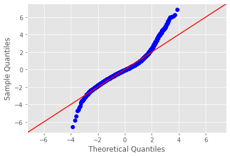


```python
pred2 = ['C(zipcode)', 'wf',
         'sca_bathrooms', 'sca_sqft_lot', 'sca_floors', 'C(viewed)',
        'sca_condition', 'sca_grade', 'sca_sqft_basement', 'sca_sqft_lot15', 
         'sca_sqft_living_log', 'sca_sqft_living15_log']
```


```python
f2 = '+'.join(pred2)
f2
```


    'C(zipcode)+wf+sca_bathrooms+sca_sqft_lot+sca_floors+C(viewed)+sca_condition+sca_grade+sca_sqft_basement+sca_sqft_lot15+sca_sqft_living_log+sca_sqft_living15_log'


```python
f ='price~'+f2
model = smf.ols(formula=f, data=df_clean).fit()
model.summary()
```


<table class="simpletable">
<caption>OLS Regression Results</caption>
<tr>
  <th>Dep. Variable:</th>          <td>price</td>      <th>  R-squared:         </th>  <td>   0.818</td>  
</tr>
<tr>
  <th>Model:</th>                   <td>OLS</td>       <th>  Adj. R-squared:    </th>  <td>   0.817</td>  
</tr>
<tr>
  <th>Method:</th>             <td>Least Squares</td>  <th>  F-statistic:       </th>  <td>   1057.</td>  
</tr>
<tr>
  <th>Date:</th>             <td>Tue, 03 Dec 2019</td> <th>  Prob (F-statistic):</th>   <td>  0.00</td>   
</tr>
<tr>
  <th>Time:</th>                 <td>12:39:36</td>     <th>  Log-Likelihood:    </th> <td>-2.3898e+05</td>
</tr>
<tr>
  <th>No. Observations:</th>      <td> 18655</td>      <th>  AIC:               </th>  <td>4.781e+05</td> 
</tr>
<tr>
  <th>Df Residuals:</th>          <td> 18575</td>      <th>  BIC:               </th>  <td>4.787e+05</td> 
</tr>
<tr>
  <th>Df Model:</th>              <td>    79</td>      <th>                     </th>      <td> </td>     
</tr>
<tr>
  <th>Covariance Type:</th>      <td>nonrobust</td>    <th>                     </th>      <td> </td>     
</tr>
</table>
<table class="simpletable">
<tr>
            <td></td>               <th>coef</th>     <th>std err</th>      <th>t</th>      <th>P>|t|</th>  <th>[0.025</th>    <th>0.975]</th>  
</tr>
<tr>
  <th>Intercept</th>             <td>  3.07e+05</td> <td> 4789.776</td> <td>   64.094</td> <td> 0.000</td> <td> 2.98e+05</td> <td> 3.16e+05</td>
</tr>
<tr>
  <th>C(zipcode)[T.98002]</th>   <td> 2.045e+04</td> <td> 8035.818</td> <td>    2.545</td> <td> 0.011</td> <td> 4698.971</td> <td> 3.62e+04</td>
</tr>
<tr>
  <th>C(zipcode)[T.98003]</th>   <td>-2600.5814</td> <td> 7244.829</td> <td>   -0.359</td> <td> 0.720</td> <td>-1.68e+04</td> <td> 1.16e+04</td>
</tr>
<tr>
  <th>C(zipcode)[T.98004]</th>   <td> 5.346e+05</td> <td> 8494.078</td> <td>   62.942</td> <td> 0.000</td> <td> 5.18e+05</td> <td> 5.51e+05</td>
</tr>
<tr>
  <th>C(zipcode)[T.98005]</th>   <td> 3.419e+05</td> <td> 9011.448</td> <td>   37.937</td> <td> 0.000</td> <td> 3.24e+05</td> <td>  3.6e+05</td>
</tr>
<tr>
  <th>C(zipcode)[T.98006]</th>   <td>  2.81e+05</td> <td> 6840.206</td> <td>   41.080</td> <td> 0.000</td> <td> 2.68e+05</td> <td> 2.94e+05</td>
</tr>
<tr>
  <th>C(zipcode)[T.98007]</th>   <td>  2.61e+05</td> <td> 9110.741</td> <td>   28.644</td> <td> 0.000</td> <td> 2.43e+05</td> <td> 2.79e+05</td>
</tr>
<tr>
  <th>C(zipcode)[T.98008]</th>   <td> 2.361e+05</td> <td> 7384.745</td> <td>   31.973</td> <td> 0.000</td> <td> 2.22e+05</td> <td> 2.51e+05</td>
</tr>
<tr>
  <th>C(zipcode)[T.98010]</th>   <td> 9.306e+04</td> <td> 1.17e+04</td> <td>    7.970</td> <td> 0.000</td> <td> 7.02e+04</td> <td> 1.16e+05</td>
</tr>
<tr>
  <th>C(zipcode)[T.98011]</th>   <td>  1.49e+05</td> <td> 8148.878</td> <td>   18.287</td> <td> 0.000</td> <td> 1.33e+05</td> <td> 1.65e+05</td>
</tr>
<tr>
  <th>C(zipcode)[T.98014]</th>   <td> 1.166e+05</td> <td> 1.11e+04</td> <td>   10.528</td> <td> 0.000</td> <td> 9.49e+04</td> <td> 1.38e+05</td>
</tr>
<tr>
  <th>C(zipcode)[T.98019]</th>   <td> 9.517e+04</td> <td> 8486.392</td> <td>   11.215</td> <td> 0.000</td> <td> 7.85e+04</td> <td> 1.12e+05</td>
</tr>
<tr>
  <th>C(zipcode)[T.98022]</th>   <td> 2221.7311</td> <td> 8585.501</td> <td>    0.259</td> <td> 0.796</td> <td>-1.46e+04</td> <td> 1.91e+04</td>
</tr>
<tr>
  <th>C(zipcode)[T.98023]</th>   <td>-1.648e+04</td> <td> 6285.409</td> <td>   -2.621</td> <td> 0.009</td> <td>-2.88e+04</td> <td>-4155.997</td>
</tr>
<tr>
  <th>C(zipcode)[T.98024]</th>   <td> 1.519e+05</td> <td> 1.43e+04</td> <td>   10.619</td> <td> 0.000</td> <td> 1.24e+05</td> <td>  1.8e+05</td>
</tr>
<tr>
  <th>C(zipcode)[T.98027]</th>   <td> 2.037e+05</td> <td> 6847.688</td> <td>   29.750</td> <td> 0.000</td> <td>  1.9e+05</td> <td> 2.17e+05</td>
</tr>
<tr>
  <th>C(zipcode)[T.98028]</th>   <td> 1.362e+05</td> <td> 7224.429</td> <td>   18.850</td> <td> 0.000</td> <td> 1.22e+05</td> <td>  1.5e+05</td>
</tr>
<tr>
  <th>C(zipcode)[T.98029]</th>   <td> 2.292e+05</td> <td> 7033.320</td> <td>   32.584</td> <td> 0.000</td> <td> 2.15e+05</td> <td> 2.43e+05</td>
</tr>
<tr>
  <th>C(zipcode)[T.98030]</th>   <td> 2511.9496</td> <td> 7370.131</td> <td>    0.341</td> <td> 0.733</td> <td>-1.19e+04</td> <td>  1.7e+04</td>
</tr>
<tr>
  <th>C(zipcode)[T.98031]</th>   <td> 6560.9382</td> <td> 7235.045</td> <td>    0.907</td> <td> 0.365</td> <td>-7620.413</td> <td> 2.07e+04</td>
</tr>
<tr>
  <th>C(zipcode)[T.98032]</th>   <td> 4658.3215</td> <td> 9420.378</td> <td>    0.494</td> <td> 0.621</td> <td>-1.38e+04</td> <td> 2.31e+04</td>
</tr>
<tr>
  <th>C(zipcode)[T.98033]</th>   <td> 3.354e+05</td> <td> 6739.825</td> <td>   49.761</td> <td> 0.000</td> <td> 3.22e+05</td> <td> 3.49e+05</td>
</tr>
<tr>
  <th>C(zipcode)[T.98034]</th>   <td> 1.885e+05</td> <td> 6200.054</td> <td>   30.403</td> <td> 0.000</td> <td> 1.76e+05</td> <td> 2.01e+05</td>
</tr>
<tr>
  <th>C(zipcode)[T.98038]</th>   <td> 3.338e+04</td> <td> 6155.317</td> <td>    5.423</td> <td> 0.000</td> <td> 2.13e+04</td> <td> 4.54e+04</td>
</tr>
<tr>
  <th>C(zipcode)[T.98039]</th>   <td> 6.729e+05</td> <td> 3.18e+04</td> <td>   21.183</td> <td> 0.000</td> <td> 6.11e+05</td> <td> 7.35e+05</td>
</tr>
<tr>
  <th>C(zipcode)[T.98040]</th>   <td>  4.51e+05</td> <td> 8627.175</td> <td>   52.272</td> <td> 0.000</td> <td> 4.34e+05</td> <td> 4.68e+05</td>
</tr>
<tr>
  <th>C(zipcode)[T.98042]</th>   <td> 4210.4220</td> <td> 6175.562</td> <td>    0.682</td> <td> 0.495</td> <td>-7894.246</td> <td> 1.63e+04</td>
</tr>
<tr>
  <th>C(zipcode)[T.98045]</th>   <td> 1.072e+05</td> <td> 8137.848</td> <td>   13.177</td> <td> 0.000</td> <td> 9.13e+04</td> <td> 1.23e+05</td>
</tr>
<tr>
  <th>C(zipcode)[T.98052]</th>   <td> 2.599e+05</td> <td> 6167.627</td> <td>   42.144</td> <td> 0.000</td> <td> 2.48e+05</td> <td> 2.72e+05</td>
</tr>
<tr>
  <th>C(zipcode)[T.98053]</th>   <td> 2.437e+05</td> <td> 6874.170</td> <td>   35.448</td> <td> 0.000</td> <td>  2.3e+05</td> <td> 2.57e+05</td>
</tr>
<tr>
  <th>C(zipcode)[T.98055]</th>   <td> 4.918e+04</td> <td> 7345.363</td> <td>    6.696</td> <td> 0.000</td> <td> 3.48e+04</td> <td> 6.36e+04</td>
</tr>
<tr>
  <th>C(zipcode)[T.98056]</th>   <td> 1.106e+05</td> <td> 6569.471</td> <td>   16.843</td> <td> 0.000</td> <td> 9.78e+04</td> <td> 1.24e+05</td>
</tr>
<tr>
  <th>C(zipcode)[T.98058]</th>   <td> 3.411e+04</td> <td> 6440.268</td> <td>    5.297</td> <td> 0.000</td> <td> 2.15e+04</td> <td> 4.67e+04</td>
</tr>
<tr>
  <th>C(zipcode)[T.98059]</th>   <td> 9.414e+04</td> <td> 6519.620</td> <td>   14.440</td> <td> 0.000</td> <td> 8.14e+04</td> <td> 1.07e+05</td>
</tr>
<tr>
  <th>C(zipcode)[T.98065]</th>   <td> 1.397e+05</td> <td> 7273.090</td> <td>   19.208</td> <td> 0.000</td> <td> 1.25e+05</td> <td> 1.54e+05</td>
</tr>
<tr>
  <th>C(zipcode)[T.98070]</th>   <td> 1.217e+05</td> <td> 1.41e+04</td> <td>    8.633</td> <td> 0.000</td> <td> 9.41e+04</td> <td> 1.49e+05</td>
</tr>
<tr>
  <th>C(zipcode)[T.98072]</th>   <td> 1.733e+05</td> <td> 7504.368</td> <td>   23.088</td> <td> 0.000</td> <td> 1.59e+05</td> <td> 1.88e+05</td>
</tr>
<tr>
  <th>C(zipcode)[T.98074]</th>   <td> 2.274e+05</td> <td> 6659.087</td> <td>   34.144</td> <td> 0.000</td> <td> 2.14e+05</td> <td>  2.4e+05</td>
</tr>
<tr>
  <th>C(zipcode)[T.98075]</th>   <td> 2.513e+05</td> <td> 7163.978</td> <td>   35.077</td> <td> 0.000</td> <td> 2.37e+05</td> <td> 2.65e+05</td>
</tr>
<tr>
  <th>C(zipcode)[T.98077]</th>   <td> 1.698e+05</td> <td> 9019.517</td> <td>   18.825</td> <td> 0.000</td> <td> 1.52e+05</td> <td> 1.87e+05</td>
</tr>
<tr>
  <th>C(zipcode)[T.98092]</th>   <td>-2.453e+04</td> <td> 7034.595</td> <td>   -3.487</td> <td> 0.000</td> <td>-3.83e+04</td> <td>-1.07e+04</td>
</tr>
<tr>
  <th>C(zipcode)[T.98102]</th>   <td> 4.472e+05</td> <td> 1.09e+04</td> <td>   41.193</td> <td> 0.000</td> <td> 4.26e+05</td> <td> 4.68e+05</td>
</tr>
<tr>
  <th>C(zipcode)[T.98103]</th>   <td> 3.446e+05</td> <td> 6237.793</td> <td>   55.236</td> <td> 0.000</td> <td> 3.32e+05</td> <td> 3.57e+05</td>
</tr>
<tr>
  <th>C(zipcode)[T.98105]</th>   <td> 4.155e+05</td> <td> 8312.548</td> <td>   49.980</td> <td> 0.000</td> <td> 3.99e+05</td> <td> 4.32e+05</td>
</tr>
<tr>
  <th>C(zipcode)[T.98106]</th>   <td> 1.474e+05</td> <td> 6995.115</td> <td>   21.065</td> <td> 0.000</td> <td> 1.34e+05</td> <td> 1.61e+05</td>
</tr>
<tr>
  <th>C(zipcode)[T.98107]</th>   <td> 3.402e+05</td> <td> 7552.619</td> <td>   45.041</td> <td> 0.000</td> <td> 3.25e+05</td> <td> 3.55e+05</td>
</tr>
<tr>
  <th>C(zipcode)[T.98108]</th>   <td> 1.389e+05</td> <td> 8216.062</td> <td>   16.903</td> <td> 0.000</td> <td> 1.23e+05</td> <td> 1.55e+05</td>
</tr>
<tr>
  <th>C(zipcode)[T.98109]</th>   <td> 4.531e+05</td> <td> 1.08e+04</td> <td>   42.100</td> <td> 0.000</td> <td> 4.32e+05</td> <td> 4.74e+05</td>
</tr>
<tr>
  <th>C(zipcode)[T.98112]</th>   <td> 4.924e+05</td> <td> 8373.765</td> <td>   58.802</td> <td> 0.000</td> <td> 4.76e+05</td> <td> 5.09e+05</td>
</tr>
<tr>
  <th>C(zipcode)[T.98115]</th>   <td> 3.443e+05</td> <td> 6212.574</td> <td>   55.415</td> <td> 0.000</td> <td> 3.32e+05</td> <td> 3.56e+05</td>
</tr>
<tr>
  <th>C(zipcode)[T.98116]</th>   <td> 3.125e+05</td> <td> 7309.824</td> <td>   42.757</td> <td> 0.000</td> <td> 2.98e+05</td> <td> 3.27e+05</td>
</tr>
<tr>
  <th>C(zipcode)[T.98117]</th>   <td>   3.4e+05</td> <td> 6272.545</td> <td>   54.199</td> <td> 0.000</td> <td> 3.28e+05</td> <td> 3.52e+05</td>
</tr>
<tr>
  <th>C(zipcode)[T.98118]</th>   <td> 1.889e+05</td> <td> 6395.814</td> <td>   29.540</td> <td> 0.000</td> <td> 1.76e+05</td> <td> 2.01e+05</td>
</tr>
<tr>
  <th>C(zipcode)[T.98119]</th>   <td> 4.268e+05</td> <td> 8896.329</td> <td>   47.980</td> <td> 0.000</td> <td> 4.09e+05</td> <td> 4.44e+05</td>
</tr>
<tr>
  <th>C(zipcode)[T.98122]</th>   <td> 3.389e+05</td> <td> 7536.463</td> <td>   44.965</td> <td> 0.000</td> <td> 3.24e+05</td> <td> 3.54e+05</td>
</tr>
<tr>
  <th>C(zipcode)[T.98125]</th>   <td> 2.142e+05</td> <td> 6677.848</td> <td>   32.078</td> <td> 0.000</td> <td> 2.01e+05</td> <td> 2.27e+05</td>
</tr>
<tr>
  <th>C(zipcode)[T.98126]</th>   <td> 2.176e+05</td> <td> 6996.693</td> <td>   31.104</td> <td> 0.000</td> <td> 2.04e+05</td> <td> 2.31e+05</td>
</tr>
<tr>
  <th>C(zipcode)[T.98133]</th>   <td> 1.669e+05</td> <td> 6314.929</td> <td>   26.424</td> <td> 0.000</td> <td> 1.54e+05</td> <td> 1.79e+05</td>
</tr>
<tr>
  <th>C(zipcode)[T.98136]</th>   <td> 2.708e+05</td> <td> 7687.856</td> <td>   35.222</td> <td> 0.000</td> <td> 2.56e+05</td> <td> 2.86e+05</td>
</tr>
<tr>
  <th>C(zipcode)[T.98144]</th>   <td> 2.593e+05</td> <td> 7143.648</td> <td>   36.291</td> <td> 0.000</td> <td> 2.45e+05</td> <td> 2.73e+05</td>
</tr>
<tr>
  <th>C(zipcode)[T.98146]</th>   <td> 1.256e+05</td> <td> 7473.731</td> <td>   16.801</td> <td> 0.000</td> <td> 1.11e+05</td> <td>  1.4e+05</td>
</tr>
<tr>
  <th>C(zipcode)[T.98148]</th>   <td>  6.51e+04</td> <td>  1.3e+04</td> <td>    5.010</td> <td> 0.000</td> <td> 3.96e+04</td> <td> 9.06e+04</td>
</tr>
<tr>
  <th>C(zipcode)[T.98155]</th>   <td> 1.534e+05</td> <td> 6501.541</td> <td>   23.596</td> <td> 0.000</td> <td> 1.41e+05</td> <td> 1.66e+05</td>
</tr>
<tr>
  <th>C(zipcode)[T.98166]</th>   <td> 1.113e+05</td> <td> 7909.731</td> <td>   14.069</td> <td> 0.000</td> <td> 9.58e+04</td> <td> 1.27e+05</td>
</tr>
<tr>
  <th>C(zipcode)[T.98168]</th>   <td> 7.088e+04</td> <td> 7342.175</td> <td>    9.654</td> <td> 0.000</td> <td> 5.65e+04</td> <td> 8.53e+04</td>
</tr>
<tr>
  <th>C(zipcode)[T.98177]</th>   <td> 2.202e+05</td> <td> 7928.432</td> <td>   27.768</td> <td> 0.000</td> <td> 2.05e+05</td> <td> 2.36e+05</td>
</tr>
<tr>
  <th>C(zipcode)[T.98178]</th>   <td> 6.855e+04</td> <td> 7582.217</td> <td>    9.041</td> <td> 0.000</td> <td> 5.37e+04</td> <td> 8.34e+04</td>
</tr>
<tr>
  <th>C(zipcode)[T.98188]</th>   <td>  4.91e+04</td> <td> 9218.799</td> <td>    5.326</td> <td> 0.000</td> <td>  3.1e+04</td> <td> 6.72e+04</td>
</tr>
<tr>
  <th>C(zipcode)[T.98198]</th>   <td> 2.992e+04</td> <td> 7505.149</td> <td>    3.986</td> <td> 0.000</td> <td> 1.52e+04</td> <td> 4.46e+04</td>
</tr>
<tr>
  <th>C(zipcode)[T.98199]</th>   <td> 3.811e+05</td> <td> 7445.980</td> <td>   51.183</td> <td> 0.000</td> <td> 3.67e+05</td> <td> 3.96e+05</td>
</tr>
<tr>
  <th>C(viewed)[T.True]</th>     <td> 6.689e+04</td> <td> 3123.706</td> <td>   21.414</td> <td> 0.000</td> <td> 6.08e+04</td> <td>  7.3e+04</td>
</tr>
<tr>
  <th>wf</th>                    <td> 1.771e-11</td> <td> 1.98e-12</td> <td>    8.952</td> <td> 0.000</td> <td> 1.38e-11</td> <td> 2.16e-11</td>
</tr>
<tr>
  <th>sca_bathrooms</th>         <td> 4843.6933</td> <td> 1218.079</td> <td>    3.977</td> <td> 0.000</td> <td> 2456.147</td> <td> 7231.240</td>
</tr>
<tr>
  <th>sca_sqft_lot</th>          <td> 5.439e+04</td> <td> 4253.171</td> <td>   12.787</td> <td> 0.000</td> <td>  4.6e+04</td> <td> 6.27e+04</td>
</tr>
<tr>
  <th>sca_floors</th>            <td>-1.172e+04</td> <td>  992.616</td> <td>  -11.807</td> <td> 0.000</td> <td>-1.37e+04</td> <td>-9773.884</td>
</tr>
<tr>
  <th>sca_condition</th>         <td> 1.803e+04</td> <td>  719.079</td> <td>   25.073</td> <td> 0.000</td> <td> 1.66e+04</td> <td> 1.94e+04</td>
</tr>
<tr>
  <th>sca_grade</th>             <td> 5.322e+04</td> <td> 1285.121</td> <td>   41.413</td> <td> 0.000</td> <td> 5.07e+04</td> <td> 5.57e+04</td>
</tr>
<tr>
  <th>sca_sqft_basement</th>     <td>-2.194e+04</td> <td> 1072.645</td> <td>  -20.454</td> <td> 0.000</td> <td> -2.4e+04</td> <td>-1.98e+04</td>
</tr>
<tr>
  <th>sca_sqft_lot15</th>        <td>-1.482e+04</td> <td> 3634.462</td> <td>   -4.078</td> <td> 0.000</td> <td>-2.19e+04</td> <td>-7695.695</td>
</tr>
<tr>
  <th>sca_sqft_living_log</th>   <td> 8.858e+04</td> <td> 1525.853</td> <td>   58.051</td> <td> 0.000</td> <td> 8.56e+04</td> <td> 9.16e+04</td>
</tr>
<tr>
  <th>sca_sqft_living15_log</th> <td> 2.178e+04</td> <td> 1209.230</td> <td>   18.015</td> <td> 0.000</td> <td> 1.94e+04</td> <td> 2.42e+04</td>
</tr>
</table>
<table class="simpletable">
<tr>
  <th>Omnibus:</th>       <td>3164.844</td> <th>  Durbin-Watson:     </th> <td>   2.001</td> 
</tr>
<tr>
  <th>Prob(Omnibus):</th>  <td> 0.000</td>  <th>  Jarque-Bera (JB):  </th> <td>11689.897</td>
</tr>
<tr>
  <th>Skew:</th>           <td> 0.825</td>  <th>  Prob(JB):          </th> <td>    0.00</td> 
</tr>
<tr>
  <th>Kurtosis:</th>       <td> 6.509</td>  <th>  Cond. No.          </th> <td>1.34e+16</td> 
</tr>
</table><br/><br/>Warnings:<br/>[1] Standard Errors assume that the covariance matrix of the errors is correctly specified.<br/>[2] The smallest eigenvalue is 2.88e-28. This might indicate that there are<br/>strong multicollinearity problems or that the design matrix is singular.


## Test-Split


```python
df_clean.columns

```


    Index(['price', 'zipcode', 'wf', 'viewed', 'yr_category', 'is_renovated',
           'sca_bedrooms', 'sca_bathrooms', 'sca_sqft_lot', 'sca_floors',
           'sca_view', 'sca_condition', 'sca_grade', 'sca_sqft_basement',
           'sca_sqft_lot15', 'sca_sqft_living_log', 'sca_sqft_living15_log'],
          dtype='object')


```python

y = df_clean[['price']]
X = df_clean[[ 'zipcode','wf', 'sca_bathrooms', 'sca_sqft_lot', 'sca_floors', 'viewed', 'sca_condition',
             'sca_grade', 'sca_sqft_basement', 'sca_sqft_lot15', 'sca_sqft_living_log', 'sca_sqft_living15_log']]
```


```python
from sklearn.model_selection import train_test_split
X_train, X_test, y_train, y_test = train_test_split(X, y, test_size=0.2, random_state=42)
```


```python
print(len(X_train), len(X_test), len(y_train), len(y_test))
```

    14924 3731 14924 3731


```python
from sklearn.linear_model import LinearRegression
linreg = LinearRegression()
linreg.fit(X_train, y_train)

y_hat_train = linreg.predict(X_train)
y_hat_test = linreg.predict(X_test)
```


```python
r_squared = linreg.score(X_train, y_train)
mse_train = np.sum((y_train-y_hat_train)**2)/len(y_train)
mse_test = np.sum((y_test-y_hat_test)**2)/len(y_test)
rmse_train = np.sqrt(mse_train)
rmse_test = np.sqrt(mse_test)
print('R Squared:', r_squared)
print('Train Mean Squarred Error:', mse_train)
print('Test Mean Squarred Error:', mse_test)
print('Train Root Mean Squarred Error:', rmse_train)
print('Test Root Mean Squarred Error:', rmse_test)
```

    R Squared: 0.4826076578126131
    Train Mean Squarred Error: price    2.215490e+10
    dtype: float64
    Test Mean Squarred Error: price    2.205471e+10
    dtype: float64
    Train Root Mean Squarred Error: price    148845.220082
    dtype: float64
    Test Root Mean Squarred Error: price    148508.288357
    dtype: float64


# INTERPRET & RECOMMENDATIONS

Using the final model can predict house values with approximately 80% confidence of variability of the response data around its mean.

The most important variables when trying to improve the value of a home are: zipcode, square feet of living space, grade, and square feet of lot.

For future work, it would be interesting to see how school district influences prices of homes. Other future projects might include looking at how home values fluctuate over a period of several years and how the economy has an influence on when and how much people are willing to pay for a home.


```python

```
